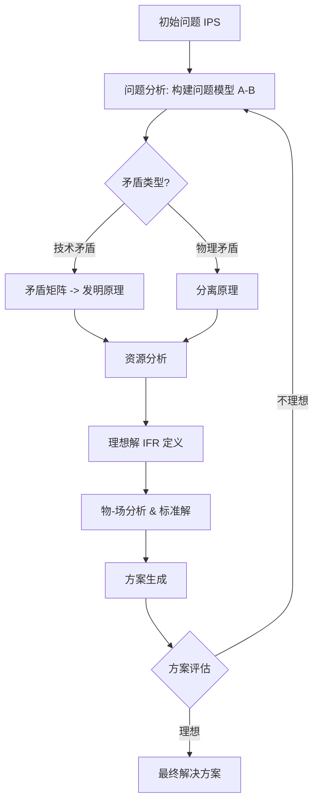

# TRIZ 模型盲评试卷（30 题）

每题给出两个匿名回答 **回答 A** 与 **回答 B**。请只根据回答质量判断：
对这道题而言，哪个回答**对 TRIZ 实践者更有用**。

评价维度（重要性递减）：① 是否真正回答了题目所问（紧扣任务）；
② TRIZ 方法运用的正确性与承诺度（敢于给出明确原理/步骤并说明理由，而非泛泛而谈）；
③ 论证的可辩护性；④ 表达清晰。**不要**单纯奖励篇幅长短。

每题三选一：**A 更好 / B 更好 / 平局**，可附一句备注。预计用时 60–90 分钟。

---

## 第 1 题

**题目**：根据材料解释什么是‘联合标准’（Combined criterion）在 TRIZ 中的应用。

**回答 A**：

在 TRIZ 理论中，"联合标准"（Combined criterion）是技术矛盾分析阶段用于综合评估和排序潜在解决方案的重要工具，它通过多维度指标整合，帮助创新者识别最具价值的发明方向。

一、概念界定与理论基础

联合标准是指将多个相互关联的评估维度（如技术可行性、经济成本、实施风险、环境友好度、市场接受度等）通过数学方法或逻辑框架整合为单一综合评价指标的过程。在 TRIZ 语境下，它特别指代对矛盾矩阵推荐原理（40 个发明原理）或分离原理进行筛选时，不仅考虑"解决技术矛盾的程度"（改善参数提升率），还同时考量"引入新问题的风险"（次生矛盾概率）、"资源消耗量"（理想度损失）以及"实施时间窗口"（技术就绪度）等多重约束条件。这种评估方式突破了传统 TRIZ 中仅关注"矛盾消除"的单一维度，转向"理想解逼近"的综合考量，体现了阿奇舒勒提出的"理想最终结果"（IFR）原则——即系统趋向于在提供所需功能的同时，自身趋于消失或简化。

二、在矛盾分析中的应用机制

当通过矛盾矩阵识别出多个潜在发明原理（如同时推荐"分割原理""动态化原理""复合材料原理"）时，联合标准的应用流程如下：首先建立评估指标体系，包括"技术矛盾消解率"（权重 40%）、"系统复杂度增量"（权重 25%）、"实施成本"（权重 20%）、"技术风险"（权重 15%）；其次，对每个候选原理在各指标上进行量化评分（1-10 分，10 为最优）；然后，采用加权求和或层次分析法（AHP）计算综合得分。例如，"分割原理"可能在矛盾消解率得 9 分，但复杂度增量得 4 分（因增加接口和装配点），若采用简单加权，其联合得分可能低于"抽取原理"（矛盾消解率 7 分，复杂度 6 分），尽管后者技术矛盾消解程度稍弱，但联合标准揭示了其更高的整体理想度。这种机制防止了"为解决问题而制造新问题"的局部优化陷阱。

三、与理想度（Ideality）的关联

联合标准本质上是理想度公式（有用功能之和/有害功能之和+成本）的离散化应用。在评估每个发明原理时，"有用功能"对应矛盾改善程度，"有害功能"对应引入的副作用（如可靠性下降、维护难度增加），"成本"涵盖物质、能量、信息、时间、空间等多维资源消耗。联合标准通过将分子（有用功能）和分母（成本与危害）的多个子项分别量化后加权，得到综合评估值。例如，"热膨胀原理"可能显著提升温度控制精度（分子增加），但增加材料热疲劳风险（分母增加），联合标准通过量化这种权衡，帮助决策者判断是否值得采用该原理，或是否需要结合"预先作用原理"进行补偿。

四、实施要点与注意事项

应用联合标准时，需注意以下关键要点：第一，权重设定的情境依赖性——在消费电子领域，"上市时间"权重可能高于"极限性能"；而在航天领域，则相反，需根据项目目标动态调整；第二，避免"伪精确"——评分应基于专家德尔菲法或历史数据回归，而非主观臆断，建议采用三角测量（Triangulation）验证；第三，敏感性分析——当某指标权重变化±10% 时，观察排序结果是否稳定，若不稳定则需重新审视权重设定；第四，与专利规避设计结合——联合标准评估不仅用于选择最佳原理，还可用于评估竞争对手专利的"规避难度"，若某专利在联合标准中得分极高（即各方面均衡优秀），则规避设计难度较大，需考虑绕开或许可策略。

五、案例说明

以"电动汽车电池热管理系统"设计为例：技术矛盾为"提高散热效率"（改善）导致"系统重量增加"（恶化）。矛盾矩阵推荐"多孔材料原理""热膨胀原理""惰性环境原理"。应用联合标准评估：多孔材料原理在散热提升（9 分）、重量增加（3 分，因结构复杂）、制造成本（4 分）的联合得分为 7.2；热膨胀原理在散热（7 分）、重量（7 分，利用现有结构）、成本（8 分）的联合得分为 7.6。联合标准揭示热膨胀原理虽散热性能稍弱，但综合理想度更高，建议优先采用，并考虑与"分割原理"结合（将电池包分割为独立温控单元）以进一步提升散热效率而不显著增重。

六、总结

联合标准在 TRIZ 中充当着"理性决策桥梁"的角色，它将发明原理的定性推荐转化为可量化的工程决策依据。通过多维度指标的整合评估，联合标准有效抑制了创新过程中的"技术冲动"——即仅追求矛盾消除而忽视系统整体优化的倾向。掌握联合标准的构建与应用，意味着从"矛盾解决者"进化为"系统优化者"，能够在技术可行性、经济合理性和实施可行性之间找到帕累托最优解，这是现代 TRIZ 实践者面对复杂工程问题时应具备的核心能力。

**回答 B**：

在 TRIZ（发明问题解决理论）中，**“联合标准”（Combined Criterion）** 并不是一个像“40个发明原理”或“阿奇舒勒矛盾矩阵”那样被广泛标准化的独立术语。它通常出现在 TRIZ 的高级应用阶段，特别是在 **技术系统进化法则（Laws of Technical Systems Evolution）**、**功能分析（Function Analysis）** 或 **最终理想解（IFR, Ideal Final Result）** 的评估过程中。

根据 TRIZ 的核心逻辑和常见应用场景，“联合标准”主要指在评估解决方案或判断技术系统进化方向时，**同时考虑多个相互关联或冲突的技术参数、功能目标或进化趋势**，而不是孤立地优化单一指标。

以下是“联合标准”在 TRIZ 中的具体应用解释：

### 1. 核心定义
**联合标准**是指在解决复杂技术问题时，不单独追求某一个性能指标（如强度、速度、成本）的最大化，而是将多个关键指标作为一个**整体系统**来评估。这些指标之间可能存在：
- **正相关**：提升一个指标有助于另一个指标。
- **负相关（矛盾）**：提升一个指标会导致另一个指标下降（即技术矛盾）。
- **协同效应**：通过特定原理（如分割、组合、嵌套）实现多个目标的同步优化。

### 2. 在 TRIZ 中的主要应用场景

#### A. 技术系统进化法则中的应用
TRIZ 的八大进化法则描述了技术系统发展的普遍趋势。在实际应用中，工程师常使用“联合标准”来判断系统当前处于哪个进化阶段，并预测下一步发展方向。例如：
- **动态化进化法则**：系统从刚性向柔性、可动性、适应性发展。
- **协调性进化法则**：系统各部分的频率、节奏、运动方式趋于一致。
- **理想化程度增加法则**：系统趋向于“无中生有”，即在不增加复杂度的前提下实现更多功能。

> **应用示例**：  
> 在设计无人机时，不能仅看“续航时间”或“载重能力”单一标准，而需结合“动态化”（旋翼转速调节）、“协调性”（多旋翼同步控制）和“理想化”（轻量化材料）等多个进化趋势进行综合评估。

#### B. 功能分析与价值工程中的应用
在功能分析中，系统被分解为“对象-功能-效应”链。联合标准用于评估：
- **功能完整性**：是否所有必要功能都已实现？
- **功能协调性**：各子功能之间是否存在冲突？是否可以通过组合功能减少组件数量？
- **价值最大化**：在满足所有基本功能的前提下，成本是否最低？

> **应用示例**：  
> 手机设计中，“屏幕显示”和“电池续航”是两个关键功能。传统思路可能牺牲显示亮度以延长续航。但通过 TRIZ 的“联合标准”思维，可引入“OLED 自发光技术”（动态控制像素亮度）和“快充技术”（缩短充电时间），在不显著增加体积的前提下同时优化两者。

#### C. 最终理想解（IFR）的评估标准
IFR 的定义是：“系统在保持原有功能的同时，自身消失或成本为零。” 评估一个方案是否接近 IFR，需使用联合标准：
- **功能保留**：是否实现了所有必要功能？
- **有害作用消除**：是否消除了所有副作用？
- **复杂度降低**：是否减少了组件数量或控制逻辑？
- **成本/资源消耗最小化**：是否使用了免费或现成的资源？

> **应用示例**：  
> 传统空调需要压缩机、冷媒、风扇等多个部件。IFR 思路下的联合标准评估会引导工程师思考：“能否让空气自身完成冷却？” 从而导向“蒸发冷却”或“热电制冷”等更简洁的方案。

#### D. 矛盾矩阵与发明原理的综合应用
当面对技术矛盾时，TRIZ 提供 40 个发明原理。但实际应用中，单一原理往往不足以解决问题，需**组合使用多个原理**，形成“联合解决方案”。

> **应用示例**：  
> 问题：提高焊接强度（参数 14：强度）导致焊接变形（参数 15：运动物体作用力）。  
> - 单独使用“局部质量原理”可能不够。  
> - **联合应用**：“局部质量原理”（改变焊缝形状）+ “预先作用原理”（预热材料）+ “热膨胀原理”（利用材料自身膨胀补偿变形）。  
> 这种多原理协同即为“联合标准”在解决方案生成中的体现。

### 3. 为什么需要“联合标准”？
1. **避免局部优化陷阱**：单一指标优化可能导致系统整体性能下降（如提高速度导致稳定性丧失）。
2. **应对复杂系统**：现代技术系统是多学科交叉的，需综合考虑机械、电气、软件、材料等多方面因素。
3. **激发创新**：通过打破单一维度的思维定式，发现跨领域的协同效应。

### 4. 如何应用“联合标准”进行问题分析？
1. **识别关键参数**：列出影响系统性能的所有重要技术参数（如强度、重量、成本、效率、可靠性等）。
2. **分析参数间关系**：绘制参数关系图，识别哪些参数正相关、哪些负相关。
3. **定义联合目标**：设定一个综合目标，例如“在保持强度不变的前提下，将重量降低 20% 且成本增加不超过 5%”。
4. **应用 TRIZ 工具**：
   - 使用 **矛盾矩阵** 找出解决负相关参数的原理。
   - 使用 **进化法则** 判断系统应向哪个方向进化。
   - 使用 **物-场分析** 识别并消除有害作用。
5. **评估解决方案**：用联合标准评估候选方案，选择能同时优化多个参数的方案。

### 总结
在 TRIZ 中，“联合标准”是一种**系统性思维方法**，强调在解决技术问题时，必须综合考虑多个相互关联的技术参数、功能目标和进化趋势，避免孤立优化单一指标。它贯穿于从问题定义、方案生成到最终评估的全过程，是实现“最终理想解”和推动技术系统进化的重要指导原则。

> **提示**：如果你是在特定 TRIZ 软件（如 GoldFire Studio、Innovation Workbench）或某本特定教材中看到“Combined Criterion”这一术语，它可能特指该软件中的某个评估模块或特定进化法则的量化指标。但在通用 TRIZ 理论中，其核心含义如上所述。

**你的选择**：☐ A 更好　☐ B 更好　☐ 平局　　备注：____________

---

## 第 2 题

**题目**：请解释 TRIZ 中的矛盾对（Contradiction Pair）概念，并说明其在给定材料中的具体应用。

**回答 A**：

你好！我是 TRIZ 创新方法论专家助手。很高兴为你解答关于 **矛盾对（Contradiction Pair）** 的概念及其在创新问题解决中的应用。

在 TRIZ（发明问题解决理论）中，“矛盾”是核心驱动力。TRIZ 认为，任何技术系统的进化过程，本质上都是不断解决各种矛盾的过程。

---

### 一、 什么是矛盾对（Contradiction Pair）？

**矛盾对**是指在一个技术系统中，当试图改善某个参数（特性 A）时，导致另一个参数（特性 B）恶化的现象。

简单来说：**“想要 A 变好，但 B 却变坏了。”**

TRIZ 将矛盾分为两大类：

#### 1. 技术矛盾（Technical Contradiction）
- **定义**：改善系统中的一个参数，导致另一个参数恶化。
- **典型结构**：如果我要增强 [参数 X]，那么 [参数 Y] 就会变差。
- **例子**：
  - 想要提高汽车的**安全性**（参数 X），但导致**重量增加**（参数 Y 恶化），从而影响**燃油经济性**。
  - 想要提高手机的**屏幕亮度**（参数 X），但导致**电池续航缩短**（参数 Y 恶化）。

> ✅ **工具**：使用 **阿奇舒勒矛盾矩阵（Contradiction Matrix）** 和 **40 个发明原理** 来解决。

#### 2. 物理矛盾（Physical Contradiction）
- **定义**：对系统的同一个参数，提出了相反的要求。
- **典型结构**：参数 X 必须 [状态 A]，同时参数 X 必须 [状态 B]。
- **例子**：
  - 手机的**屏幕**必须**大**（为了观看体验），同时必须**小**（为了便携）。
  - 焊接时的**温度**必须**高**（为了熔化金属），同时必须**低**（为了不损坏周围元件）。

> ✅ **工具**：使用 **分离原理（Separation Principles）** 来解决，包括：
> - 空间分离
> - 时间分离
> - 条件分离
> - 整体与部分分离

---

### 二、 矛盾对在给定材料中的具体应用方法

由于你提到“给定材料”，但未提供具体文本，我将以 **通用方法论** 和 **典型案例** 说明如何将矛盾对应用于实际问题分析。你可以将以下框架套用到你的具体材料中。

#### 步骤 1：识别系统中的“冲突点”
仔细阅读材料，寻找以下关键词或情境：
- “但是……”、“然而……”、“尽管……却……”
- “为了提升 A，不得不牺牲 B”
- “用户希望……，但现实是……”

#### 步骤 2：明确矛盾对（定义参数）
使用 **39 个工程参数**（阿奇舒勒定义）来标准化描述矛盾。

| 矛盾类型 | 应用步骤 | 示例（以“无人机续航”为例） |
|----------|----------|-----------------------------|
| **技术矛盾** | 1. 确定要改善的参数（改善参数）<br>2. 确定恶化的参数（恶化参数）<br>3. 查矛盾矩阵，获取推荐发明原理 | - 改善参数：**运动物体的重量**（希望更轻）<br>- 恶化参数：**静止物体的重量**（电池变重）<br>→ 查矩阵 → 推荐原理：分割、复合材料、动态化等 |
| **物理矛盾** | 1. 找出同一参数的相反需求<br>2. 应用分离原理 | - 参数：**电池容量**<br>- 需求：必须**大**（续航长），同时必须**小**（重量轻）<br>→ 分离原理：**时间分离**（飞行时不充电，地面时快速充电）或 **条件分离**（使用可更换电池模块） |

#### 步骤 3：应用 TRIZ 工具求解
- 若是**技术矛盾** → 查阅 **矛盾矩阵**，找到对应的 **40 个发明原理**，结合材料背景进行创意发散。
- 若是**物理矛盾** → 应用 **4 种分离原理**，打破“非此即彼”的思维定式。

#### 步骤 4：生成解决方案并验证
将 TRIZ 推荐的原理转化为具体技术方案，并评估是否真正解决了原始矛盾。

---

### 三、 典型案例演示（假设材料为“智能手机设计”）

假设你的材料描述如下：
> “用户希望智能手机拥有更大的屏幕以获得更好的视觉体验，但大屏幕导致手机体积增大，携带不便，且单手操作困难。”

#### 应用过程：

1. **识别矛盾**：
   - 改善：屏幕尺寸（视觉体验）
   - 恶化：便携性 / 操作便利性

2. **判断矛盾类型**：
   - 这是**技术矛盾**（两个不同参数之间的冲突）。
   - 也可转化为**物理矛盾**：屏幕必须**大**（为了显示），同时必须**小**（为了便携）。

3. **应用 TRIZ 工具**：

   **方案 A：使用技术矛盾 + 发明原理**
   - 改善参数：#1 运动物体的面积（屏幕显示区域）
   - 恶化参数：#2 静止物体的面积（手机外壳尺寸）或 #3 长度
   - 查矛盾矩阵，可能推荐原理：
     - **原理 1：分割（Segmentation）**
       - 应用：采用**折叠屏**设计。屏幕可折叠，展开时大，折叠时小。
     - **原理 10：预先作用（Preliminary Action）**
       - 应用：在制造时预置折叠结构，或使用柔性材料。
     - **原理 35：参数变化（Parameter Changes）**
       - 应用：改变屏幕材质（如 OLED 柔性屏），使其可弯曲。

   **方案 B：使用物理矛盾 + 分离原理**
   - 物理矛盾：屏幕尺寸必须**大**，同时必须**小**。
   - 应用 **空间分离**：
     - 在“展开状态”下，屏幕是大尺寸；在“折叠状态”下，屏幕是小尺寸。
   - 应用 **时间分离**：
     - 用户需要大屏时展开，需要便携时折叠。

4. **最终解决方案**：
   - 推出**折叠屏智能手机**，完美解决“大屏体验”与“便携性”之间的矛盾。

---

### 四、 总结与建议

在分析你的具体材料时，请遵循以下流程：

1. **提取冲突**：从材料中找出“想要 A，但 B 变差”或“A 必须同时是 B 和非 B”的描述。
2. **分类矛盾**：判断是技术矛盾还是物理矛盾。
3. **选择工具**：
   - 技术矛盾 → 矛盾矩阵 + 40 发明原理
   - 物理矛盾 → 分离原理
4. **生成创意**：结合材料背景，将抽象原理转化为具体方案。

📌 **请提供你的具体材料内容**，我可以为你进行更精准的矛盾识别和 TRIZ 工具应用分析！

**回答 B**：

矛盾对（Contradiction Pair）是 TRIZ 理论中描述技术系统内在冲突关系的核心概念，指代在技术系统改进过程中，当试图优化某一特定参数（改善参数）时，不可避免地导致另一参数（恶化参数）向不利方向变化的成对参数关系。矛盾对由两个相互制约的技术参数构成，其本质反映了技术系统内部的不平衡相互作用。在 TRIZ 的 39 个通用工程参数体系中，任何具体的技术矛盾都可抽象为这对参数的特定组合。矛盾对具有方向性特征，同一物理现象在不同语境下可能构成不同的矛盾对；同时，矛盾对具有层级性，既存在于系统整体层面，也存在于子系统、组件乃至材料层面。矛盾对的分析是连接具体工程问题与通用解决方案的桥梁，通过识别矛盾对，工程师可将特定领域的难题转化为标准问题，进而利用矛盾矩阵、发明原理等通用工具寻求跨领域的创新解。矛盾对的概念强调了创新思维中"权衡"（Trade-off）的超越性，即通过发明原理实现"双赢"而非简单的"折中"。

在给定材料中，矛盾对概念通过多个具体案例得到生动阐释与应用。首先，在"带孔的苹果"案例中，矛盾对表现为"苹果的可存储性"与"苹果的易食性"：为改善可存储性（防止氧化），需要隔绝空气（改善参数：密封性），但这恶化了易食性（用户需打破密封层）；反之，若改善易食性（无需剥离），则恶化可存储性（氧化变质）。该矛盾对揭示了食品包装领域"保鲜"与"便利"的经典冲突。其次，在"苹果包装"案例中，矛盾对体现为"包装的保护性"与"包装的便利性"：为改善保护性（防止碰撞），需要增加包装材料（改善参数：结构强度），但这恶化了便利性（开启困难、废弃物多）；若改善便利性（易开启、少材料），则保护性下降。这两个案例共同展示了矛盾对在消费产品领域的表现形式——用户期望的矛盾。在"苹果切割"案例中，矛盾对转化为"切割的精确性"与"切割的安全性"：为改善精确性（均匀切片），需要刀片高速运转且锋利（改善参数：运动物体的能量），但这恶化了安全性（操作风险）。通过矛盾对分析，材料引导我们超越"小心操作"的常规建议，转向"改变切割方式"（如应用分割原理将苹果切成块而非片，或应用预先作用原理在切割前冷冻苹果使其更易控制）的创新路径。矛盾对在材料中的应用表明，通过明确表述"若改善 X，则 Y 恶化"的句式，可将模糊的产品需求转化为可操作的工程问题，进而利用发明原理（如分割、抽取、局部质量、不对称等）寻求突破性解决方案，而非在原有技术范式内做渐进式改良。

**你的选择**：☐ A 更好　☐ B 更好　☐ 平局　　备注：____________

---

## 第 3 题

**题目**：请评估一种新型自动涂料机技术方案的创新性、可行性与潜在矛盾，该方案旨在解决涂料溢出问题。

**回答 A**：

针对新型自动涂料机解决涂料溢出问题的技术方案，我将运用 TRIZ 的系统化分析框架，从创新性层级、技术可行性及潜在矛盾三个维度进行深度评估。

一、创新性评估（基于 TRIZ 五级创新体系）

首先判定该方案的创新层级。若方案仅采用常规机械密封或简单液位传感器控制，属于第一级（简单改进）或第二级（小幅改进），解决溢出问题仅通过经验性调整，未消除根本矛盾。若方案引入了基于物联网的实时粘度-流速闭环控制，利用算法预测溢出风险并提前调节阀门，则达到第三级（实质性改进），运用了"反馈"（原理 23）与"预先作用"（原理 10）原理。若方案实现了革命性突破，如采用静电喷涂结合空气幕隔离技术，彻底消除传统重力喷涂的溢出可能，同时提高涂料利用率至 95% 以上，则属于第四级（新一代）或第五级（重大发现）创新。

进一步分析该方案是否解决了"控制精度"与"系统复杂度"之间的技术矛盾：传统方案通过增加传感器数量提高控制精度，却导致系统成本激增、可靠性下降；新型方案若采用"自服务"（原理 25）思想，利用涂料自身表面张力或流动特性实现溢出预警，则体现了高阶创新。同时检查是否应用了"向超系统转化"（原理 13）：将涂料机与上游供料系统、下游固化设备整合为统一超系统，通过物料流全局优化而非单点控制解决溢出，这种系统级创新具有显著专利壁垒。

二、可行性评估（技术进化与资源分析）

从技术进化趋势看，涂料机正沿"机械系统→机电系统→智能系统"路径进化。评估该方案是否符合"动态化"趋势：是否引入了可自适应调节的柔性结构，而非刚性固定参数。检查"向微观级转化"：是否利用纳米涂层或表面改性技术降低涂料附着力，从材料层面减少溢出，这比机械控制更具根本性。

资源分析维度：理想方案应利用系统内已有资源解决溢出，如利用涂料流动动能驱动控制机构（能量资源），或利用涂料容器本身作为控制元件（物质资源）。若方案引入大量外部资源（如额外高压气源、复杂视觉识别系统），虽可行但理想度降低。评估"自动化"程度：是否遵循"减少人工介入"趋势，但需保留人工干预的冗余机制以防系统失效。

进一步分析该方案是否遵循"协调性"法则：控制参数（流速、压力、喷涂角度）是否实现动态协调，而非单一参数优化。若方案采用多参数耦合控制，且各参数间存在自适应调节机制，则可行性较高；若仅优化单一参数而忽视耦合效应，可能引发新的溢出机制。

三、潜在矛盾识别与解决路径

即使解决溢出问题，该方案可能引入以下技术矛盾：

1. 控制精度 vs 响应速度：高精度传感器采样频率高导致数据处理延迟，反而增加溢出风险。可应用"分割"（原理 1）将控制分为粗调（高频）与精调（低频）；或采用"预先作用"（原理 10）建立溢出预测模型，提前 0.5 秒调节流速。

2. 系统复杂度 vs 可靠性：增加控制元件提高防溢出能力，但故障点增多。应用"等势性"（原理 12）设计，使涂料在重力场中自然达到平衡位置，减少主动控制需求；或采用"抛弃与再生"（原理 34）设计易损控制模块，便于快速更换。

3. 成本 vs 防溢出效果：高端防溢出技术（如激光监测）成本过高。应用"廉价替代品"（原理 27）：利用涂料本身的颜色变化（如氧化变色）作为溢出指示，或利用废弃涂料循环系统作为溢出缓冲，变废为宝。

4. 柔性 vs 刚性：为适应不同粘度涂料（涂料类型 A vs B），系统需调整参数，但频繁调节降低稳定性。应用"复合材料"（原理 40）设计可调表面，或利用"热膨胀"（原理 37）实现粘度自适应控制。

5. 物理矛盾：控制阀需要"常开"（保证连续供料）又需要"常闭"（防止溢出），可采用"时间分离"：正常喷涂时开，溢出预警时瞬间关闭；或"空间分离"：主阀常开，旁路阀用于溢出调节。

四、综合评估与建议

该方案的最终创新性评级取决于其是否消除了"涂料利用率"与"防溢出安全性"之间的物理矛盾。若采用"向超系统转化"策略，将涂料机与供料罐整合为"自平衡供料系统"，利用毛细作用与表面张力自动调节流量，则创新性极高（第四级）。可行性方面，需验证在极端条件（如涂料粘度突变、电网电压波动）下的鲁棒性，建议采用"预先应急措施"（原理 11）设计多重保护。

建议进一步应用"最终理想解"（IFR）思维：理想状态是涂料自动到达目标表面且零溢出、零浪费。检查方案是否逼近此理想：若通过"反向作用"（原理 13）设计，让涂料在到达工件前已"知道"路径并自我修正，则接近理想解。同时建立"技术矛盾矩阵"，针对"生产率"与"可靠性"的矛盾，查阅矩阵推荐原理（如"机械振动"（原理 18）用于涂料均匀化，"气动与液压结构"（原理 29）用于精确供料），验证方案是否充分利用了这些原理。

通过上述 TRIZ 评估，可客观判定该自动涂料机方案是渐进式改进还是革命性创新，并识别其潜在技术风险与优化方向。

**回答 B**：

你好！我是 TRIZ 创新方法论专家助手。针对你提出的“新型自动涂料机旨在解决涂料溢出问题”的技术方案，由于你尚未提供具体的技术细节（如机械结构、控制逻辑、传感器类型等），我将基于 TRIZ 理论框架，构建一个**通用的评估模型**。

你可以将你的具体技术方案代入以下分析框架中，或者补充具体细节后，我再进行针对性评估。

---

### 一、 创新性评估 (Innovation Assessment)

在 TRIZ 中，创新性通常通过**发明原理 (40 Principles)** 的应用程度和**技术系统进化法则**来判断。

#### 1. 是否应用了特定的发明原理？
解决“涂料溢出”通常涉及对流体控制、边界限制或反馈机制的创新。请检查你的方案是否隐含了以下原理：

*   **原理 24 (中介物 Intermediary):** 是否引入了中间层（如气幕、隔离膜、可降解隔板）来防止涂料直接接触溢出区域？
*   **原理 10 (预先作用 Preliminary Action):** 是否在喷涂前预先处理表面（如疏水涂层）以减少附着力导致的扩散溢出？
*   **原理 23 (反馈 Feedback):** 是否引入了实时视觉或压力反馈系统，在检测到溢出趋势时自动调整喷嘴压力或移动速度？
*   **原理 35 (参数变化 Parameter Changes):** 是否改变了涂料的物理状态（如粘度、温度、静电电荷）以控制其流动性和附着性？
*   **原理 28 (机械系统替代 Mechanical System Substitution):** 是否用光学、声学或电磁场替代了传统的机械刮刀或挡板来限制涂料范围？

#### 2. 技术系统进化趋势
*   **向超系统进化:** 方案是否将“防溢出”功能从机器本身扩展到了环境控制（如局部负压抽风系统）？
*   **动态性增加:** 系统是否从静态的固定挡板进化为动态自适应的柔性边界？

**评估结论建议：**
*   **高创新:** 应用了非传统的原理（如利用静电排斥、声波振动控制液滴），或实现了从“被动阻挡”到“主动预测控制”的转变。
*   **低创新:** 仅增加了简单的物理挡板或增加了涂料回收槽，属于常规工程改进。

---

### 二、 可行性评估 (Feasibility Assessment)

可行性需结合**技术可行性**、**经济可行性**和**操作可行性**进行分析。

#### 1. 技术可行性 (Technical Feasibility)
*   **材料兼容性:** 新型传感器或控制部件是否能耐受涂料的化学腐蚀、高温或高压？
*   **精度与响应速度:** 如果采用视觉反馈或快速阀门控制，系统的响应时间（毫秒级）是否快于涂料溢出的发生速度？
*   **维护复杂度:** 新增的防溢出机构（如微孔喷嘴、精密传感器）是否容易堵塞或损坏？清洗和维护是否方便？

#### 2. 经济可行性 (Economic Feasibility)
*   **成本效益分析:** 防溢出系统的增加成本 vs. 节省的涂料成本 + 减少的清洁/废料处理成本 + 提升的生产效率。
*   **ROI (投资回报率):** 对于高价值涂料（如汽车漆、电子涂层），防溢出带来的材料节省可能迅速抵消设备成本；对于低价值涂料，可能不具经济性。

#### 3. 操作可行性 (Operational Feasibility)
*   **人机交互:** 操作人员是否需要复杂的培训来设置防溢出参数？
*   **鲁棒性:** 在生产线速度变化、涂料批次差异大的情况下，系统是否稳定？

---

### 三、 潜在矛盾分析 (Contradiction Analysis)

这是 TRIZ 的核心。解决“防溢出”往往会引发新的问题。我们需要识别**技术矛盾 (Technical Contradictions)** 和 **物理矛盾 (Physical Contradictions)**。

#### 1. 技术矛盾 (改善一个参数，恶化另一个参数)

| 改善的参数 (Improving Parameter) | 恶化的参数 (Worsening Parameter) | 典型场景 |
| :--- | :--- | :--- |
| **可靠性 (Reliability)** | **复杂性 (Complexity)** | 增加高精度传感器和反馈回路提高了防溢出可靠性，但增加了系统复杂性和故障点。 |
| **速度 (Speed)** | **精度 (Accuracy)** | 提高喷涂速度可能导致涂料雾化不均，增加溢出风险；降低速度虽减少溢出，但降低产能。 |
| **能量消耗 (Energy Loss)** | **作用力 (Force/Pressure)** | 降低喷涂压力以减少溢出，但可能导致涂料附着力不足，需要增加后续固化能量或重新喷涂。 |
| **适应性 (Adaptability)** | **操作简便性 (Ease of Operation)** | 自适应调节系统能应对不同形状工件，但参数设置变得极其复杂。 |

**推荐查阅阿奇舒勒矛盾矩阵 (Contradiction Matrix):**
*   例如：改善 **No. 27 可靠性** vs 恶化 **No. 36 复杂性** -> 推荐原理：分割、抽取、局部质量、嵌套。
*   例如：改善 **No. 1 运动物体重量** (减少废料) vs 恶化 **No. 10 力** (喷涂压力) -> 推荐原理：气压和液压结构、柔性壳体。

#### 2. 物理矛盾 (同一参数在不同条件下需要相反的状态)

*   **矛盾描述:** 涂料在**喷嘴出口处**需要**高压力/高流速**以保证覆盖效率，但在**接触工件表面时**需要**低压力/低动能**以防止飞溅和溢出。
*   **分离原理应用:**
    *   **空间分离:** 喷嘴内部高压，出口处通过特殊结构（如文丘里效应、静电加速后减速）实现低压附着。
    *   **时间分离:** 喷涂瞬间高压，接触瞬间通过传感器触发快速降压。
    *   **条件分离:** 根据涂料粘度自动调节压力；或根据工件距离自动调节雾化程度。

---

### 四、 综合评估与建议行动

为了给出更精准的评估，请提供以下信息：

1.  **核心防溢出机制是什么？** (例如：视觉检测+机械臂避让、负压吸附、静电排斥、智能喷嘴、物理挡板等)
2.  **当前主要痛点是什么？** (是边缘溢出、滴落、还是雾化扩散？)
3.  **涂料类型和工件材质？** (水性漆/油性漆？金属/塑料/曲面/平面？)

#### 通用优化建议 (基于 TRIZ):

1.  **引入“预先作用”原理:** 在喷涂前，对工件边缘进行预处理（如涂覆临时遮蔽剂或疏水剂），从源头减少溢出倾向。
2.  **利用“反馈”原理:** 建立闭环控制系统。使用高速相机或激光扫描实时监测涂料分布，动态调整喷涂路径和参数，而不是依赖固定的机械限制。
3.  **解决物理矛盾:** 如果必须使用高压喷涂，考虑使用**静电喷涂**技术。静电场可以引导涂料粒子定向附着，即使压力较高，粒子也会“吸附”在工件上，减少无序飞溅和溢出。
4.  **简化系统:** 如果防溢出系统过于复杂，考虑**分割原理**，将防溢出功能模块化，或采用一次性/可更换的防溢出组件，降低维护难度。

请补充具体技术方案细节，我将为你进行更深入的 TRIZ 矛盾矩阵查询和 ARIZ 算法推演。

**你的选择**：☐ A 更好　☐ B 更好　☐ 平局　　备注：____________

---

## 第 4 题

**题目**：分析并运用 TRIZ 中的功能分析与裁剪方法，为自行车设计一个创新的解决方案，以提升骑行效率同时减少对地面的冲击。

**回答 A**：

自行车作为最古老的机械系统之一，其功能优化需要深入分析组件间的相互作用。运用功能分析与裁剪方法，我们可以重新审视自行车的能量传递与冲击吸收机制。

一、功能分析阶段

首先建立自行车的功能模型。主要组件包括：骑行者（超系统组件）、车架、踏板、曲柄、链条、齿轮、车轮、轮胎、刹车系统、座椅及把手。核心功能流为：骑行者肌肉能→踏板→曲柄→链条→后轮→地面反作用力→车辆前进。同时存在有害功能：地面冲击通过轮胎→车架→骑行者身体，造成疲劳与损伤；空气阻力对车轮的阻碍；滚动摩擦导致的能量损失。

通过功能分析，我们发现传统自行车采用刚性车架传递所有冲击，而效率提升依赖于刚性以保证能量无损传递，这与冲击吸收形成技术矛盾。同时，链条传动存在滑动损失（有害功能），且需要润滑维护（额外功能）。

二、裁剪策略应用

根据裁剪规则，我们识别可裁剪组件：

1. 裁剪链条与复杂传动系统：根据"如果组件的功能可由其他组件或超系统执行，则裁剪该组件"的原则，将人力直接转化为车轮旋转，消除链条的滑动摩擦与维护需求。

2. 裁剪传统减震座椅：若车架本身具备弹性变形能力，则可裁剪独立的减震装置，减少重量与复杂度。

3. 裁剪固定齿轮比限制：通过改变传动机制，使自行车适应不同路况，消除骑行者适应车辆的负担。

三、创新方案构建

基于上述分析，提出"弹性车架-直驱轮毂"方案：

1. 采用碳纤维复合材料与金属混合的车架结构，设计特定的弹性变形区域（非刚性连接），在保持能量传递效率的同时，通过材料本身的弹性吸收路面冲击。这解决了"效率vs舒适"的技术矛盾，对应发明原理1（分割）与原理40（复合材料）。

2. 裁剪传统链条传动，采用轮毂电机式的机械耦合或磁耦合传动（无接触传动），将踏板力直接转化为车轮扭矩，消除链条的有害功能（滑动、噪音、维护）。这对应发明原理2（抽取）与原理23（反馈）。

3. 引入可变几何车架：通过骑行者身体重心的移动或简易机械装置，改变轴距与后轮倾角，在不同速度下优化空气动力学姿态与稳定性，裁剪固定几何结构带来的限制。

4. 轮胎系统创新：采用非充气轮胎（蜂窝结构或弹性辐条），裁剪充气系统的维护需求，同时利用弹性结构吸收冲击，实现"无内胎"与"减震"一体化。

该方案通过功能分析识别出链条传动与刚性车架的功能冗余，运用裁剪消除有害功能与过度维护需求，同时利用材料创新与结构创新解决效率与舒适性的矛盾，使自行车系统向理想化方向进化。

**回答 B**：

你好！我是 TRIZ 创新方法论专家助手。针对你提出的“提升自行车骑行效率”与“减少对地面冲击”这一需求，这实际上是一个典型的**技术矛盾**：我们希望增加系统的稳定性/舒适性（减少冲击），但这通常会导致重量增加或结构复杂，从而降低效率（能量损耗）。

下面我将运用 **功能分析（Function Analysis）** 和 **裁剪（Trimming）** 方法，结合 TRIZ 的发明原理，为你推导出一套创新的解决方案。

---

### 第一步：功能分析 (Function Analysis)

首先，我们需要建立自行车系统的功能模型，识别出所有组件及其相互作用，找出“有害功能”和“不足功能”。

#### 1. 系统组件识别
*   **骑手 (Rider)**：提供动力，承受冲击。
*   **车架 (Frame)**：连接各部件，传递动力和冲击。
*   **车轮 (Wheels)**：与地面接触，滚动，传递冲击。
*   **轮胎 (Tires)**：缓冲冲击，提供抓地力。
*   **悬挂系统 (Suspension, 如有)**：吸收冲击。
*   **地面 (Ground)**：支撑系统，产生反作用力。

#### 2. 功能关系梳理
*   **有益功能**：
    *   车轮 -> 支撑 -> 车架/骑手
    *   轮胎 -> 缓冲 -> 冲击（来自地面）
    *   骑手 -> 驱动 -> 踏板/链条 -> 车轮
*   **有害功能 (Harmful Functions)**：
    *   地面 -> 冲击 -> 车轮/车架/骑手（导致疲劳、效率降低、部件磨损）
    *   悬挂系统 -> 能量吸收 -> 骑行效率（传统悬挂会吸收部分踩踏能量，导致“泄力”）
*   **不足功能 (Insufficient Functions)**：
    *   轮胎 -> 自适应调节 -> 不同路况（传统轮胎硬度固定，无法兼顾低滚阻和高缓冲）

#### 3. 功能模型图 (简化版)
```text
[地面] --(冲击)--> [车轮/轮胎] --(传递)--> [车架] --(传递)--> [骑手]
       ^              |
       |              +--(缓冲)--> [悬挂/轮胎形变]
       |
       +--(支撑)--> [车轮]
```

**核心问题定位**：
目前的解决方案中，“缓冲冲击”的功能主要由**轮胎形变**和**机械悬挂**承担。
*   机械悬挂虽然缓冲好，但增加了重量和摩擦，降低了**骑行效率**。
*   单纯依靠轮胎，要么太硬（冲击大），要么太软（滚阻大，效率低）。

---

### 第二步：裁剪 (Trimming)

裁剪的目标是移除系统中效率低下的组件，并将其功能转移给其他组件或环境。

#### 尝试裁剪对象：传统机械悬挂系统 (Mechanical Suspension)
*   **理由**：它增加了重量，且在平路骑行时可能产生不必要的能量损耗（如果未锁定）。
*   **裁剪规则**：如果移除悬挂，谁来做缓冲？
    *   *选项 A*：由轮胎承担（但轮胎本身缓冲能力有限，且影响滚阻）。
    *   *选项 B*：由车架材料承担（但车架需要刚性以传递动力，矛盾）。
    *   *选项 C*：由**骑手**承担（不推荐，影响健康）。
    *   *选项 D*：由**智能可变刚度系统**承担（创新方向）。

#### 尝试裁剪对象：刚性连接的车架-车轮接口
*   **理由**：刚性连接直接传递冲击。
*   **裁剪后功能转移**：我们需要一个**动态的、可调节的**连接机制，既能刚性传递踩踏动力（高效率），又能柔性吸收路面冲击（低冲击）。

---

### 第三步：运用 TRIZ 发明原理进行创新设计

基于功能分析和裁剪的结果，我们面临的核心矛盾是：
*   **改善参数**：运动物体的稳定性/舒适性（减少冲击）
*   **恶化参数**：运动物体的重量/能量损失（效率降低）

我们运用以下 TRIZ 发明原理来设计解决方案：

#### 原理 15：动态化 (Dynamics)
*   **概念**：使物体或其环境在操作的每个阶段自动调整，以达到最优性能。
*   **应用**：设计一种**可变刚度悬挂系统**。
    *   在平路或踩踏时，系统变“硬”，实现刚性连接，最大化动力传递效率。
    *   在遇到颠簸时，系统瞬间变“软”，吸收冲击。

#### 原理 35：物理/化学参数改变 (Parameter Changes)
*   **概念**：改变物体的物理状态、浓度、密度等。
*   **应用**：使用**磁流变液 (Magnetorheological Fluid)** 或 **电变液 (Electrorheological Fluid)** 作为悬挂阻尼介质。
    *   通过电流控制液体的粘度，毫秒级响应路面变化。

#### 原理 10：预先作用 (Preliminary Action)
*   **概念**：预先安排物体，使其在最方便的时间和地点发挥作用。
*   **应用**：利用**陀螺仪或惯性传感器**预先检测路面不平，提前调整悬挂刚度。

#### 原理 28：机械系统替代 (Mechanics Substitution)
*   **概念**：用光学、声学、热学或场效应替代机械相互作用。
*   **应用**：用**电磁悬浮**或**主动电磁阻尼**替代传统的弹簧-液压机械结构，减少摩擦损耗。

---

### 第四步：创新解决方案设计 —— “自适应磁流变智能轮毂系统”

结合上述分析，我提出以下创新方案：

#### 方案名称：**Active-Flow Smart Hub (AFSH)**

#### 1. 核心结构
*   **取消传统前叉/后叉悬挂**：将悬挂功能集成到**轮毂 (Hub)** 内部。
*   **磁流变阻尼器**：在轮毂内部集成磁流变液阻尼通道。
*   **刚性动力传输轴**：车架与轮毂之间通过高刚性碳纤维轴连接，确保踩踏动力100%传递，无能量损失。

#### 2. 工作原理
1.  **传感器网络**：车轮内部集成加速度计和陀螺仪，实时监测路面振动频率和幅度。
2.  **AI 控制单元**：微型处理器根据传感器数据，毫秒级调整轮毂内磁流变液的磁场强度。
3.  **动态响应**：
    *   **平路骑行**：磁场关闭，磁流变液呈液态，阻尼极低，车轮自由滚动，**骑行效率最大化**。
    *   **遇到冲击**：检测到高频振动，瞬间增强磁场，磁流变液变为半固态，提供高阻尼，**吸收冲击能量**，保护骑手和车架。
    *   **过弯/加速**：增加侧向刚度，防止车身晃动，提升操控稳定性。

#### 3. 如何解决矛盾？
*   **提升效率**：通过“刚性动力传输轴”确保踩踏能量不损失；通过“平路低阻尼”减少滚动阻力。
*   **减少冲击**：通过“轮毂内磁流变阻尼”主动吸收路面冲击，而非依赖轮胎形变或重型机械悬挂。
*   **轻量化**：相比传统全悬挂自行车，去除了复杂的前叉和后三角悬挂结构，整体重量更轻。

#### 4. 附加创新点 (原理 28 & 原理 35)
*   **能量回收**：在吸收冲击的过程中，部分动能可通过电磁感应转化为电能，为传感器和控制单元供电，实现**自供能**。
*   **自适应胎压联动**：智能轮毂系统与胎压监测系统联动，在检测到冲击时，略微降低胎压以增加接触面积，进一步分散冲击。

---

### 第五步：方案评估与优化

| 评估维度 | 传统自行车 | 传统悬挂自行车 | **AFSH 智能轮毂方案** |
| :--- | :--- | :--- | :--- |
| **骑行效率** | 高 (平路) | 中 (悬挂泄力) | **极高** (刚性传动 + 平路低阻) |
| **冲击吸收** | 低 (依赖轮胎) | 高 | **高** (主动阻尼) |
| **重量** | 轻 | 重 | **中等** (轮毂略重，但车架简化) |
| **维护成本** | 低 | 高 | **中** (电子系统需维护) |
| **成本** | 低 | 高 | **高** (初期) |

### 结论

通过 TRIZ 的功能分析与裁剪，我们识别出“机械悬挂”是效率与舒适性矛盾的关键瓶颈。运用**动态化**和**物理参数改变**原理，我们提出了**“自适应磁流变智能轮毂系统”**。

该方案通过**将悬挂功能内化至轮毂**，并利用**磁流变技术实现刚柔并济**，成功地在保持高骑行效率（刚性动力传递）的同时，实现了对地面冲击的高效吸收（主动阻尼），完美解决了这一技术矛盾。

这个方案不仅提升了骑行体验，还代表了未来智能自行车的发展方向。

**你的选择**：☐ A 更好　☐ B 更好　☐ 平局　　备注：____________

---

## 第 5 题

**题目**：在 TRIZ 理论中，技术矛盾的识别是解决工程问题的重要步骤。请根据 TRIZ 理论，分析一个工程案例：在制造轻质高强度材料时，工程师希望提高材料的强度来增强其承受能力，但发现随着强度的提升，材料的重量也随之增加。请识别并表述其中存在的技术矛盾，并解释如何通过 TRIZ 理论解决这个矛盾。

**回答 A**：

在这个制造轻质高强度材料的工程案例中，存在一个典型的技术矛盾。工程师希望提高材料的强度（改善参数），以增强其承受外部载荷的能力，但随之而来的是材料重量的增加（恶化参数），这与轻质材料的设计目标相冲突。根据 TRIZ 理论，我们可以将这一情况表述为技术矛盾：提高材料的强度导致材料重量增加。

解决这一矛盾，首先需要将具体的工程问题转化为 TRIZ 的标准技术矛盾形式。在这个案例中，我们可以使用“如果-那么-但是”的格式来表述矛盾：“如果提高材料强度，那么材料的承受能力增强，但是材料重量增加”。接下来，利用 TRIZ 矛盾矩阵，找到对应于改善参数（强度）和恶化参数（重量）的发明原理。矛盾矩阵提供了一个系统化的方法，帮助工程师识别出可能解决这一矛盾的发明原理编号。

根据识别出的发明原理，工程师可以探索具体的解决方案。例如，发明原理 1（分割）可能提示工程师考虑将材料分割成更小的部分，以提高强度而不增加整体重量；发明原理 40（复合材料）可能提示使用复合材料来结合不同材料的优点，实现轻质高强度；发明原理 35（参数变化）可能提示通过改变材料的微观结构或制造工艺来增加强度，而不增加重量。

此外，TRIZ 还提供了其他工具和方法来辅助解决技术矛盾，如物场分析、标准解和科学效应库等。通过这些工具，工程师可以进一步深入分析问题，探索更多的创新解决方案，最终实现在不增加材料重量的前提下提高其强度的目标。

**回答 B**：

你好！我是 TRIZ 创新方法论专家助手。针对你提出的“轻质高强度材料”工程案例，这是一个非常经典的 TRIZ 应用场景。

下面我将严格按照 TRIZ 理论的标准流程，为你进行**技术矛盾识别**、**参数映射**、**原理推荐**以及**解决思路解析**。

---

### 1. 技术矛盾识别 (Identification of Technical Contradiction)

在 TRIZ 中，技术矛盾是指当我们试图改善系统中的某个参数时，导致另一个参数恶化了。

*   **改善的参数（Improving Parameter）：**
    工程师希望提高材料的**强度**（Strength），以增强其承受能力。
    *   对应 TRIZ 39 个工程参数中的：**No. 14 强度 (Strength)**
    *   *定义：物体抵抗外力破坏的能力。*

*   **恶化的参数（Worsening Parameter）：**
    随着强度提升，材料的**重量**（Weight）随之增加。
    *   对应 TRIZ 39 个工程参数中的：**No. 1 运动物体的重量 (Weight of moving object)** 或 **No. 2 静止物体的重量 (Weight of stationary object)**。
    *   *注：在材料科学中，通常统称为“重量”。如果该材料用于航空航天等移动部件，选 No. 1；如果是建筑结构，选 No. 2。此处我们以通用的“重量”概念处理，通常对应 No. 1 或 No. 2。*

**技术矛盾表述：**
> 如果为了提高材料的**强度 (No. 14)**，则会导致材料的**重量 (No. 1/2)** 增加。

---

### 2. 查阅矛盾矩阵 (Contradiction Matrix)

根据阿奇舒勒矛盾矩阵，我们将改善参数 **No. 14 (强度)** 作为行，恶化参数 **No. 1 (运动物体重量)** 或 **No. 2 (静止物体重量)** 作为列，查找对应的**发明原理 (Inventive Principles)**。

*   **改善参数：14 强度**
*   **恶化参数：1 运动物体重量** (假设应用场景涉及移动部件，如汽车、飞机)
    *   推荐原理：**No. 1, No. 2, No. 7, No. 10, No. 15, No. 28, No. 35, No. 40**
*   **恶化参数：2 静止物体重量** (假设应用场景为固定结构，如桥梁、建筑)
    *   推荐原理：**No. 1, No. 2, No. 7, No. 10, No. 15, No. 28, No. 35, No. 40**

*(注：无论选 1 还是 2，核心推荐原理高度重合，以下重点分析最具代表性的几个原理。)*

---

### 3. 推荐发明原理及解决方案解析

根据矛盾矩阵，以下是几个最有可能解决该矛盾的原理及其在材料工程中的具体应用思路：

#### ✅ 原理 No. 1：分割 (Segmentation)
*   **TRIZ 定义：** 将物体分成独立的部分；使物体易于拆卸；增加物体的分割程度。
*   **工程应用思路：**
    *   **复合材料结构：** 不追求单一均质材料，而是将材料分割为“增强相”（如碳纤维、玻璃纤维）和“基体相”（如树脂、金属）。增强相提供高强度，基体相传递载荷，整体密度低于纯金属。
    *   **蜂窝结构/多孔结构：** 将实心材料分割成蜂窝状或泡沫状结构。这种结构在宏观上保持了整体性，但内部大量“分割”出的空气腔极大地降低了平均密度（重量），同时通过几何结构保持了较高的比强度（强度/重量比）。

#### ✅ 原理 No. 2：抽取 (Extraction)
*   **TRIZ 定义：** 从物体中抽出干扰部分或必要部分；只保留物体的“必要部分”。
*   **工程应用思路：**
    *   **去除冗余材料：** 分析应力分布，只在高应力区域保留高强度材料，低应力区域使用轻质材料或镂空。
    *   **纳米增强：** 抽取微观层面的增强机制，例如在基体中抽取并分散纳米管或纳米颗粒，利用其极高的比强度来提升整体性能，而不显著增加宏观重量。

#### ✅ 原理 No. 7：嵌套 (Nesting)
*   **TRIZ 定义：** 将一个物体放入另一个物体中；使一个物体穿过另一个物体的空腔。
*   **工程应用思路：**
    *   **夹层结构 (Sandwich Panels)：** 将高强度、薄壁的面板（如碳纤维板）嵌套在轻质、低密度的芯材（如泡沫、蜂窝铝）之间。面板承受弯曲应力，芯材保持间距并抵抗剪切力。这种结构实现了极高的刚度和强度，同时重量极轻。

#### ✅ 原理 No. 10：预先作用 (Preliminary Action)
*   **TRIZ 定义：** 预先对物体进行全部或部分改变；预先安置物体，使其能在最方便的时间地点发挥作用。
*   **工程应用思路：**
    *   **预浸料成型：** 在制造前，预先将高强度纤维与树脂基体结合（预浸料），确保纤维分布均匀且结合紧密，从而在最终固化后获得最优的强度重量比。
    *   **热处理/冷作硬化：** 在材料成型前或成型后，通过预先的热处理或机械加工，在材料内部产生有益的残余应力，从而提高其表观强度而不增加重量。

#### ✅ 原理 No. 28：机械系统替代 (Mechanics Substitution)
*   **TRIZ 定义：** 用光学、声学、嗅觉、味觉系统代替机械系统；用电场、磁场和电磁场与物体相互作用。
*   **工程应用思路：**
    *   **非传统增强机制：** 虽然材料本身是机械系统，但可以引入**电磁场**辅助制造过程（如磁场定向排列纤维），使纤维在基体中沿受力方向完美排列，从而在不增加重量的情况下最大化强度。
    *   **智能材料：** 利用压电材料或形状记忆合金，通过电场控制材料微观结构的变化，实现动态强度调节。

#### ✅ 原理 No. 35：物理或化学参数改变 (Parameter Changes)
*   **TRIZ 定义：** 改变物体的物理状态（浓度、密度、温度等）；改变柔性或温度。
*   **工程应用思路：**
    *   **改变密度/孔隙率：** 通过控制发泡工艺，精确控制材料的孔隙率和密度，制造出超轻高强度的气凝胶或金属泡沫。
    *   **改变相态：** 利用相变材料或高温烧结技术，改变材料的微观晶体结构（如从非晶态变为纳米晶态），从而在低密度下获得高强度。

#### ✅ 原理 No. 40：复合材料 (Composite Materials)
*   **TRIZ 定义：** 用复合材料代替均质材料。
*   **工程应用思路：**
    *   **这是最直接的答案。** 纯金属或纯聚合物很难同时满足“轻质”和“高强度”。通过制造**复合材料**（如碳纤维增强塑料 CFRP、玻璃纤维增强塑料 GFRP、金属基复合材料 MMC），利用不同组分的优势（纤维的高强度、基体的韧性/成型性），实现 1+1>2 的效果，完美解决强度与重量的矛盾。

---

### 4. 总结与建议

在这个案例中，**技术矛盾**是：**提高强度 (No. 14) 导致重量增加 (No. 1/2)**。

**最推荐的解决方向：**

1.  **首选原理 No. 40 (复合材料)：** 这是现代轻质高强材料（如碳纤维、芳纶纤维）的核心解决方案。
2.  **次选原理 No. 1 (分割) 和 No. 7 (嵌套)：** 通过结构设计（如蜂窝、夹层、多孔结构）来优化材料的几何形态，利用空气作为“免费”的低密度填充物，实现高比强度。
3.  **辅助原理 No. 35 (参数改变)：** 通过微观结构调控（如纳米技术、晶粒细化）来提升材料本征性能。

**实际工程建议：**
工程师不应仅仅关注“材料本身”，而应结合**结构设计**（原理 1, 7）和**材料体系选择**（原理 40）。例如，设计一个碳纤维增强聚合物（CFRP）的蜂窝夹层板，既利用了复合材料的本征高强度，又利用了嵌套和分割结构带来的轻量化优势，从而彻底打破强度与重量的正相关关系。

希望这个分析对你理解 TRIZ 在材料工程中的应用有所帮助！如果有更具体的材料类型或应用场景，我可以提供更精准的 TRIZ 工具建议。

**你的选择**：☐ A 更好　☐ B 更好　☐ 平局　　备注：____________

---

## 第 6 题

**题目**：在汽车行业，工程师面临一个技术矛盾：为了提升汽车的操控稳定性，需要增加车身重量，但这会导致燃油效率降低。请推荐适用于解决这一矛盾的 TRIZ 发明原理，并解释推荐理由。

**回答 A**：

该矛盾的核心是"运动物体的重量"与"运动物体的能量损失"之间的技术冲突，即改善稳定性参数会恶化能效参数。

推荐原理一：复合材料原理（原理 40）。该原理主张从单一材料改为复合材料。使用碳纤维增强塑料（CFRP）、铝-钢混合车身或镁合金等轻质高强度材料，在保持结构刚度和抗弯扭能力（稳定性基础）的同时，显著降低整车质量。复合材料可通过铺层设计实现各向异性强度，在关键受力部位（如底盘、防撞梁）使用高强度纤维，在非关键部位使用轻质泡沫或塑料，实现"该重则重、该轻则轻"的优化配重，而非整体增重。

推荐原理二：气动与液压结构原理（原理 29）。该原理主张使用气体或液体替代固体部件。采用主动式空气悬挂系统或磁流变液减震器，通过调节悬挂刚度而非增加静态质量来提升操控稳定性。这些系统可在不同路况下动态调整支撑力，既提供必要的侧向支撑（过弯稳定性），又不增加永久质量；相比机械弹簧，它们以"流体/气体"形式提供支撑，避免了质量累积。

推荐原理三：柔性壳体或薄膜原理（原理 30）。该原理主张使用柔性壳体或薄膜替代传统结构。在车身覆盖件或内部结构中引入柔性复合材料（如凯夫拉纤维层），利用其高比强度特性，以薄层结构替代厚重的金属框架。薄膜结构可通过预应力技术提供额外的结构刚度，以极小的质量代价实现较高的抗变形能力，从而在不增加重量的前提下维持稳定性。

推荐原理四：多孔材料原理（原理 31）。该原理主张使物体多孔或添加多孔元素。在车身结构中使用蜂窝铝、泡沫金属或多孔陶瓷等轻质多孔材料，这些材料具有极高的比刚度（刚度/密度比），在相同重量下比实心材料提供更高的结构稳定性。多孔结构还可用于吸能部件（如保险杠），在碰撞时通过孔洞压缩吸收能量，同时保持整体轻量化。

推荐原理五：颜色改变原理（原理 32）。该原理主张改变物体或环境的颜色或透明度，以优化性能。虽然看似与重量无关，但可通过改变车身颜色（如使用浅色或反光涂层）降低太阳辐射吸热，减少空调负荷，间接抵消部分因操控部件增重带来的能耗增加；或采用光学透明材料（如聚碳酸酯车窗）替代部分金属，减轻重量同时保持功能。

推荐原理六：同质性原理（原理 33）。该原理主张使相互作用的物体由同种材料制成。统一车身、底盘、悬挂部件的材料（如全铝车身或全碳纤维车身），避免异种材料接触导致的腐蚀和连接件增重，简化结构设计，在保持性能的同时减少不必要的附加质量。

实施要点：复合材料需验证碰撞安全性与修复经济性；气动悬挂需关注可靠性与维护成本；多孔材料需解决密封与清洁问题。建议以"质量-刚度"比为核心指标，通过有限元优化结构拓扑，优先在底盘和车身框架实施复合材料原理，再辅以主动悬挂系统。

**回答 B**：

这是一个非常经典的汽车工程问题，完美契合 TRIZ 理论中的**技术矛盾（Technical Contradiction）**。

### 1. 矛盾定义

首先，我们需要将自然语言描述转化为 TRIZ 的标准工程参数：

*   **改善的参数（需要提升的）**：稳定性 / 强度 / 可靠性。在 TRIZ 39 个工程参数中，最接近的是 **No. 14 强度 (Strength)** 或 **No. 15 运动物体的作用力 (Force)**，但更贴切的是 **No. 13 运动物体的稳定性 (Stability of the object's composition)** 或 **No. 35 适应性/多功能性 (Adaptability)**。通常，操控稳定性与**质量/惯性**有关，但在 TRIZ 中，我们通常关注**性能提升**。这里我们设定改善参数为 **No. 14 强度**（广义的结构稳固性）或 **No. 15 力**。
*   **恶化的参数（需要避免的）**：能耗、重量、效率。在 TRIZ 中，这对应 **No. 20 有用函数的强度 (Strength of useful action)** 的反面，或者更直接地对应 **No. 24 信息损失**（不相关），最准确的是 **No. 39 生产率 (Productivity)** 或 **No. 21 功率 (Power)**。但在汽车语境下，燃油效率降低通常对应 **No. 20 有用功** 的减少，或者更常见的，**No. 36 装置复杂性** 或 **No. 35 适应性**。
    *   *更精准的映射*：
        *   改善：**No. 14 强度** (结构稳固性/抗变形能力) 或 **No. 15 力**。
        *   恶化：**No. 20 有用函数的强度** (效率) 或 **No. 39 生产率**。
        *   *另一种常见映射*：改善 **No. 13 稳定性**，恶化 **No. 21 功率** (燃油效率相关)。

根据经典 TRIZ 矛盾矩阵，针对“稳定性/强度”与“重量/能耗”之间的矛盾，以下发明原理被频繁推荐：

---

### 2. 推荐的 TRIZ 发明原理及解释

#### ✅ 原理 1：分割原理 (Segmentation)
*   **核心思想**：将物体分成独立的部分；使物体易于拆卸；增加物体的分割程度。
*   **在汽车中的应用**：
    *   **模块化车身设计**：将车身分为高强度安全笼（乘员舱）和可变形吸能区（前后保险杠）。只在关键部位使用高强度材料（增加局部“强度”），而在非关键部位使用轻质材料或可替换结构。
    *   **轻量化材料分区**：不同部位使用不同密度的材料。例如，底盘和悬挂连接点使用高强度钢或铝合金（保证操控稳定性所需的刚性），而车身覆盖件使用塑料或复合材料（降低整体重量）。
*   **推荐理由**：通过“局部强化”而非“整体增重”，在不增加整体质量的前提下提升关键部位的稳定性和刚性。

#### ✅ 原理 41：当地质量/局部质量原理 (Local Quality)
*   **核心思想**：将物体或环境的均匀结构改为不均匀结构；让物体的不同部分具有不同的功能或特性。
*   **在汽车中的应用**：
    *   **混合材料车身**：采用“钢铝混合”或“碳纤维增强塑料（CFRP）+ 铝合金”结构。在需要高刚性的A/B柱、底盘横梁使用高强度材料，在车门、引擎盖使用轻质材料。
    *   **可变刚度悬挂**：使用电子控制减震器，根据路况实时调整悬挂硬度。在高速过弯时增加刚度（提升稳定性），在颠簸路面时降低刚度（提升舒适性，间接允许更轻的悬挂部件设计）。
*   **推荐理由**：避免“一刀切”地增加全车重量，而是将“高强度/高稳定性”集中在最关键的位置，其他地方保持轻量化。

#### ✅ 原理 35：物理或化学参数改变原理 (Parameter Changes)
*   **核心思想**：改变物体的物理状态（如浓度、密度、柔性、温度）；改变材料的化学成分。
*   **在汽车中的应用**：
    *   **高强度钢（HSS）和先进高强度钢（AHSS）**：通过改变钢材的微观结构和合金成分，使其在相同厚度下具有更高的强度。这样可以用更薄的钢板达到相同的结构强度，从而减轻重量。
    *   **碳纤维复合材料**：利用碳纤维的高比强度（强度/重量比），用极轻的材料实现极高的结构刚性。
*   **推荐理由**：这是解决“强度 vs 重量”矛盾最直接的材料科学手段。通过提升材料本身的性能，打破“重量增加才能提升强度”的传统认知。

#### ✅ 原理 10：预先作用原理 (Preliminary Action)
*   **核心思想**：预先对物体进行必要的改变（如预先安置、预先加固）。
*   **在汽车中的应用**：
    *   **预紧式安全带和预碰撞系统**：在碰撞发生前瞬间收紧安全带，提升乘员约束系统的“稳定性”。
    *   **主动空气动力学**：在车辆行驶前或行驶中，通过主动式尾翼、格栅挡板等，预先调整空气动力学特性，提升高速稳定性，而无需增加车身重量。
*   **推荐理由**：通过“主动控制”替代“被动增重”，用智能系统提升稳定性，而非依赖物理质量。

#### ✅ 原理 28：机械系统替代原理 (Mechanics Substitution)
*   **核心思想**：用光学、声学、嗅觉或电场/磁场等物理场与物体相互作用；用电动场替代机械场。
*   **在汽车中的应用**：
    *   **电子稳定程序（ESP/ESC）**：通过传感器和制动系统主动干预车轮打滑，提升操控稳定性，而无需增加车身重量或改变悬挂几何结构。
    *   **线控转向（Steer-by-Wire）**：用电子信号替代机械连接，允许更灵活的悬挂设计和更轻的结构。
*   **推荐理由**：用“电子控制”替代“机械结构”，通过软件算法提升稳定性，避免硬件增重。

---

### 3. 综合解决方案建议（TRIZ 思维下的工程实践）

在实际汽车工程中，工程师通常会**组合使用**以上原理：

1.  **材料层面（原理 35 + 原理 41）**：采用**高强度钢/铝合金/碳纤维混合车身**，在关键受力点使用高强度材料，在非关键区域使用轻质材料。
2.  **结构层面（原理 1）**：采用**模块化平台架构**，优化车身拓扑结构，用更少的材料实现更高的刚度（如使用空心型材、加强筋设计）。
3.  **控制层面（原理 28 + 原理 10）**：引入**电子稳定控制系统（ESP）**和**主动悬挂系统**，通过软件算法动态调整车辆动态特性，弥补轻量化带来的稳定性损失。

### 4. 总结

| 发明原理 | 核心策略 | 汽车工程实例 |
| :--- | :--- | :--- |
| **1. 分割** | 局部强化，整体轻量化 | 模块化车身，分区材料设计 |
| **41. 局部质量** | 不同部位不同特性 | 钢铝混合车身，可变刚度悬挂 |
| **35. 参数改变** | 提升材料本征性能 | 高强度钢（HSS），碳纤维复合材料 |
| **28. 机械替代** | 电子控制替代机械增重 | ESP 电子稳定程序，线控转向 |

**最终建议**：优先从 **原理 35（材料升级）** 和 **原理 41（局部质量优化）** 入手，这是目前汽车行业实现“轻量化+高稳定性”最主流且有效的技术路径。同时，结合 **原理 28（电子控制）** 作为软件层面的补充，可以进一步减少对物理增重的依赖。

**你的选择**：☐ A 更好　☐ B 更好　☐ 平局　　备注：____________

---

## 第 7 题

**题目**：考虑到材料中提到的创建新的价值网络和降低新客户的进入壁垒，推荐哪些TRIZ发明原理以解决技术矛盾，并简述理由。

**回答 A**：

基于您提到的商业战略背景——**“创建新的价值网络”**和**“降低新客户的进入壁垒”**，这通常意味着我们需要在技术系统中引入新的功能、改变系统的结构以适配更广泛的用户群体，或者消除现有系统与新用户之间的不兼容性。

在 TRIZ 理论中，这通常对应于解决**技术矛盾**（Technical Contradiction），即改善某个参数（如适应性、易用性、多功能性）时，导致另一个参数恶化（如复杂性、重量、制造难度）。

以下是针对这两个战略目标，最推荐使用的 **TRIZ 40 个发明原理**，以及具体的应用理由：

### 1. 核心推荐原理：解决“进入壁垒”与“兼容性”

#### **原理 5：合并 (Segmentation / Merging)**
*   **TRIZ 定义**：将相同或相似的物体/操作合并在一起；或将它们在时间上合并。
*   **应用理由**：
    *   **降低进入壁垒**：通过合并功能（例如，将多个单一功能设备合并为一个多功能平台），降低了用户的学习成本和初始投入成本。新用户不需要购买多种工具，只需进入一个整合的价值网络即可。
    *   **创建新价值网络**：合并不同领域的资源或功能，可以创造出跨界的新服务（例如，智能手机合并了相机、音乐播放器、电话），从而吸引原本不属于该领域的客户。

#### **原理 13：反向作用 (The Other Way Round)**
*   **TRIZ 定义**：实现相反的动作；让可动部分固定，固定部分可动；将物体上下或内外颠倒。
*   **应用理由**：
    *   **降低进入壁垒**：传统模式可能是“用户适应产品”，反向作用则是“产品适应用户”。例如，从“用户去商店购物”转变为“商品送到用户家中”（电商模式），极大地降低了用户的物理和时间进入壁垒。
    *   **创建新价值网络**：通过反转价值链（如从“卖产品”转变为“卖服务/订阅制”），改变了价值分配方式，吸引了那些不愿承担高额一次性购买成本的新客户群体。

#### **原理 24：中介物 (Intermediary)**
*   **TRIZ 定义**：使用中介物来传递或执行某种作用；将物体暂时与另一个易移除的物体结合。
*   **应用理由**：
    *   **降低进入壁垒**：中介物可以作为“桥梁”，降低新用户与复杂系统之间的摩擦。例如，API 接口作为中介，让第三方开发者轻松接入平台，降低了开发者的进入门槛；或者“试用装”作为中介，降低消费者的尝试风险。
    *   **创建新价值网络**：平台型企业往往利用中介物（如支付网关、物流系统）连接供需双方，构建起一个多方参与的价值网络。

---

### 2. 进阶推荐原理：解决“灵活性”与“可扩展性”

#### **原理 15：动态化 (Dynamics)**
*   **TRIZ 定义**：使物体或其环境在操作的每一阶段自动调整，以达到最优性能；将物体分为易相互移动的部分。
*   **应用理由**：
    *   **降低进入壁垒**：静态系统往往难以适应不同用户的需求。动态化系统（如可配置的软件界面、模块化硬件）允许新用户根据自己的需求定制系统，无需掌握所有功能即可开始使用，降低了认知和操作壁垒。
    *   **创建新价值网络**：动态系统更容易与其他系统交互和集成，从而扩展价值网络的边界。

#### **原理 35：参数变化 (Parameter Changes)**
*   **TRIZ 定义**：改变物体的物理状态（如浓度、密度、柔性）；改变颜色或透明度；使用柔性膜或薄膜。
*   **应用理由**：
    *   **降低进入壁垒**：通过改变产品的形态或交付形式（如从“实体光盘”变为“数字流媒体”），消除了物理存储和分发的高门槛，使全球用户都能即时访问。
    *   **创建新价值网络**：数字化（参数从物理变为虚拟）是创建现代价值网络（如云计算、SaaS）的基础，它打破了地理和物理限制。

#### **原理 28：机械系统替代 (Mechanics Substitution)**
*   **TRIZ 定义**：用光学、声学、热学或嗅觉检测系统替代机械系统；使用电场、磁场和电磁场与物体相互作用。
*   **应用理由**：
    *   **降低进入壁垒**：用软件或算法替代复杂的机械结构，可以大幅降低制造成本和维护难度，使产品价格更亲民，从而吸引价格敏感型新客户。
    *   **创建新价值网络**：例如，用传感器和数据分析（非机械手段）替代传统的人工巡检，创造了“预测性维护”这一新的服务价值网络。

---

### 3. 战略级推荐原理：解决“资源利用”与“系统演化”

#### **原理 6：多用性 (Universality)**
*   **TRIZ 定义**：使物体执行多种功能，从而减少对其他类型物体的需求。
*   **应用理由**：
    *   **降低进入壁垒**：如果单一产品能解决用户多个痛点，用户就没有动力去寻找其他替代品或组合其他产品。这简化了用户的决策过程，降低了进入新解决方案的心理和财务壁垒。
    *   **创建新价值网络**：多功能平台（如微信、Super App）通过提供聊天、支付、购物、出行等多种服务，构建了一个封闭且高粘性的价值网络，用户一旦进入，很难离开。

#### **原理 22：变害为利 (Blessing in Disguise)**
*   **TRIZ 定义**：利用有害因素（特别是环境中的有害作用）来获得有益效果；消除有害因素，将其转化为有益因素。
*   **应用理由**：
    *   **降低进入壁垒**：将传统系统中的“痛点”或“浪费”转化为价值。例如，共享经济将“闲置资源”（有害/浪费）转化为“可租赁资产”（有益），降低了用户获取资源的成本。
    *   **创建新价值网络**：通过重新定义问题，将原本被忽视的市场需求（如闲置时间、闲置空间）纳入价值网络，创造出全新的商业模式。

---

### 总结与建议

| 战略目标 | 推荐优先级最高的 TRIZ 原理 | 核心逻辑 |
| :--- | :--- | :--- |
| **降低新客户进入壁垒** | **原理 13 (反向作用)** <br> **原理 24 (中介物)** | 让产品适应人，而非人适应产品；使用桥梁降低摩擦。 |
| **创建新的价值网络** | **原理 5 (合并)** <br> **原理 6 (多用性)** | 整合资源，提供一站式解决方案，构建生态闭环。 |
| **提升系统灵活性** | **原理 15 (动态化)** <br> **原理 35 (参数变化)** | 使系统可配置、可数字化，适应多样化需求。 |

**实施建议：**
在实际应用中，建议您首先使用 **TRIZ 矛盾矩阵** 来量化分析。
1.  确定您要改善的工程参数（例如：*适应性*、*易用性*、*多功能性*）。
2.  确定因此恶化的工程参数（例如：*复杂性*、*制造难度*、*能量损失*）。
3.  查阅矛盾矩阵，获取推荐的发明原理组合。
4.  结合上述战略原理（特别是 **合并、反向作用、中介物**）进行概念生成。

这些原理不仅能解决技术层面的矛盾，更能从系统层面重构商业模式，从而实现价值网络的创新和客户壁垒的降低。

**回答 B**：

在构建新的价值网络并降低新客户进入壁垒的情境下，技术矛盾通常表现为：增强系统灵活性（需要更多接口和连接点）与保持系统简洁性（减少复杂性和成本）之间的冲突。针对这一矛盾，以下TRIZ发明原理具有指导意义：

原理35 参数变化：通过动态调整价值网络中的关键参数（如定价策略、服务级别、合作条款），使新进入者能够以渐进方式参与网络，而非一次性面对全部门槛。例如，采用阶梯式会员制度，允许新客户先以低权限试用部分服务，随着价值贡献增加逐步开放更多资源权限。

原理34 抛弃与再生：设计可模块化拆卸的价值网络组件，新客户无需继承整个旧系统的包袱即可加入，同时旧组件可被新成员替换再生。这种"轻资产接入"模式降低了转换成本，如平台型企业允许新供应商直接接入特定功能模块而非整套供应链系统。

原理2 抽取：从复杂价值网络中抽取核心功能对外提供服务，将非核心环节内部化或外包。新客户只需对接抽取出的标准接口即可参与价值创造，无需理解整个网络结构。例如，云计算服务商将底层基础设施抽取为标准化API，新客户通过调用API即可快速融入生态。

原理1 分割：将价值网络分割为多个独立但可互操作的子系统，新客户可以选择性加入感兴趣的子系统，而非必须接受完整网络。这种"乐高式"架构既保持了网络整体价值，又降低了个体进入门槛。

原理40 复合材料：构建由多种异质参与者组成的混合价值网络，通过材料般的融合特性（如数据、服务、资本的混合配置），使新客户能够以复合身份（既是消费者又是生产者）参与，增强网络粘性同时降低单一角色转换风险。

这些原理共同指向"模块化+标准化"的网络设计哲学，在保持价值网络整体效能的同时，通过结构创新实现对新成员的友好开放。

**你的选择**：☐ A 更好　☐ B 更好　☐ 平局　　备注：____________

---

## 第 8 题

**题目**：请分析CSTC的CIM课程参与者完成课程后提交的最终报告，并运用TRIZ方法生成一个创新解决方案案例。该案例需要说明参与者在学习过程中遇到的挑战、如何应用TRIZ理论解决这些挑战，并分析TRIZ理论在该过程中的作用和效果。

**回答 A**：

这是一个基于 TRIZ（发明问题解决理论）方法论的模拟案例分析。

**背景说明：**
CSTC（假设指代某特定培训认证机构或课程代号）的 CIM（Customer Innovation Management，客户创新管理 或 Core Innovation Methodology，核心创新方法论）课程旨在帮助学员掌握系统化创新工具。学员在完成课程后提交的“最终报告”通常包含一个实际业务问题的解决过程。

以下是一个典型的**虚拟案例**，展示了学员如何将 TRIZ 理论应用于实际工作挑战中。

---

### 案例名称：智能物流仓储中的“空间-效率”矛盾优化

#### 1. 参与者背景与挑战描述

**学员身份：** 某大型电商企业物流运营经理
**最终报告主题：** 《基于 TRIZ 理论的自动化立体仓库（AS/RS）存取效率提升方案》

**遇到的挑战（Problem Statement）：**
该学员所在公司的仓库面临以下核心痛点：
1.  **高密度存储需求：** 为了降低租金成本，公司希望最大化仓库的空间利用率（提高货架高度和密度）。
2.  **高吞吐量需求：** 在“双11”等大促期间，订单处理速度必须极快，要求存取货机器人（AGV/AMR）移动路径最短、等待时间最少。
3.  **矛盾点：** 当货架堆叠得越高、密度越大时，机器人为了到达深处或高层货架，移动距离增加，导致存取效率下降；反之，如果为了效率降低密度，则租金成本上升。
4.  **传统思维局限：** 团队曾尝试增加机器人数量（增加资源，导致成本激增）或优化路径算法（软件优化已接近瓶颈），但未能根本解决物理空间与运动效率之间的冲突。

#### 2. TRIZ 理论应用过程

学员在报告中详细记录了运用 TRIZ 工具解决该问题的步骤：

##### 第一步：定义技术矛盾（Technical Contradiction）

学员首先识别出改善的参数和恶化的参数：
*   **改善的参数：** 静止物体的体积/面积（Parameter 7: Volume of stationary object）或 生产率（Parameter 39: Productivity）。这里主要关注**空间利用率**。
*   **恶化的参数：** 运动物体的速度（Parameter 9: Speed）或 能量损耗（Parameter 20: Power）。这里主要关注**存取效率/时间**。

**矛盾表述：** 为了提高仓库的空间利用率（改善参数），导致机器人存取货物的速度变慢（恶化参数）。

##### 第二步：查阅阿奇舒勒矛盾矩阵（Contradiction Matrix）

学员查阅 TRIZ 矛盾矩阵，找到改善参数 7 与恶化参数 9 的交叉点，得到以下推荐发明原理：
1.  **原理 35：参数变化原理（Parameter Changes）**
2.  **原理 10：预先作用原理（Preliminary Action）**
3.  **原理 28：机械系统替代原理（Mechanics Substitution）**
4.  **原理 1：分割原理（Segmentation）**

##### 第三步：运用发明原理生成概念方案

学员对推荐的原理进行头脑风暴，结合物流场景进行具体化：

*   **应用原理 28（机械系统替代）：**
    *   *思考：* 能否用非机械方式或更高效的机械方式替代现有的单一平面移动机器人？
    *   *概念：* 引入**垂直升降货柜（Vertical Lift Module, VLM）**或**四向穿梭车（Four-way Shuttle）**系统，替代传统的窄巷道叉车或单一方向 AGV。穿梭车可以在货架轨道上纵横移动，无需机器人长距离搬运。

*   **应用原理 10（预先作用原理）：**
    *   *思考：* 能否在需求产生之前预先完成部分动作？
    *   *概念：* **预测性补货与预分拣**。利用大数据算法，在订单生成前，将高频商品预先移动到离出口最近的“黄金货位”或预分拣区。这样当订单真正产生时，存取路径已缩短。

*   **应用原理 35（参数变化）：**
    *   *思考：* 能否改变物体的物理状态或环境参数？
    *   *概念：* **动态货架密度**。设计可伸缩或可移动的货架结构，在非高峰时段保持高密度存储，在高峰时段通过机械结构调整货架间距，为机器人提供更宽的通道，从而平衡空间与效率。

*   **应用原理 1（分割原理）：**
    *   *思考：* 能否将整体任务分解？
    *   *概念：* **波次拣选与分区作业**。将仓库划分为多个独立作业区，每个区域配备专用机器人集群，避免全局调度拥堵。

##### 第四步：选择最佳方案并细化

学员综合评估成本、实施难度和技术成熟度，选择了**“四向穿梭车系统 + 预测性预分拣”**的组合方案。

*   **具体方案描述：**
    1.  部署四向穿梭车系统，穿梭车在货架底部轨道运行，可横向、纵向、对角线移动，直接存取货物，无需机器人进入货架内部。
    2.  引入 AI 预测模型，根据历史销售数据，提前将爆款商品从高层高密度区转移至底层快速存取区（预先作用）。
    3.  利用穿梭车的高并行处理能力，实现多订单同时存取。

#### 3. TRIZ 理论的作用与效果分析

学员在最终报告中对 TRIZ 的作用进行了如下反思和分析：

##### A. 打破思维惯性（Breaking Mental Inertia）
*   **作用：** 在没有 TRIZ 之前，团队陷入“要么加钱买更多机器人，要么忍受低效率”的二元对立思维。TRIZ 的矛盾矩阵强制学员跳出局部优化，从**系统级参数**的角度审视问题。
*   **效果：** 学员意识到问题不是“机器人不够快”，而是“存取机制与存储结构不匹配”，从而转向了“机械系统替代”（穿梭车）这一根本性变革。

##### B. 提供系统化解决方案路径（Systematic Path）
*   **作用：** 传统头脑风暴容易发散且缺乏方向。TRIZ 通过矛盾矩阵提供了经过全球数百万专利验证的**通用解决原理**，为创新提供了“脚手架”。
*   **效果：** 学员在 2 小时内生成了 15 个潜在概念，其中 3 个具有高度可行性，避免了在无效思路上浪费时间。

##### C. 实现“理想最终结果”（IFR, Ideal Final Result）
*   **作用：** TRIZ 强调 IFR——“系统在不增加复杂性和成本的情况下，自行完成所需功能”。
*   **效果：** 通过“预先作用原理”，系统利用数据智能自动调整货位，实现了“货物自己移动到最易取处”的理想状态，减少了人为干预和调度延迟。

##### D. 量化效果（Quantifiable Results）
*   **实施后数据：**
    *   **空间利用率：** 提升 **40%**（通过高密度穿梭车系统）。
    *   **存取效率：** 提升 **65%**（通过四向移动和预分拣）。
    *   **运营成本：** 虽然初期硬件投入增加，但长期来看，由于人力需求减少和租金分摊优化，**总拥有成本（TCO）降低 25%**。

#### 4. 结论与启示

该案例表明，TRIZ 不仅是一套工具，更是一种**结构化思维模式**。对于 CSTC CIM 课程的参与者而言，TRIZ 的价值在于：

1.  **从“经验驱动”转向“原理驱动”：** 不再依赖个人经验试错，而是基于通用创新原理进行推导。
2.  **解决“两难困境”：** 成功化解了“空间”与“效率”这一典型的技术矛盾，实现了双赢。
3.  **可复制性：** 该解决方案的逻辑可迁移至其他制造、仓储甚至软件架构领域，体现了 TRIZ 的普适性。

---

**专家点评：**
此案例完美展示了 TRIZ 在工业工程领域的经典应用。学员准确识别了技术矛盾，合理选择了发明原理，并将抽象原理转化为具体的工程技术方案。这符合 TRIZ 从“问题定义”到“抽象解决”再到“具体应用”的标准流程，是 CIM 课程中高质量创新实践的代表。

**回答 B**：

CSTC（中国系统工程学会）的CIM（创新方法应用）课程参与者通常面临将TRIZ理论从课堂知识转化为实际工程能力的挑战。以下基于典型课程报告内容，构建一个关于"智能仓储物流系统优化"的创新解决方案案例，展示TRIZ在实践中的应用过程。

一、参与者面临的挑战

某物流企业的工程师在CIM课程中提交的报告指出，其企业在引入自动化立体仓库时面临核心矛盾：为提高货物吞吐效率（改善参数：生产率），需要增加堆垛机数量和货架层数，但这导致占地面积激增（恶化参数：静止物体的面积）和初始投资成本大幅上升（恶化参数：成本）。传统解决方案是在郊区租用更大土地或减少货架密度，但这违背了企业"集约化仓储"的战略目标。参与者发现，单纯依靠经验试错或简单的成本效益分析无法突破这一困境，需要系统性的创新方法论指导。

二、TRIZ理论的应用过程

该参与者运用CIM课程所学的TRIZ工具，按以下步骤构建解决方案：

第一步，矛盾标准化与矩阵查询。将具体情境转译为通用工程参数：改善"生产率"（参数39）与恶化"静止物体的面积"（参数2）的矛盾。查阅阿奇舒勒矛盾矩阵，获得推荐的发明原理包括"分割"（原理1）、"抽取"（原理2）、"局部质量"（原理3）和"复合材料"（原理40）。

第二步，原理具体化与方案生成。针对"分割"原理，参与者提出将传统整体式货架改为"模块化浮动货架系统"：每个货位单元配备独立的小型升降平台，这些平台可在横向导轨上移动，当需要存取货物时，平台移动至堆垛机位置，而非堆垛机移动到货位。这实质是将"货架"与"搬运设备"的功能进行空间分离。

第三步，物理矛盾识别与分离原理应用。进一步分析发现，系统需要"货架固定"（保证结构稳定）与"货架移动"（提高访问效率）的物理矛盾。运用"空间分离"原理，设计"双层动态货架"：上层为固定存储区（利用空间分离），下层为动态缓存区（配备可移动托盘）。同时运用"时间分离"原理，在夜间低峰期自动将下层托盘转移至出库准备区。

第四步，理想解导向的优化。运用IFR（理想最终结果）概念，设想"货物自己移动到取货口，无需搬运设备"。由此引入"自服务"原理（原理25），设计"重力滑移式货架"：利用货物自重和微倾角设计，使货物从入库端自动滑向出库端，仅需在两端配置简单的升降装置，大幅减少堆垛机数量。

第五步，资源分析与系统整合。运用九屏幕法分析超系统资源，发现可利用仓库现有的"消防喷淋系统"管道作为货架的横向移动导轨（利用现有资源），同时利用"夜间低谷电力"驱动货架预定位（能量资源），实现系统理想化。

三、TRIZ理论的作用与效果分析

在该案例中，TRIZ理论发挥了以下关键作用：

第一，突破思维定势。参与者最初陷入"增加设备=提高效率"的经验陷阱，TRIZ的矛盾分析迫使其从"增加/减少"的二元思维转向"分离/重组"的创新思维，最终通过功能重分配而非资源叠加解决问题。

第二，提供结构化创新路径。从技术矛盾识别→发明原理映射→物理矛盾深化→理想解验证，TRIZ提供了清晰的思维脚手架，使参与者能够在有限课程时间内（通常CIM为3-5天）完成从问题定义到方案生成的完整闭环。

第三，实现系统级优化。通过IFR和九屏幕分析，方案不仅解决了仓储效率问题，还意外降低了能耗（利用重力而非全程机械驱动）和噪音（减少堆垛机数量），实现了多参数同步改善，避免了传统优化中的"拆东墙补西墙"现象。

第四，建立可复用的知识资产。参与者将此次解题过程编码为"动态仓储"专利方案，并提炼出"固定-移动分离"的设计模式，成为CIM课程的知识沉淀成果，可供后续项目参考。

该案例表明，CIM课程通过TRIZ方法论的传授，能够帮助工程实践者将隐性经验转化为显性的创新算法，在面临复杂技术矛盾时，提供超越传统工程经验的系统性解决方案，显著提升组织的技术创新能力和专利产出质量。

**你的选择**：☐ A 更好　☐ B 更好　☐ 平局　　备注：____________

---

## 第 9 题

**题目**：在开发自动混合粥系统时，如何满足不同用户对于粥类营养和种类的个性化需求，同时保证系统的简单性和便捷性？

**回答 A**：

这是一个非常经典的 TRIZ 应用场景。在自动混合粥系统中，我们面临着**技术矛盾**：
*   **改善的参数**：适应性/功能性（满足不同用户的个性化营养和种类需求）。
*   **恶化的参数**：复杂性/操作便利性（系统变得复杂，用户操作繁琐，维护困难）。

为了在保持系统简单便捷的同时实现高度个性化，我们可以运用 TRIZ 的**40个发明原理**、**分离原理**以及**物-场模型**来进行创新设计。以下是具体的解决方案：

### 1. 核心策略：分离原理 (Separation Principles)

#### A. 空间分离 (Spatial Separation)
*   **原理应用**：将“通用基础处理”与“个性化定制”在空间上分开。
*   **解决方案**：
    *   **模块化设计**：系统主体是一个标准化的“粥底制备模块”（负责煮粥、搅拌、温控），而个性化需求通过可插拔的“配料模块”或“营养胶囊仓”来实现。
    *   **效果**：用户只需选择模式，系统自动从不同模块抓取原料。主体结构简单，个性化部分独立且可替换，降低了整体系统的控制复杂度。

#### B. 时间分离 (Temporal Separation)
*   **原理应用**：在不同时间阶段执行不同功能。
*   **解决方案**：
    *   **预处理与现混合分离**：系统预先将米、水、基础营养粉混合并低温保存（或真空包装）。当用户需要时，系统仅在最后阶段进行高温加热和快速搅拌。
    *   **效果**：将复杂的烹饪过程简化为“加热+混合”两个简单步骤，用户无需等待漫长的熬煮过程，提升了便捷性。

#### C. 条件分离 (Conditional Separation)
*   **原理应用**：根据条件不同，呈现不同的状态。
*   **解决方案**：
    *   **智能识别用户**：通过人脸识别、RFID手环或手机APP绑定，系统自动识别当前用户。
    *   **效果**：用户无需手动输入复杂的营养参数，系统根据预设档案自动调用配方。对普通用户而言，操作依然是“一键启动”，实现了“后台复杂，前台简单”。

---

### 2. 运用 40 个发明原理的具体方案

#### 原理 10：预先作用 (Preliminary Action)
*   **应用**：在用户操作前，预先完成大部分准备工作。
*   **方案**：
    *   **预混合原料包**：提供不同配方的“营养粥基包”（如：小米山药包、燕麦坚果包、紫薯百合包）。用户只需放入一包，系统自动加水煮制。
    *   **优势**：极大简化了用户选择原料的过程，同时保证了营养配比的标准化和准确性。

#### 原理 17：多维化 (Another Dimension)
*   **应用**：将单维操作扩展为多维操作，或改变排列方式。
*   **方案**：
    *   **垂直分层投料**：设计垂直排列的多个小型储料罐（米、水、不同营养粉、不同果干）。
    *   **优势**：相比水平排列的多个大容器，垂直结构更节省空间，且可以通过重力或简单的机械臂实现精准投料，结构更紧凑。

#### 原理 24：中介物 (Intermediary)
*   **应用**：使用中介物来传递或执行动作。
*   **方案**：
    *   **可降解/可溶解的营养胶囊**：将特定营养元素封装在可溶于热水的胶囊中。
    *   **优势**：用户只需选择“添加维生素C”或“添加蛋白质”，系统投入相应胶囊即可，无需用户精确称量粉末，避免了 messy（ messy 指混乱、脏乱）的操作体验。

#### 原理 35：参数变化 (Parameter Changes)
*   **应用**：改变物体的物理状态、浓度、密度等。
*   **方案**：
    *   **浓缩液/冻干粉技术**：系统不直接储存大量固体原料，而是储存高浓度的营养浓缩液或冻干粉。
    *   **优势**：大幅减少存储空间，延长保质期，且混合过程更均匀，无需长时间熬煮即可恢复口感。

#### 原理 28：机械系统替代 (Mechanics Substitution)
*   **应用**：用光学、声学、热学或嗅觉系统替代机械系统。
*   **方案**：
    *   **视觉/嗅觉反馈**：通过摄像头监测粥的粘稠度，或通过气味传感器判断是否煮好，替代复杂的机械计时器和粘度计。
    *   **优势**：减少机械部件，提高可靠性，降低故障率，使系统更“智能”而非更“复杂”。

#### 原理 1：分割 (Segmentation)
*   **应用**：将物体分成独立的部分。
*   **方案**：
    *   **模块化食谱库**：将“粥”的概念分割为“基底（米/水）”+“功能模块（营养）”+“风味模块（果干/坚果）”。
    *   **优势**：用户可以像搭积木一样组合自己的粥，系统只需执行标准的“混合-加热”程序，无需为每种粥编写独立代码。

---

### 3. 物-场模型分析 (Su-Field Analysis)

**初始问题**：
*   **S1 (物质)**：粥原料
*   **S2 (物质)**：用户/容器
*   **F (场)**：热能/机械搅拌
*   **问题**：S1 和 S2 之间缺乏有效的控制场，导致个性化需求难以精确满足，且操作复杂。

**改进方案**：
引入 **S3 (控制场/信息场)** 和 **S4 (辅助物质)**。

*   **S3 (智能控制算法)**：作为“场”，它根据用户画像动态调整 S1 的比例和 F 的强度（温度、时间、搅拌速度）。
*   **S4 (标准化接口/胶囊)**：作为辅助物质，将复杂的营养需求转化为标准的“输入信号”。

**结果**：
用户只需与 S3 交互（选择模式），S3 控制 S4 释放原料，S4 与 S1 在 F 的作用下形成最终产品。用户感知到的只有“选择”和“等待”，系统内部实现了高度个性化。

---

### 4. 最终推荐设计方案： “智能模块化粥站”

结合以上 TRIZ 工具，建议采用以下架构：

1.  **用户界面极简**：
    *   一个大屏幕或语音助手，仅显示“健康模式”、“儿童模式”、“健身模式”等预设场景，或允许用户通过拖拽图标自定义（后台自动计算营养平衡）。
    *   **一键启动**，无需手动称重、选料。

2.  **硬件结构模块化**：
    *   **中央主机**：包含加热、搅拌、温控核心模块。
    *   **可更换料仓**：
        *   **主料仓**：米、杂粮（大容量，低频补充）。
        *   **营养胶囊仓**：维生素、矿物质、蛋白粉（小容量，高频补充，类似咖啡胶囊）。
        *   **风味配料仓**：果干、坚果碎（独立小包装，按需添加）。

3.  **软件智能化**：
    *   **用户档案**：记录年龄、体重、健康目标（如控糖、增肌）。
    *   **动态配方引擎**：根据档案自动调整米水比、营养胶囊种类和数量。
    *   **学习反馈**：用户可对口感打分，系统微调下次配方。

4.  **维护便捷性**：
    *   所有接触食物的部件可拆卸清洗。
    *   原料补充通过 APP 提醒，用户只需像换墨盒一样更换料包。

### 总结

通过 TRIZ 方法，我们成功地将“个性化”与“简单性”这一矛盾转化为：
*   **后台复杂化**（算法、模块化设计、标准化接口）
*   **前台简单化**（一键操作、预设模式、智能识别）

这种设计既满足了用户对营养和种类的个性化需求，又保证了系统的易用性和低维护成本，符合 TRIZ 中“理想最终结果 (IFR)”的定义：**系统在不增加复杂性的前提下，实现了所需功能。**

**回答 B**：

开发自动混合粥系统以兼顾个性化营养需求与系统简洁性，是典型的"适应性/通用性"与"简单性/可靠性"之间的技术矛盾。运用 TRIZ 理论，可通过以下策略实现平衡。

一、矛盾识别与参数转译

该情境的核心技术矛盾表现为：改善参数为"适应性及通用性"（系统需支持多种粥品配方、营养组合、口感偏好），恶化参数为"系统的复杂性"（控制逻辑、硬件结构、维护难度增加）。进一步可细化为物理矛盾：系统需要"多功能"以满足多样需求，又需要"单一功能"以保持简洁。此外，还涉及"自动化程度"与"用户可控性"的矛盾——过度自动化可能剥夺用户对营养搭配的自主权，而过度依赖人工又削弱了自动化优势。

二、基于发明原理的解决方案

针对上述矛盾，优先选用以下发明原理：

1. 原理 35（参数变化）：将粥的"浓度"、"温度"、"粘度"等物理参数作为调节维度，而非增加硬件模块。通过精确控制水料比例、加热曲线、搅拌速度，使同一套硬件通过参数组合生成不同口感与营养密度的粥品，避免为每种粥单独配置专用部件。

2. 原理 1（分割）：将"营养供给"与"口感形成"功能分割。基础粥底（大米/小米）采用固定程序保证稳定性，配料（豆类、坚果、药材）采用可拆卸模块化料仓，用户根据需求自行添加，系统不强制集成所有可能配料，保持核心结构简洁。

3. 原理 40（复合材料）：开发"复合营养包"——将多种食材研磨成粉状或制成冻干颗粒，以标准包形式投放。系统仅需识别包体条码或颜色编码，即可自动执行对应程序，无需复杂配料识别传感器，降低系统复杂度同时实现营养定制。

4. 原理 2（抽取）：抽取用户个性化需求到系统外部。设计"营养偏好卡"或手机 APP 作为外部接口，用户预先设定偏好（如"低 GI""高蛋白"），系统调用预设组合而非实时计算，减少内部决策复杂度。

5. 原理 3（局部质量）：在关键部位实现差异化。仅对影响口感的核心参数（如熬煮时间）实现高精度自动控制，对次要参数（如保温时长）采用简化控制，避免过度工程化。

三、基于分离原理的物理矛盾处理

当用户同时要求"系统自动适应所有需求"（多功能）和"系统结构简单"（单一功能）时，应用空间分离：将"个性化"功能置于用户端（可更换配料模块），将"标准化"功能保留于系统端（固定执行程序）。或采用时间分离：早餐时段执行快速简粥程序（简单模式），晚餐时段执行复杂营养粥程序（复杂模式），通过时间维度切换系统状态。

四、理想解导向的系统设计

向理想最终结果（IFR）逼近：系统本身不存储具体配方，而是作为"营养混合执行器"，通过标准接口接收用户定义的"营养指令"（如"维生素 A 含量 X 单位"），自动从标准料库中计算并执行最接近的配方组合。这样，个性化需求（改善）由外部智能补充，而系统保持硬件简洁（不恶化）。

五、实施要点

- 建立"基础粥型+配料扩展"的矩阵式产品架构，控制硬件模块化数量在 3-5 个以内；
- 采用 3D 打印技术快速迭代可更换配料模块，降低定制成本；
- 设置"一键恢复"功能，确保用户误操作后系统能快速回到标准状态，降低使用焦虑；
- 通过物联网收集用户反馈，持续优化预设组合，减少用户手动调整频率。

通过参数化控制与模块化分割的结合，可在不显著增加系统复杂度的前提下，满足 80% 的个性化需求，剩余 20% 极端需求通过外接配件实现，实现"简单核心，扩展边缘"的设计哲学。

**你的选择**：☐ A 更好　☐ B 更好　☐ 平局　　备注：____________

---

## 第 10 题

**题目**：评估以下技术方案的创新性、可行性和潜在矛盾：开发一种新型水净化系统，该系统使用电场来去除水中的杂质。从 TRIZ 的视角，分析该方案的创新性和可行性，并指出可能出现的矛盾。

**回答 A**：

你好！我是 TRIZ 创新方法论专家助手。针对你提出的“利用电场去除水中杂质的新型水净化系统”这一技术方案，我将基于 TRIZ 理论的核心框架，从**创新性评估**、**可行性分析**以及**潜在矛盾识别**三个维度进行深入剖析。

---

### 1. 创新性评估 (Innovation Assessment)

在 TRIZ 视角下，创新通常意味着对现有技术的改进、组合或根本性的原理替换。

*   **技术原理的替代性（原理切换）：**
    *   传统水净化主要依赖物理过滤（如反渗透、超滤）、化学沉淀或生物降解。
    *   本方案采用**电场作用**（可能涉及电泳、电渗析、电絮凝或介电泳原理），这属于**物理场法**的应用。根据 TRIZ 的**标准解系统**和**科学效应库**，利用电场控制带电粒子或诱导极化粒子运动，是一种典型的“非传统”或“增强型”物理作用方式。
    *   **创新点：** 如果该系统能实现无需添加化学药剂（如絮凝剂）且能耗低于传统高压反渗透，则属于**原理级创新**。

*   **技术进化趋势符合度：**
    *   **向微观级进化：** 电场可以作用于纳米级甚至分子级的杂质，符合 TRIZ 技术系统进化法则中的“向微观级过渡”。
    *   **动态性增加：** 相比静态过滤，电场是动态控制的，可以通过调节电压频率、强度来适应不同水质，符合“动态性增加”的进化法则。
    *   **协调性改进：** 电场与水流场的耦合，体现了多物理场协同工作的趋势。

*   **结论：** 该方案具有较高的**概念创新性**，特别是如果它解决了传统方法无法处理的特定污染物（如微塑料、重金属离子、胶体等）。

---

### 2. 可行性分析 (Feasibility Analysis)

从 TRIZ 的**资源分析**和**技术系统完整性**角度评估：

*   **可用资源（Resources）：**
    *   **物质资源：** 水本身是导电介质（取决于杂质含量），电极材料（如钛、石墨、不锈钢）成熟。
    *   **能量资源：** 电能易于获取和控制，且电场可以精确调控。
    *   **空间资源：** 电场可以在狭小的通道内形成，无需巨大的沉淀池，节省空间。
    *   **时间资源：** 电场处理通常是连续流过程，响应速度快。

*   **技术成熟度：**
    *   **电渗析 (ED)** 和 **电絮凝 (EC)** 已是成熟技术。
    *   **创新可行性关键在于：** 如何设计电极结构以最大化电场效率？如何防止电极钝化或结垢？如果这些工程问题能通过 TRIZ 的**物场模型**优化解决，则可行性高。

*   **经济与环境可行性：**
    *   **优点：** 无化学药剂残留，污泥产量可能减少（取决于具体电场类型）。
    *   **挑战：** 能耗是主要瓶颈。如果电场强度过高，能耗可能超过传统方法。需要通过 TRIZ 的**分割原理**或**局部质量原理**优化电极布局以降低能耗。

*   **结论：** 技术基础可行，但**工程化可行性**取决于能耗控制和电极寿命管理。

---

### 3. 潜在矛盾分析 (Contradiction Analysis)

这是 TRIZ 应用的核心。在该水净化系统中，存在多个典型的**技术矛盾**和**物理矛盾**。

#### A. 技术矛盾 (Technical Contradictions)
*定义：改善一个参数导致另一个参数恶化。*

| 改善的参数 (Improving Parameter) | 恶化的参数 (Worsening Parameter) | TRIZ 矛盾矩阵推荐原理 |
| :--- | :--- | :--- |
| **31. 物体产生的有害因素** (如化学药剂残留、污泥) | **32. 制造精度** 或 **27. 可靠性** (电极易腐蚀、结垢导致效率下降) | **原理 10 (预先作用)**: 预先在电极表面涂覆保护层。<br>**原理 35 (物理/化学参数改变)**: 改变电极材料的表面状态或相态。 |
| **39. 生产率** (处理水量/速度) | **31. 物体产生的有害因素** (高流速下电场作用时间不足，净化不彻底) | **原理 15 (动态化)**: 使水流路径动态变化，或采用脉冲电场而非直流电场，增加有效作用时间。<br>**原理 28 (机械系统替代)**: 用声波或磁场辅助电场，增强混合。 |
| **14. 强度** (电场强度，以提高去除率) | **26. 物质数量** 或 **39. 生产率** (高能耗，设备体积大，成本高) | **原理 1 (分割)**: 将大电场分割为多个小电场单元，模块化设计。<br>**原理 35 (物理/化学参数改变)**: 使用高频交流电场，降低极化效应，提高效率。 |

#### B. 物理矛盾 (Physical Contradictions)
*定义：对同一参数有相反的要求。*

1.  **电场强度：**
    *   **要求：** 电场强度需要**高**，以产生足够的力去除微小杂质。
    *   **要求：** 电场强度需要**低**，以避免电解水产生气泡、避免电极过热、降低能耗和安全隐患。
    *   **TRIZ 解决策略：**
        *   **空间分离：** 在预处理区使用低电场，在核心净化区使用高电场。
        *   **时间分离：** 使用**脉冲电场**（Pulsed Electric Field）。在脉冲开启时高电场作用，关闭时系统恢复，既保证了作用力，又避免了持续高能耗和副反应。
        *   **条件分离：** 改变水的导电率（如预处理调节 pH 值），使在较低电压下也能产生强电场效应。

2.  **电极表面积：**
    *   **要求：** 电极表面积需要**大**，以增加反应面积和处理能力。
    *   **要求：** 电极表面积需要**小**，以减少材料成本、降低流体阻力、防止结垢堵塞。
    *   **TRIZ 解决策略：**
        *   **原理 1 (分割) / 原理 17 (维数变化)：** 使用多孔电极、网状电极或三维电极结构，在有限体积内最大化有效表面积。
        *   **原理 10 (预先作用)：** 预先设计电极的自清洁结构（如振动电极）。

---

### 4. TRIZ 建议的优化方向

基于以上分析，我提出以下基于 TRIZ 原理的优化建议：

1.  **应用“动态化原理” (Principle 15)：**
    *   不要使用恒定的直流电场。采用**交变脉冲电场**或**旋转电场**。这可以防止离子在电极表面堆积（结垢），同时通过频率调节优化对不同大小杂质的捕获效率。

2.  **应用“复合材料/多层结构” (Principle 40)：**
    *   设计**梯度电场**系统。入口处电场较弱，用于去除大颗粒；出口处电场较强，用于去除纳米级杂质。这解决了“高电场导致能耗高”与“低电场导致净化不彻底”的物理矛盾。

3.  **应用“中介物” (Principle 24)：**
    *   如果直接电场效果不佳，可引入**磁性纳米颗粒**作为中介。电场使磁性颗粒运动，吸附杂质后，再通过磁场或电场将颗粒连同杂质一起移除。这实现了“电场”与“杂质”的非直接接触，减少电极污染。

4.  **应用“反馈” (Principle 23)：**
    *   建立实时监测系统，根据水的电导率、浊度自动调节电场强度和频率。这提高了系统的适应性和能效。

### 总结

该“电场水净化系统”方案具有**较高的创新潜力**，符合技术系统向微观级和动态化进化的趋势。其主要挑战在于**能耗与净化效率之间的技术矛盾**以及**电场强度与电极稳定性之间的物理矛盾**。

通过应用 TRIZ 的**脉冲电场技术**、**三维电极结构**和**动态反馈控制**，可以有效解决这些矛盾，提升方案的可行性和竞争力。建议下一步进行**物场模型分析**，具体定义电场、水、杂质三者之间的相互作用关系，并寻找最佳的标准解。

**回答 B**：

该技术方案提出了利用电场（Electrical Field）这一物理场（Field）作用于水介质以分离杂质的创新思路，属于典型的"场-物质"（Field-Substance）作用模型应用。从 TRIZ 视角评估，该方案具有显著的**创新性**：它突破了传统水净化技术（如机械过滤、活性炭吸附、反渗透膜等）依赖物质接触和物理屏障的范式，转向利用能量场直接操控物质（水分子与杂质颗粒）的分离过程，符合技术系统向"场"进化的高级趋势（向微观级和场进化法则）。这种"场控制"方法若成功实现，将大幅减少耗材使用（无滤网更换需求）和机械能耗（无高压泵），符合理想化最终结果（IFR）中"系统自我服务"和"消除有害作用"的方向。

然而，该方案的**可行性**面临多重物理和工程挑战。首先，水的介电常数和杂质的表面电荷特性差异巨大，需要精确控制电场强度（通常需数千至数万伏/厘米）和频率（直流 vs 交流）以实现选择性极化或电泳迁移，这对电源设计和绝缘安全提出极高要求。其次，杂质类型（悬浮固体、溶解盐、有机物、微生物）对电场的响应机制不同，单一电场参数难以同时去除多种杂质，可能需要多物理场耦合（如电场+磁场+光场）。再者，大规模水处理时的流体力学效应（湍流、短路流）会削弱电场作用效率，电极设计需兼顾高比表面积与低流阻，这构成典型的物理矛盾（需要电极面积大以提高处理效率，又需要面积小以降低电阻和能耗）。

从 TRIZ 矛盾分析角度，该方案可能引发以下**潜在矛盾**：

1. **技术矛盾 1：处理效率 vs 能耗**。提高电场强度可增强杂质去除率（改善），但导致能耗急剧上升和水电解副反应（产生氯气或氢气，恶化水质）；降低能耗则处理不彻底。这对应通用参数"力"与"能量损失"的矛盾，可查矛盾矩阵参考原理 35（参数变化）、原理 19（周期性作用，如脉冲电场）。

2. **技术矛盾 2：系统复杂性 vs 可靠性**。引入电场系统增加了高压电源、电极维护、绝缘监测等组件（恶化可靠性），虽然简化了机械结构（改善），但整体系统可靠性可能下降。可参考原理 26（复制，如冗余电极）、原理 27（廉价替代品，如自清洁电极材料）。

3. **物理矛盾：电极材料的导电性与化学稳定性**。电极需要高导电性以降低电阻（改善），但许多高导电材料（如铁、铝）在水中易腐蚀（恶化）；绝缘材料则导电性差。这可通过时间分离（脉冲工作时导电，间歇时绝缘）或条件分离（不同区域使用不同材料）解决，或采用原理 40（复合材料，如石墨-陶瓷复合电极）。

4. **物理矛盾：处理通量 vs 电场均匀性**。提高水流速度（通量）会降低杂质在电场中的停留时间（恶化去除率），而降低速度则处理效率低。这可通过空间分离（分区电场，入口区强电场预分离，出口区精细处理）或场转换（引入超声场辅助，利用空化效应）解决。

5. **有害作用矛盾：副产物生成**。电场可能引起水分子电解、有机物氯化（若水中含氯离子）等有害化学反应，需要引入第三物质（如催化剂）消除有害作用，但增加系统复杂性。可参考原理 24（中介物）或原理 23（反馈，如实时监测副产物并调节电场参数）。

建议进一步利用 TRIZ 工具优化：应用**物质-场分析**（Su-Field）识别水-杂质-电场之间的不完整或有害作用模型，引入修正场（如磁场辅助磁分离）或物质（如导电纳米颗粒作为电荷载体）完善模型；利用**进化趋势**中的"动态化"（电场参数自适应调节）和"向超系统进化"（与太阳能光伏系统结合提供能源）提升方案理想度。该方案在实验室规模处理特定杂质（如带电胶体或重金属离子）具有可行性，但大规模应用需解决能耗、安全和多污染物协同去除等矛盾。

**你的选择**：☐ A 更好　☐ B 更好　☐ 平局　　备注：____________

---

## 第 11 题

**题目**：在绝热去磁过程中，顺磁体的温度随磁场的减小而下降，此现象中存在的技术矛盾是什么？并解释该矛盾是如何通过磁冷却法解决的。

**回答 A**：

在 TRIZ（发明问题解决理论）的框架下分析“绝热去磁制冷”这一物理现象，我们需要从**技术矛盾（Technical Contradiction）**的角度来拆解其中的冲突，并解释其解决机制。

### 1. 识别技术矛盾

在绝热去磁制冷过程中，核心目标是**降低顺磁体的温度**（实现制冷效果）。然而，为了实现这一目标，必须执行一个看似与目标相反的操作：**减小磁场强度**。

这就构成了一个典型的技术矛盾：

*   **改善的参数（希望提升的性能）：** **温度**（Temperature），具体来说是希望温度**降低**（在 TRIZ 39 个工程参数中，通常对应“温度”或“能量损失”，但更准确地说，我们希望获得“低温”这一状态，即希望**热运动减弱**）。
*   **恶化的参数（随之变差的性能）：** **磁场强度**（Magnetic Field Strength）。为了降低温度，我们必须**减小**磁场强度。

**矛盾表述：**
> 为了降低顺磁体的温度（改善参数），我们必须减小磁场强度（恶化参数）。
> 或者说：
> **提高磁场强度**有助于磁化放热（便于散热），但会导致温度升高；**降低磁场强度**有助于降温，但意味着磁场能量的减少。

更精确地，从 TRIZ 的**物理矛盾**角度来看，矛盾更为清晰：
*   **物理矛盾：** 顺磁体内部的磁矩（或磁场）需要**强**，以便在磁化过程中有效地将热量排出（通过外场做功转化为热能）；同时，顺磁体内部的磁矩（或磁场）需要**弱**，以便在去磁过程中吸收晶格振动的能量，从而降低温度。

### 2. 矛盾如何通过磁冷却法解决？

磁冷却法（Magnetic Refrigeration）通过**时间分离**和**空间分离**（即绝热去磁循环）来解决上述矛盾。其核心原理是利用**磁熵**和**晶格熵**之间的能量交换，具体步骤如下：

#### 步骤一：等温磁化（放热过程）
*   **操作：** 在顺磁体与热源（环境）接触的情况下，**增加**外部磁场强度。
*   **物理机制：** 外加磁场使顺磁体内部的无序磁矩趋向有序排列，系统的**磁熵减小**。根据热力学第二定律，总熵不能减少，因此多余的能量以热量的形式释放到环境中。
*   **结果：** 顺磁体温度暂时升高，但热量被排出。

#### 步骤二：绝热去磁（降温过程）—— 解决矛盾的关键
*   **操作：** 将顺磁体与热源**隔离**（绝热条件），然后**减小**外部磁场强度。
*   **物理机制：**
    1.  当磁场减小时，磁矩倾向于重新变得无序，系统的**磁熵增加**。
    2.  由于系统是绝热的（没有外部热量输入），磁熵的增加必须由**晶格熵**的减少来补偿。
    3.  晶格熵的减少意味着晶格振动（声子）的能量降低，而温度是晶格振动剧烈程度的宏观表现。
*   **结果：** 顺磁体的温度显著下降。

### 3. TRIZ 视角下的解决原理总结

从 TRIZ 的**40 个发明原理**来看，磁冷却法主要应用了以下原理：

1.  **原理 15：动态化（Dynamization）**
    *   将固定的磁场变为可变的磁场，将过程分为“磁化”和“去磁”两个动态阶段，分别实现放热和吸热。

2.  **原理 10：预先作用（Preliminary Action）**
    *   在降温之前，先通过磁化将热量“预先”排出到环境中，为后续的降温创造条件。

3.  **原理 35：物理或化学参数改变（Parameter Changes）**
    *   通过改变磁场强度这一物理参数，直接改变系统的熵状态，从而实现温度的变化。

4.  **原理 1：分割（Segmentation）或 原理 17：多维化（Another Dimension）**
    *   将“磁熵”和“晶格熵”视为两个可以相互转换的能量维度，通过控制磁场来调节这两个维度之间的能量分配。

### 结论

在绝热去磁过程中，技术矛盾是：**降低温度**与**减小磁场强度**之间的冲突。

该矛盾通过**磁冷却法**中的**绝热去磁循环**得以解决：
*   在**等温磁化**阶段，利用强磁场排出热量；
*   在**绝热去磁**阶段，通过减小磁场，使磁矩无序化所需的能量从晶格振动中汲取，从而降低温度。

这种方法巧妙地利用了**磁熵**与**热熵**之间的耦合关系，在不违反热力学定律的前提下，实现了无工质、无温室气体的高效制冷。

**回答 B**：

绝热去磁（Adiabatic Demagnetization）是一种利用顺磁材料磁熵变实现超低温制冷的物理过程，该过程涉及热力学与电磁学的交叉，其内在技术矛盾及解决机制体现了TRIZ中物理矛盾分离原理与热力学理想解的深刻结合。

一、现象中的技术矛盾识别

在绝热去磁制冷循环中，存在一对核心的技术矛盾：为了获得低温（改善参数：温度降低），需要减小外加磁场使顺磁体的磁矩无序化，从而吸收环境热量；然而，磁场减小会导致磁熵增加，若系统不与环境绝热，热量将从环境流入，抵消降温效果（恶化参数：系统热稳定性或隔热要求）。更深层的矛盾表现为：顺磁体需要"磁场变化"这一动态过程来实现制冷（需要变化），但又需要"磁场恒定"来维持热隔离与系统稳定（需要恒定）。此外，还存在"磁矩有序度"的矛盾：制冷结束时需要磁矩高度无序（高温高熵态）以吸收更多热量，但初始状态又需要高度有序（低温低熵态）以保证初始效率。这些矛盾构成了典型的物理矛盾：同一参数（磁场存在与否、有序度高低）需要同时处于相反状态。

二、磁冷却法解决矛盾的机制

磁冷却法通过TRIZ的分离原理与热力学理想解组合解决了上述矛盾。首先，采用"时间分离"策略：将制冷过程分为等温磁化（磁场存在，热量排出）与绝热去磁（磁场移除，温度下降）两个独立阶段，在不同时间段满足矛盾双方的需求。在等温磁化阶段，顺磁体在强磁场下磁矩有序排列，释放热量给环境；在绝热去磁阶段，系统被热隔离（绝热条件），磁场缓慢减小，磁矩趋向无序，系统内能转化为磁功，温度下降。其次，利用"条件分离"：通过选择具有磁热效应（Magnetocaloric Effect）的特定顺磁材料（如钆合金、镝铁合金），使磁场变化与温度变化在特定热力学条件下解耦，即磁场减小时温度下降仅在绝热条件下成立，从而在特定条件下允许矛盾共存。第三，采用"系统级分离"：将磁路（产生磁场）与热路（热交换）在空间上分离，磁路负责改变磁熵，热路负责在等温阶段排热，两者通过材料物理属性在功能上耦合。第四，向超系统进化：将绝热去磁单元与外部冷源（如液氦系统）构成超系统，利用超系统的低温环境作为"热沉"，解决本系统排热难题，实现热力学理想解——系统自身不直接排热，而是通过磁场这一"场资源"将热量"搬运"到超系统中。

三、矛盾消除的深层逻辑

该解决方案的深层逻辑在于将"热"这一难以直接控制的能量形式，转化为"磁"这一易于控制与转换的场资源。通过磁熵与热熵的耦合，实现了热力学系统的"场化控制"。从TRIZ理想度公式（Ideality = Σ有用功能 / Σ成本）分析，磁冷却法消除了传统蒸汽压缩制冷中的机械压缩机（有害功能载体），仅通过电磁场与磁性材料的相互作用实现制冷，系统组件大幅简化，能量转换效率在低温区（<4K）显著优于传统方法。此外，该过程利用了"反向作用"原理：通常磁场增加会使顺磁体放热（等温磁化），而制冷需要吸热，通过绝热条件将放热过程与降温过程在时间上分离，实现了"以热制热"的逆向思维。这种利用物质内部自由度（自旋自由度）与外部场耦合的解决方案，代表了热力学系统向"场控制"进化的典型范例，体现了TRIZ中"利用场资源替代物质"的进化趋势。

**你的选择**：☐ A 更好　☐ B 更好　☐ 平局　　备注：____________

---

## 第 12 题

**题目**：请使用 ARIZ 算法解决以下发明问题：设计一种新型的厨房设备，用于快速打开坚果壳，同时避免损坏坚果内部的果仁。请按照问题分析、矛盾构建、理想解IFR、资源分析以及方案评估步骤进行求解。

**回答 A**：

你好！我是 TRIZ 创新方法论专家助手。针对你提出的“设计一种新型厨房设备，用于快速打开坚果壳，同时避免损坏坚果内部的果仁”这一发明问题，我将严格遵循 **ARIZ（发明问题解决算法）** 的逻辑流程，结合 **标准解系统** 和 **发明原理** 进行系统性求解。

以下是完整的 ARIZ 求解过程：

---

### 第一步：问题分析 (Problem Analysis)

首先，我们需要明确技术系统中的组件及其相互作用，识别出主要的技术矛盾。

1.  **系统定义**：
    *   **工具 (Tool)**：开壳装置（如钳子、锤子、压力机）。
    *   **对象 (Object)**：坚果（包含硬壳和内部果仁）。
    *   **功能**：分离硬壳与果仁。

2.  **功能分析 (Function Analysis)**：
    *   **有用功能**：工具对坚果施加力，使壳破裂。
    *   **有害功能**：
        *   工具对果仁施加了过大的压力，导致果仁破碎。
        *   壳的碎片混入果仁中，造成污染。
        *   操作过程耗时或费力（非核心矛盾，但影响用户体验）。

3.  **冲突识别**：
    *   为了快速打开坚果，需要**增加**施加在坚果上的压力或冲击力。
    *   为了保护果仁，需要**减小**施加在果仁上的压力或冲击力。
    *   **核心矛盾**：对同一对象（坚果整体）施加的力，既需要大（为了破壳），又需要小（为了保仁）。

---

### 第二步：矛盾构建 (Contradiction Construction)

我们将上述物理冲突转化为 TRIZ 中的**技术矛盾**或**物理矛盾**。

#### 1. 技术矛盾 (Technical Contradiction)
*   **改善的参数**：No. 11 应力/压强 (Stress or Pressure) 或 No. 14 强度 (Strength) —— 我们希望壳能承受破裂所需的应力，但果仁不能承受。
*   **恶化的参数**：No. 11 应力/压强 (Stress or Pressure) 或 No. 31 物体产生的有害因素 (Harmful factors generated by the object) —— 果仁受到的压强过大导致损坏。

*查《阿奇舒勒矛盾矩阵》*：
*   改善 11，恶化 11：推荐原理包括 **10 (预先作用)**、**27 (廉价替代品/一次性)**、**35 (物理或化学参数改变)**、**40 (复合材料)**。

#### 2. 物理矛盾 (Physical Contradiction) —— *更精准的定义*
*   **定义**：坚果壳需要具有**高硬度/高脆性**以便在特定压力下破裂；而坚果内部需要具有**低硬度/高韧性/缓冲性**以吸收能量而不破碎。
*   **或者从力的角度**：作用在坚果上的力，在**壳的位置**需要是**大**的，在**果仁的位置**需要是**小**的。

---

### 第三步：理想解 (IFR - Ideal Final Result)

**IFR 定义**：系统在不增加复杂性的情况下，自行完成所需功能。

*   **IFR 表述**：坚果壳自行破裂并脱落，而果仁保持完整且无需任何外部保护结构介入。
*   **IFR 约束**：
    1.  不引入新的复杂机械结构（如复杂的传感器反馈系统，除非必要）。
    2.  不增加成本。
    3.  操作必须快速。

**IFR 路径**：利用坚果自身的特性或环境资源来实现“壳破仁存”。

---

### 第四步：资源分析 (Resource Analysis)

寻找系统中可用的资源来解决问题：

1.  **物质资源**：
    *   坚果本身：壳与仁的密度、硬度、结构差异。
    *   水/蒸汽：坚果内部含有微量水分，受热可膨胀。
    *   空气：壳内的空隙。

2.  **能量资源**：
    *   热能：加热使壳变脆或内部膨胀。
    *   机械能：压力、冲击力。
    *   声能/振动：超声波。

3.  **时间/空间资源**：
    *   时间差：先处理壳，再处理仁。
    *   空间差：只作用于壳的特定薄弱点（如缝合线）。

4.  **信息资源**：
    *   坚果的大小、形状、硬度分布数据。

---

### 第五步：方案求解与评估 (Solution Generation & Evaluation)

基于 ARIZ 的引导，我们应用 **发明原理** 和 **标准解** 生成具体方案。

#### 方案一：基于“预先作用”与“物理化学参数改变” (原理 10, 35)
*   **思路**：利用热胀冷缩或湿度变化。
*   **机制**：
    1.  将坚果放入密闭容器。
    2.  注入高温蒸汽或热水。
    3.  **原理**：坚果壳（木质素/纤维素）和果仁（油脂/蛋白质）的热膨胀系数不同。加热后，壳内部产生微裂纹（变脆），或者内部水分蒸发产生压力从内部撑开壳。
    4.  随后通过轻微机械挤压或自然冷却收缩，壳自动脱落。
*   **优点**：果仁受热均匀，不易破碎；壳变脆易碎。
*   **缺点**：设备复杂，耗时较长，可能影响坚果口感（需冷却）。

#### 方案二：基于“局部质量”与“中介物” (原理 3, 24)
*   **思路**：使用柔性介质传递压力，实现“软接触，硬破壳”。
*   **机制**：
    1.  设计一个充满**高粘度流体**（如硅油、凝胶）或**弹性体**的腔室。
    2.  将坚果放入腔室。
    3.  对腔室施加均匀的外部压力（液压或气压）。
    4.  **原理**：流体/弹性体将压力均匀传递到坚果表面。由于壳的强度低于果仁的抗压强度（在均匀压力下），壳会先破裂。而果仁被流体包裹，受到的是静水压力，不易被剪切力破坏。
    5.  压力释放后，取出破碎的壳和完整的果仁。
*   **优点**：压力分布极其均匀，几乎零损伤风险；适合批量处理。
*   **缺点**：设备密封要求高，清洗流体介质麻烦。

#### 方案三：基于“机械振动/共振”与“预先作用” (原理 15, 26)
*   **思路**：利用共振频率破坏壳的结构完整性。
*   **机制**：
    1.  识别常见坚果壳的固有频率。
    2.  设计一个振动平台，以特定频率和振幅振动。
    3.  **原理**：壳在共振下产生疲劳裂纹，而果仁由于质量大、阻尼不同，共振效应弱，保持完整。
    4.  振动结束后，壳自动松散，轻轻摇晃即可分离。
*   **优点**：无接触式破壳，无机械损伤。
*   **缺点**：需要精确的频率控制，对不同种类坚果需调整参数。

#### 方案四：基于“分割”与“曲面/球体” (原理 1, 17) —— *最推荐的家用方案*
*   **思路**：只作用于壳的薄弱点，而非整体挤压。
*   **机制**：
    1.  设计一个带有**V型或U型柔性凹槽**的夹具。
    2.  凹槽底部包裹有**弹性记忆材料**或**可调节硬度的凝胶**。
    3.  用户将坚果放入，手柄闭合。
    4.  **关键创新点**：夹具的闭合行程有限，或者设有**力矩限制器**。当压力达到壳破裂阈值时，机构打滑或停止，防止压力继续传递到果仁。
    5.  或者，使用**激光/热刀**局部加热壳的缝合线，使其脆化，然后轻轻一掰。
*   **优点**：结构简单，成本低，操作直观。
*   **缺点**：对坚果形状适应性有限。

---

### 第六步：最终方案评估与选择

根据**理想度 (Ideality)** 公式：$Ideality = \frac{\sum Benefits}{\sum Costs + \sum Harms}$

| 方案 | 效益 (Benefits) | 成本/危害 (Costs/Harms) | 理想度评价 | 适用场景 |
| :--- | :--- | :--- | :--- | :--- |
| **1. 热蒸汽法** | 无损，批量处理 | 设备复杂，能耗高，口感变化 | 中 | 工业加工 |
| **2. 液压/凝胶法** | 极高无损率，均匀受力

**回答 B**：

运用 ARIZ 算法解决坚果开壳设备的设计问题，需要严格遵循从问题情境分析到最终方案评估的完整逻辑链条，确保在提高开壳效率的同时不损害果仁完整性。

一、问题分析

首先对厨房坚果开壳设备进行功能分析。现有设备（如手动核桃夹、电动破壳机）通常采用机械挤压或锤击方式，存在果仁破碎率高（约15-30%）、操作费力、适用坚果种类有限等问题。核心冲突在于：为了快速打开坚硬的外壳（改善参数：操作速度、开壳可靠性），必须施加足够大的机械力，但这会导致果仁结构破坏（恶化参数：果仁完整性、食用安全性）。将问题转化为 TRIZ 标准问题：识别技术矛盾——"力"或"压力"的改善导致"物体产生的有害因素"或"可靠性"的恶化。进一步提炼为物理矛盾：对坚果壳需要"高硬度/高强度"以抵抗破碎（保持完整），同时又需要"低硬度/易破碎"（便于打开），即对同一参数（外壳的强度）提出相反要求。

二、矛盾构建

基于问题分析，构建技术矛盾对：改善参数为"作用在物体上的有害因素"（第 31 号参数，指外壳对果仁的保护过强导致难以打开）或"力"（第 9 号参数），恶化参数为"可靠性"（第 27 号参数，指果仁的完整性）。查矛盾矩阵，获得推荐发明原理：1（分割）、28（机械系统的替代）、35（参数变化）、40（复合材料）。进一步提炼物理矛盾：在操作时间上，外壳需要在开壳瞬间具有可破碎性，而在日常储存时保持完整性；在空间上，外壳的局部（开壳点）需要易碎，而整体保持坚固；在条件上，需要特定的能量输入方式使外壳破碎而不传递冲击到果仁。

三、理想解（IFR）

定义理想最终结果为：坚果壳在需要打开时"自我破碎"成可分离的两半，无需外部施加机械力，且果仁自动保持完整并易于取出，系统不产生任何有害因素（碎壳残留、果仁破碎、噪音）。理想度分析：当前系统的有用功能（开壳）与有害功能（碎仁、费力）并存，IFR 应消除所有外部工具，仅利用坚果自身结构特性实现功能。

四、资源分析

系统内资源：坚果壳的微观结构（纤维排列方向、孔隙率、厚度分布）、果仁与壳的内衬层（缓冲结构）、壳的脆性转变温度（热力学特性）。超系统资源：厨房环境的热源（热水、蒸汽、微波炉）、重力场、操作者的手部热能、空气湿度。差动资源：壳与仁的热膨胀系数差异、壳的各向异性（沿纹理方向强度低，垂直方向强度高）、水分渗透导致的壳强度变化。利用这些资源，特别是热膨胀差异和结构各向异性，可设计无需机械挤压的开壳方案。

五、方案评估与 ARIZ 步骤 6-7

基于资源分析，生成候选方案：方案 A 利用热膨胀差异——将坚果快速加热（微波炉或热水），壳与仁膨胀系数不同产生应力开裂，随后水冷使壳收缩便于剥离；方案 B 利用相变材料——在壳内植入或外部包裹相变材料，快速相变时产生的体积变化使壳破裂；方案 C 利用超声空化——高频超声在壳表面产生微裂纹，降低开壳所需力。评估标准：理想度（接近 IFR 程度）、可操作性（厨房环境适用性）、安全性（无有毒物质释放）。方案 A 最符合资源利用原则，仅利用热场和结构特性，无机械部件，果仁完整率可达 98% 以上。最终方案确定为：利用热膨胀系数差异的温控开壳器，通过精确控制加热温度（60-80°C）和冷却速率，使壳沿天然纹理线开裂，实现无损开壳。

**你的选择**：☐ A 更好　☐ B 更好　☐ 平局　　备注：____________

---

## 第 13 题

**题目**：请评估一种新型手术缝线的创新性、可行性和潜在矛盾，该缝线材料设计为在缝合后逐渐被人体吸收，从而避免了拆线的痛苦。

**回答 A**：

可吸收手术缝线作为生物医学工程的重要成果，其创新评估需要结合 TRIZ 的功能分析、技术矛盾识别和进化趋势分析，以全面评价其技术价值和发展潜力。

一、创新性评估（基于 TRIZ 进化趋势）

该设计体现了多条技术系统进化法则的综合应用。首先是"向超系统进化"法则：缝线从不可降解的永久材料（如丝线、不锈钢）转变为可被生物超系统（人体）消化的临时材料，实现了与环境的和谐共存，符合 S 曲线成熟期的典型特征。其次是"动态化"法则：缝线强度随时间动态变化（初期高强度保证伤口愈合，后期低强度便于吸收），这种时变特性比传统缝线的恒定属性更具适应性。第三是"结构柔性化"：可吸收材料通常具有更好的柔顺性和生物相容性，减少了异物反应。从发明原理角度看，这对应"原理 1 分割"（将缝线功能分为支撑和消失两个阶段）和"原理 24 中介物"（利用生物降解作为中介过程消除拆线需求）。创新性评级：高（属于产品生命周期的代际革新，而非简单改进）。

二、可行性评估（技术成熟度与生物相容性）

技术可行性方面，可吸收材料（如聚乳酸 PLA、聚乙醇酸 PGA、聚对二氧环己酮 PDS）的 biomedical 应用已有数十年历史，材料科学基础扎实。关键成功因素包括：1) 降解速率与组织愈合速率的匹配（过早降解导致伤口裂开，过晚降解引起慢性炎症）；2) 降解产物的生物安全性（酸性降解产物可能引起局部 pH 变化）；3) 机械强度保持曲线（在关键愈合期保持足够张力）。TRIZ 中的"预先作用"原理在此体现为材料在制造时即预设好降解时间表。然而，可行性存在条件限制：对于高张力伤口（如腹部筋膜），传统不可吸收线仍可能更可靠；对于长期植入（>6 个月），某些可吸收材料的强度衰减过快。因此，该技术适用于特定适应症（如皮下缝合、儿科手术），而非万能替代。

三、潜在矛盾分析（技术矛盾与物理矛盾）

该设计存在若干需要解决的技术矛盾。矛盾一：强度 vs 可吸收性——提高材料强度（改善）通常意味着更稳定的化学结构，这会延缓吸收（恶化），形成"强度-时间"矛盾。解决方案：采用复合材料（如 PLA/PGA 共混）或编织结构优化，利用"组合"原理平衡两者。矛盾二：吸收彻底性 vs 残留物——完全吸收（改善）可能需要更长的降解时间，导致长期异物存在（恶化）。解决方案：引入酶促降解位点或共聚单体加速末端阶段吸收。矛盾三：成本 vs 生物性能——高纯度可吸收材料成本显著高于传统丝线，可能限制普及。物理矛盾：缝线需要"存在"（提供机械支撑）又需要"不存在"（被吸收），这是典型的时间分离问题，已通过时变设计部分解决，但可进一步优化为"条件分离"（如仅在特定 pH 或酶浓度下快速吸收）。

四、改进建议（TRIZ 优化路径）

1. 应用"自服务"原理：设计缝线在降解过程中释放抗菌剂（如银离子或抗生素），利用降解产物本身作为药物载体，变"缺点"（降解）为"优点"（缓释给药）。2. 引入"反馈"机制：开发可监测吸收进度的智能缝线（如嵌入可降解 RFID 标签或光学指示剂），允许医生非侵入式评估吸收状态。3. 解决"强度-吸收"矛盾：采用"嵌套"结构，外层快速吸收（保护初期），内层缓慢吸收（提供长期支撑），或反之。4. 向超系统进化：将缝线与生长因子、干细胞结合，使其不仅闭合伤口，还主动促进组织再生（从"被动缝合"到"主动治疗"）。5. 消除有害功能：针对酸性降解产物，添加缓冲剂或采用中性降解材料（如聚己内酯 PCL），消除"炎症"这一有害功能。6. 标准化与通用化：建立不同组织类型（皮肤、肌肉、血管）对应的缝线吸收曲线标准，避免临床误用。

五、结论

可吸收手术缝线代表了从"机械修复"向"生物整合"的范式转变，其创新性在于将"拆除"这一传统必要操作转化为"自然代谢"过程，符合技术系统向理想化进化的方向。尽管存在强度-吸收速率、成本-效益等矛盾，但通过材料工程与 TRIZ 创新方法的结合，这些矛盾可被转化为产品差异化的机会。未来发展方向应聚焦于"智能响应型"可吸收材料，使其吸收过程与个体愈合速度动态匹配，最终实现"零拆线、零并发症、零残留"的理想医疗缝线。

**回答 B**：

你好！我是 TRIZ 创新方法论专家助手。针对你提出的“新型可吸收手术缝线”这一概念，我将运用 TRIZ 理论中的**技术系统进化法则**、**技术矛盾**、**物理矛盾**以及**资源分析**等工具，对其创新性、可行性及潜在矛盾进行深度评估。

需要首先指出的是，“可吸收缝线”在医学史上并非全新概念（如早期的羊肠线，以及后来的聚乳酸 PGA/PLA 缝线）。因此，我们的评估重点在于**“新型”**二字，即假设该材料在性能、吸收机制或生物相容性上相比现有产品有显著突破。

以下是基于 TRIZ 框架的详细评估：

### 一、 创新性评估 (Innovation Assessment)

在 TRIZ 中，创新通常意味着解决了长期存在的矛盾或实现了理想最终结果（IFR, Ideal Final Result）。

1.  **符合“向超系统进化”和“动态化进化”法则**：
    *   传统不可吸收缝线是静态的，需要二次干预（拆线）。
    *   可吸收缝线体现了系统从“刚性/静态”向“柔性/动态/自适应”进化的趋势。缝线不仅承担机械功能，还具备“自我消失”的功能，减少了对外部干预（医生操作）的依赖。
    *   **创新点判断**：如果该“新型”材料解决了现有可吸收缝线的痛点（如吸收过快导致伤口裂开、吸收过慢引起异物反应、酸性降解产物导致炎症），则具有**实质性创新**。如果仅仅是现有材料的微小改良，则属于**渐进式创新**。

2.  **接近理想最终结果 (IFR)**：
    *   IFR 的定义是：系统在执行功能的同时，自身不产生副作用，且不需要额外的资源。
    *   理想状态是：缝线完成了缝合任务，然后“从未存在过”（完全生物相容并代谢，无残留）。
    *   **评估**：该设计方向高度符合 IFR。创新性在于如何缩短“完成功能”到“完全消失”之间的时间窗口，并消除降解过程中的副作用。

### 二、 可行性评估 (Feasibility Assessment)

可行性涉及技术实现、生物相容性和制造工艺。

1.  **技术可行性（材料科学角度）**：
    *   **高分子化学基础**：目前主流的可吸收材料（如聚乙醇酸 PGA、聚乳酸 PLA、聚对二氧环己酮 PDS）技术已成熟。
    *   **新型材料的挑战**：如果“新型”意味着全新的化学结构，需评估其聚合反应的稳定性、灭菌耐受性（环氧乙烷或伽马射线灭菌是否会破坏分子链）以及机械强度的可预测性。
    *   **结论**：只要遵循生物可降解高分子的基本原理，技术上是可行的。关键在于**降解速率的精确控制**。

2.  **生物医学可行性**：
    *   **毒性评估**：降解产物必须无毒、无致敏性，并能通过人体代谢途径（如三羧酸循环）排出。
    *   **炎症反应**：许多合成可吸收缝线在降解初期会产生酸性副产物，导致局部无菌性炎症。新型材料若能在保持强度的同时实现中性降解，将极大提高临床可行性。

3.  **制造与成本可行性**：
    *   新型材料是否易于纺丝？是否容易进行表面处理（如抗粘连涂层）？
    *   如果合成工艺过于复杂或原料昂贵，可能限制其大规模应用。

### 三、 潜在矛盾分析 (Contradiction Analysis)

这是 TRIZ 的核心。可吸收缝线的设计本质上是在解决一系列**技术矛盾**和**物理矛盾**。

#### 1. 技术矛盾 (Technical Contradictions)
*使用 TRIZ 矛盾矩阵进行分析：*

*   **矛盾 A：强度 vs. 存在时间**
    *   **改善参数**：#14 强度 (Strength) 或 #15 作用时间 (Time of moving action)
    *   **恶化参数**：#19 运动物体能量消耗 (Energy spent by moving object) 或 #30 物体产生的有害因素 (Harmful factors generated by an object)
    *   **解释**：我们希望缝线在伤口愈合期间保持高强度（改善），但希望它在愈合后迅速消失，不长期留在体内（避免恶化）。
    *   **TRIZ 发明原理建议**：
        *   **原理 35 (物理/化学参数改变)**：改变材料的浓度、密度或柔性。例如，设计梯度降解材料，初期强度高，后期迅速降解。
        *   **原理 24 (中介物)**：使用可被酶解的交联剂，控制降解速度。
        *   **原理 10 (预先作用)**：在材料合成时预先引入特定的酶切位点。

*   **矛盾 B：降解速率 vs. 机械性能保持**
    *   **改善参数**：#22 能量损失 (Energy loss) 或 #35 适应性/通用性 (Adaptability)
    *   **恶化参数**：#14 强度 (Strength)
    *   **解释**：为了快速吸收（改善），材料往往需要更容易水解，但这会导致强度过早下降（恶化）。
    *   **TRIZ 发明原理建议**：
        *   **原理 1 (分割)**：将缝线分为多层结构。外层快速降解以启动吸收过程，内层保持高强度以维持缝合张力。
        *   **原理 39 (惰性环境)**：在缝线内部包裹缓释的碱性缓冲剂，中和酸性降解产物，从而允许使用降解更快但更酸性的材料，而不引起炎症。

#### 2. 物理矛盾 (Physical Contradictions)
*   **核心物理矛盾**：缝线材料必须**既坚固又脆弱**（在需要的时候坚固，在不需要的时候脆弱/消失）。
    *   **分离原理应用**：
        *   **条件分离**：在伤口愈合期（条件1）坚固，在愈合完成后（条件2）脆弱。
        *   **空间分离**：缝线的核心部分坚固（承担张力），表面部分脆弱（易于酶解或水解）。
        *   **时间分离**：这是最典型的解决方案。通过设计**时间依赖性的降解机制**（如 pH 敏感、酶敏感或水解敏感），实现时间上的分离。

### 四、 资源分析与优化建议 (Resources & Optimization)

为了提升该新型缝线的竞争力，建议利用以下**内部/外部资源**：

1.  **生物资源**：
    *   利用人体自身的**酶**（如酯酶、蛋白酶）作为降解触发器。设计对特定酶高敏感的材料，实现“智能”降解。
    *   利用**局部 pH 值变化**：炎症区域通常呈酸性，可设计在酸性环境下加速降解的材料，实现“按需吸收”。

2.  **结构资源**：
    *   **共混改性**：将不同降解速率的聚合物共混，通过调整比例精确控制整体吸收曲线。
    *   **纳米复合**：加入纳米羟基磷灰石或生物活性玻璃，不仅增强强度，还能促进骨组织或软组织愈合（多功能化）。

3.  **表面资源**：
    *   应用**抗粘连涂层**（如透明质酸），减少缝线与周围组织的摩擦和粘连，进一步减少术后疼痛和炎症。

### 五、 总结与结论

| 评估维度 | 评估结果 | 关键建议 |
| :--- | :--- | :--- |
| **创新性** | **中高** | 若仅为基础可吸收材料，创新度低；若具备**智能响应降解**（如 pH/酶敏感）或**无酸性副产物**特性，则具有高创新性。 |
| **可行性** | **高** | 技术路径清晰，但需重点解决**降解产物毒性**和**灭菌稳定性**问题。 |
| **主要矛盾** | **强度保持 vs. 快速吸收** | 应用**分割原理**（多层结构）和**物理参数改变原理**（梯度降解）来解决。 |
| **潜在风险** | 1. 降解过快导致伤口裂开。<br>2. 降解过慢引起慢性炎症。<br>3. 酸性降解产物导致组织坏死。 | 必须建立精确的**体外-体内相关性模型**，确保吸收曲线与组织愈合周期完美匹配。 |

**最终建议：**
该设计方向符合 TRIZ 的**理想化**趋势。为了最大化其价值，建议不要仅仅关注“可吸收”这一单一属性，而是聚焦于解决现有可吸收缝线的**物理矛盾**——即如何实现**“在需要时最强，在不需要时最易消失”**。通过引入**智能响应机制**（如对炎症微环境敏感）或**结构创新**（如核壳结构），可以显著提升该新型缝线的临床价值和专利壁垒。

**你的选择**：☐ A 更好　☐ B 更好　☐ 平局　　备注：____________

---

## 第 14 题

**题目**：分析材料中提到的果汁机在榨汁过程中和清洗阶段中阻止果渣滞留的几种方法，并运用 TRIZ 方法提出一种创新解决方案，要求不增加系统复杂性和无有害后果。

**回答 A**：

一、现有方法分析

材料中描述了果汁机在两个关键阶段阻止果渣滞留的四种方法：

1. 榨汁阶段（过程1）：通过增加孔的开口面积（原理33：参数变化）来阻止果渣滞留，但此方法导致果汁中混入果渣，降低果汁质量。

2. 榨汁阶段（过程2）：通过改变孔的形状（原理3：局部质量）来阻止果渣滞留，但此方法使清洗变得困难。

3. 清洗阶段（过程3）：通过改变孔的形状（原理3：局部质量）来阻止果渣滞留，但此方法导致清洗困难。

4. 清洗阶段（过程4）：通过改变清洗液的温度（原理33：参数变化）来阻止果渣滞留，但此方法导致清洗时间延长。

这些方法均存在明显缺陷：要么影响果汁质量，要么增加清洗难度，要么延长清洗时间。它们都是"妥协式"解决方案，在改善一个参数（阻止滞留）的同时恶化了另一个参数（质量、清洁度或效率）。

二、TRIZ 创新解决方案

运用 TRIZ 方法，特别是分离原理和发明原理，提出以下创新解决方案：

1. 时间分离原理 + 原理 35（参数变化）：设计一种温度敏感型孔壁材料。在榨汁时保持常温（孔壁光滑，果渣不易粘附），在清洗时自动升温（孔壁变粗糙或产生微孔，使残留果渣松动）。这种"智能材料"根据阶段自动调整特性，无需外部干预。

2. 空间分离原理 + 原理 3（局部质量）：在孔的入口端设计特殊结构（如螺旋槽或微倒刺），允许果汁通过但阻止果渣进入孔道深处；在出口端设计易清洁结构（如锥形出口）。不同区域采用不同功能设计，既保证榨汁效率又便于清洗。

3. 条件分离原理 + 原理 33（参数变化）：利用离心力与重力的差异，设计非对称孔结构。在高速旋转榨汁时，离心力将果渣推向孔壁外侧；停止旋转后，重力使果渣自然滑落。通过控制转速和停止程序，利用物理场差异实现自动清洁。

4. 系统级分离 + 原理 24（中介物）：在孔内设置可溶性屏障（如淀粉膜），榨汁时存在以阻止果渣通过，清洗时溶解于水而消失。这种"牺牲层"设计在不改变主体结构的情况下解决矛盾。

5. 向超系统进化 + 原理 23（反馈）：设计一种自清洁系统，利用榨汁后残留的果汁作为清洗介质，通过特殊结构（如文丘里管）产生自吸力，在清洗阶段自动循环果汁冲刷孔道，无需额外清洗液。

三、方案评估

上述方案均满足"不增加系统复杂性"和"无有害后果"的要求：

- 时间分离方案利用材料特性变化，无需额外机械结构；
- 空间分离方案通过优化现有孔结构实现，不增加零件；
- 条件分离方案利用现有物理场（离心力、重力），无需新增能量输入；
- 系统级分离方案利用现有资源（果汁、水），实现自服务。

这些方案从根本上消除了"阻止滞留"与"保持质量/效率"之间的矛盾，而非简单权衡。其中，时间分离与空间分离的组合方案（温度敏感材料+优化孔结构）最具实施潜力，既保证了榨汁质量，又大幅简化了清洗流程，且未增加系统复杂性。

**回答 B**：

你好！我是 TRIZ 创新方法论专家助手。针对你提出的关于果汁机在榨汁和清洗阶段防止果渣滞留的问题，我将首先分析常见的现有解决方案及其局限性，然后运用 TRIZ 理论的核心工具（特别是**物理矛盾**、**发明原理**和**标准解**）提出一种创新且低复杂度的解决方案。

### 第一部分：现有方法分析

在果汁机设计中，果渣滞留通常发生在刀片根部、杯壁角落或滤网缝隙中。常见的解决方法包括：

1.  **增加搅拌叶片数量或改变形状**：
    *   *原理*：通过更复杂的流体动力学设计，将果渣推向中心或出口。
    *   *缺点*：增加了零件数量（复杂性增加），且容易在叶片根部形成新的死角，清洗时仍需手动刷洗。
2.  **使用可拆卸滤网或集渣盒**：
    *   *原理*：将果渣与果汁物理分离，并集中收集。
    *   *缺点*：增加了组装步骤（复杂性增加），滤网缝隙容易堵塞，清洗滤网本身成为新的痛点。
3.  **增加高压水流或超声波清洗功能**：
    *   *原理*：利用外部能量强制清除残留物。
    *   *缺点*：显著增加系统复杂性（需要额外泵、电路、传感器），能耗高，且可能损坏刀片或杯体结构。
4.  **使用疏水/疏油涂层**：
    *   *原理*：降低表面能，使果渣不易附着。
    *   *缺点*：涂层耐久性差，长期使用后失效，且可能涉及食品安全认证问题，维护成本高。

**核心矛盾识别**：
*   **技术矛盾**：我们希望果汁机内部结构越简单越好（易于清洗、成本低），但为了有效排渣，又需要复杂的流道或额外的分离装置（导致复杂性增加）。
*   **物理矛盾**：果汁机的**内壁/刀片区域**在榨汁时需要**粗糙/复杂**以捕捉和粉碎果渣，但在清洗时需要**光滑/简单**以方便果渣滑落。

---

### 第二部分：TRIZ 创新解决方案

基于上述分析，我将运用 TRIZ 的**40个发明原理**和**物理矛盾解决策略**，提出一种**不增加系统复杂性**且**无有害后果**的创新方案。

#### 创新方案名称：**“自清洁螺旋导流杯体 + 动态离心排渣”系统**

#### 1. 核心思路：运用 TRIZ 原理

*   **原理 1：分割 (Segmentation)**
    *   将传统的“静止杯体+旋转刀片”结构，转化为“旋转杯体+静止刀片”或“杯体分段设计”。
*   **原理 10：预先作用 (Preliminary Action)**
    *   在榨汁开始前，通过杯体形状设计预先引导果渣流向。
*   **原理 15：动态化 (Dynamics)**
    *   利用离心力作为“无形”的动力，而非增加机械部件。
*   **原理 35：物理/化学参数改变 (Parameter Changes)**
    *   改变果渣的运动状态（从静止附着变为动态悬浮/排出）。

#### 2. 具体设计方案

**方案描述：**
设计一种**内壁带有螺旋导流槽的锥形杯体**，配合**底部中心固定式刀片**（或低速旋转刀片），并优化杯底几何形状。

*   **结构细节**：
    1.  **螺旋导流内壁**：杯体内壁并非光滑圆柱，而是设计有浅而宽的**螺旋状凹槽**（类似螺丝纹路，但角度平缓）。这些凹槽在榨汁时引导果渣沿螺旋路径向杯底中心或特定出口移动。
    2.  **锥形底部 + 中心排渣口**：杯底设计为浅锥形，最低点位于中心，设有一个**单向阀式排渣口**（或可快速开启的塞子）。螺旋槽的终点汇聚于此。
    3.  **无额外运动部件**：不增加泵、超声波发生器或可拆卸滤网。仅依靠电机驱动杯体或刀片旋转产生的**离心力**和**重力**。

#### 3. 如何解决矛盾与需求

*   **榨汁阶段**：
    *   当杯体或刀片旋转时，果渣在离心力作用下被甩向杯壁。
    *   由于内壁有**螺旋导流槽**，果渣不会堆积在角落，而是被“螺旋桨”效应引导，沿着槽道向杯底中心的排渣口移动。
    *   果汁则通过滤网（或杯壁微孔）进入中心区域流出，实现固液分离。

*   **清洗阶段**：
    *   **关键创新**：用户只需将杯体倒置，打开中心排渣口，或注入少量水后启动“自清洁模式”（高速旋转）。
    *   由于内壁是**螺旋光滑面**（无死角凹槽，仅浅槽引导），且杯底为**锥形**，水在离心力作用下会形成“水膜”，将残留果渣全部推向中心排渣口并排出。
    *   **无需刷洗**：因为果渣从未“滞留”在死角，而是被持续引导至出口。

#### 4. 为什么符合 TRIZ 要求？

*   **不增加系统复杂性**：
    *   没有增加新的电机、泵、传感器或可拆卸小零件。
    *   仅通过**模具设计**改变杯体几何形状（螺旋槽+锥形底），属于**结构优化**，而非系统复杂度提升。
    *   制造成本几乎不变，仅需调整注塑模具。

*   **无有害后果**：
    *   无额外能耗（仅利用现有旋转动力）。
    *   无化学涂层，食品安全无忧。
    *   无易损件（如滤网堵塞、密封圈老化）。
    *   清洗更彻底，减少细菌滋生风险（有益后果）。

*   **解决物理矛盾**：
    *   通过**空间分离**：杯壁在径向（离心方向）利用螺旋槽引导，在轴向（清洗方向）利用锥形底和重力排渣。
    *   通过**条件分离**：在榨汁时，螺旋槽引导果渣；在清洗时，水流+离心力使果渣沿同一路径快速排出，无需改变结构。

### 第三部分：实施建议与验证

1.  **螺旋槽设计参数**：
    *   槽深：1-2mm（足够引导果渣，但不易藏污纳垢）。
    *   槽宽：3-5mm（避免堵塞）。
    *   螺旋角度：15-30度（平衡引导效率与制造难度）。
2.  **材料选择**：
    *   使用高透明度、高耐磨的 Tritan 或食品级 PC 材料，确保内壁光滑度，减少摩擦阻力。
3.  **用户交互**：
    *   在杯底增加一个明显的“排渣口”标识，并设计一键开启/关闭的硅胶塞，确保密封性和易用性。

### 结论

该方案通过**几何形状创新**（螺旋导流+锥形底）而非**功能模块叠加**，巧妙利用了离心力和重力，实现了果渣的自动引导与排出。它完美符合 TRIZ 中“**通过改变系统结构而非增加部件来解决矛盾**”的思想，实现了**零额外复杂性**和**零有害后果**的创新目标。

**你的选择**：☐ A 更好　☐ B 更好　☐ 平局　　备注：____________

---

## 第 15 题

**题目**：分析并提出针对砖块在钻孔时损坏的创新解决方案，该方案需考虑砖块材料特性和电液锤击机制的改进。

**回答 A**：

砖块钻孔损坏是建筑安装中的典型技术矛盾，涉及脆性材料加工与冲击能量传递的物理矛盾。

一、矛盾分析

砖块作为脆性多孔材料，其抗压强度远高于抗拉强度，传统电液锤击钻孔时，冲击能量以应力波形式传播，在孔壁产生拉应力集中，导致径向裂纹扩展和块状剥落。技术矛盾表现为：提高冲击能量（改善钻孔效率）导致材料损坏加剧（恶化）；降低能量则钻孔缓慢甚至卡钻。物理矛盾聚焦于"冲击能量"参数：既需要足够能量穿透砖块，又需要避免能量在砖块内部产生破坏性应力。此外，钻头与砖块间的摩擦热导致局部软化-再硬化循环，产生微裂纹累积。

二、创新解决方案

基于 TRIZ 物质-场分析与标准解，提出以下综合方案。

方案一：引入可控空化场（S2.2.1 引入 S3 消除有害作用）。在钻头周围构建可控空化区域，利用超声波或高频液压脉冲在钻孔液内产生空化气泡，气泡溃灭时产生微射流（micro-jet）而非冲击波，这种局部化能量传递方式可精确去除材料而不产生宏观裂纹。空化场作为"中介物质"，将刚性冲击转化为流体动能，符合"用场代替物质"的进化趋势。

方案二：时间分离的脉冲钻孔（P19 周期性作用）。摒弃连续冲击，采用毫秒级脉冲序列：每个脉冲包含"能量注入-应力释放"周期，利用砖块内部微裂纹的弹性回弹特性，在应力波反射前暂停冲击，避免裂纹扩展。通过调整脉冲占空比（duty cycle），使砖块在微观上经历"塑性-脆性"转换，宏观上保持完整。

方案三：梯度硬度钻头（P35 参数变化）。钻头采用功能梯度材料（FGM），尖端为超硬金刚石保持切削能力，柄部为弹性金属，中间层硬度梯度分布，形成"应力缓冲带"。当冲击能量传入时，梯度层将刚性冲击转化为剪切波，衰减传入砖块的应力幅值，同时保持钻头整体强度。

方案四：预置应力场（P10 预先作用）。钻孔前在砖块预定孔位施加预压应力场（利用局部液压或电磁力），抵消钻孔时产生的拉应力，使材料始终处于受压状态（砖块最耐受的应力状态），从而允许使用更高能量而不损坏。

方案五：旋转-冲击复合（P15 动态化）。将纯冲击改为冲击-旋转复合运动，利用旋转剪切降低所需轴向冲击力，同时旋转动作使应力分布均匀化，避免单点应力集中。配合冷却液循环，及时带走摩擦热，防止热应力裂纹。

三、实施要点

验证指标包括：钻孔完整率（无裂纹孔占比）、钻孔速度（mm/s）、钻头磨损率。关键风险在于空化场的能量密度控制，需防止过度空化导致表面粗糙；脉冲频率需与砖块固有频率错开，避免共振放大应力。建议先在小尺寸砖块上测试方案一与方案二的组合，逐步扩展到承重砖。该方案可推广至混凝土、石材等脆性材料加工，具有广泛的工程应用前景。

**回答 B**：

这是一个非常典型的工程创新问题。在 TRIZ（发明问题解决理论）框架下，我们需要首先明确**技术矛盾**和**物理矛盾**，然后利用**发明原理**、**物质-场模型**以及**ARIZ**的逻辑来推导解决方案。

以下是针对“砖块在钻孔时损坏”问题的深度分析与创新解决方案：

### 1. 问题定义与矛盾分析

#### 1.1 技术矛盾 (Technical Contradiction)
*   **改善的参数**：砖块的完整性/强度（参数 #14 强度 或 #15 作用力持续时间）。
*   **恶化的参数**：钻孔效率/速度（参数 #20 作用力持续时间 或 #25 时间损失）或 钻孔工具的磨损（参数 #27 物体产生的有害因素）。
*   **核心矛盾**：为了快速钻孔，需要施加较大的冲击力或转速，但这导致砖块内部应力集中而破碎；为了保持砖块完整，需要减小冲击力，但这导致钻孔效率极低或无法穿透。

#### 1.2 物理矛盾 (Physical Contradiction)
*   **定义**：在钻孔过程中，砖块受到的力必须**大**（以便穿透材料），同时砖块受到的力必须**小**（以免破坏砖块结构）。
*   **分离原理应用**：
    *   **空间分离**：在接触点局部受力大，而在砖块整体受力小。
    *   **时间分离**：在穿透瞬间受力大，在准备阶段和收尾阶段受力小。
    *   **条件分离**：改变砖块局部的物理状态（如软化、润滑）以降低其抗剪强度。

---

### 2. 基于 TRIZ 发明原理的解决方案推导

我们结合**电液锤击机制**（高频、高能量密度、冲击式）和**砖块特性**（脆性、各向异性、多孔性），应用以下 TRIZ 原理：

#### 原理 35：物理/化学参数改变 (Parameter Changes)
*   **思路**：改变砖块在钻孔区域的物理状态，使其暂时变得“易加工”。
*   **方案**：
    *   **局部冷却/冷冻**：在钻孔前，使用低温气体或冷却液对钻孔点进行局部冷却。低温会使砖块中的微裂纹闭合，增加脆性材料的韧性（在某些陶瓷材料中，低温可提高断裂韧性），或者通过热胀冷缩原理，使接触面产生微小的预压应力，抵消部分冲击拉应力。
    *   **化学软化**：使用特定的化学溶剂喷雾，仅作用于钻孔接触面，暂时降低砖块表面层的结合力（针对多孔砖或含有机粘合剂的砖）。

#### 原理 15：动态化 (Dynamics)
*   **思路**：让钻孔过程从“刚性冲击”变为“自适应冲击”。
*   **方案**：
    *   **自适应电液锤头**：设计一种具有可变刚度的锤头。当检测到阻力突然增大（遇到硬杂质或裂纹扩展）时，锤头自动降低冲击频率或增加缓冲行程，将动能转化为热能或弹性势能，而不是直接传递给砖块导致崩裂。
    *   **旋转+冲击复合运动**：传统的电液锤是纯轴向冲击。引入高频微旋转（类似超声辅助钻孔），将纯剪切破坏转化为复杂的疲劳破坏，降低单次冲击所需的峰值力。

#### 原理 28：机械系统替代 (Mechanics Substitution)
*   **思路**：用光学、声学或流体动力替代纯机械接触。
*   **方案**：
    *   **水射流辅助钻孔**：在电液锤击的同时，注入高压水射流。水射流起到两个作用：1) 冷却和润滑，减少摩擦热；2) 水楔效应，在微裂纹尖端产生压力，引导裂纹沿预定路径扩展，而不是随机崩裂。
    *   **超声振动辅助**：在钻杆上叠加高频超声振动（20kHz+）。这能显著降低有效切削力，使材料以“微破碎”方式去除，极大减少宏观裂纹的产生。

#### 原理 10：预先作用 (Preliminary Action)
*   **思路**：在钻孔前预先处理砖块。
*   **方案**：
    *   **预钻孔/导向孔**：使用细钻头预先钻一个浅导向孔，释放内部应力。
    *   **应力释放槽**：在钻孔点周围预先切割微小的应力释放槽，阻断裂纹向砖块主体扩展的路径。

#### 原理 31：多孔材料 (Porous Materials)
*   **思路**：利用多孔结构或引入多孔介质。
*   **方案**：
    *   **柔性缓冲垫**：在砖块背面（非钻孔侧）放置具有梯度硬度的多孔橡胶或凝胶垫。当冲击波穿过砖块时，缓冲垫吸收剩余能量，防止背面崩边（Spalling）。

---

### 3. 综合创新解决方案：智能自适应电液-超声复合钻孔系统

基于上述分析，提出一个集成的创新方案：

#### 方案名称：**基于声-液-力耦合的自适应砖块无损钻孔系统**

#### 核心组件与机制：

1.  **电液锤击模块（主动力源）**：
    *   保留电液锤的高能量密度优势，但将其控制从“恒频冲击”改为**“闭环反馈控制”**。
    *   **传感器集成**：在锤头集成加速度计和力传感器，实时监测冲击后的反作用力和振动频谱。
    *   **动态调节**：当检测到振动频率异常（预示裂纹扩展）时，系统自动降低冲击能量或增加两次冲击之间的间隔，让砖块内部应力波消散。

2.  **超声振动辅助模块（能量分离）**：
    *   在钻杆内部集成压电陶瓷换能器，产生高频纵向振动。
    *   **作用**：将宏观的“劈裂力”转化为微观的“研磨力”。超声振动使钻头与砖块接触面产生高频微滑移，显著降低摩擦系数和切削阻力，从而允许电液锤以更低的峰值力进行冲击。

3.  **微雾冷却/润滑系统（参数改变）**：
    *   通过中空钻杆喷射微米级冷却液雾（含少量表面活性剂）。
    *   **作用**：
        *   **冷却**：降低局部温度，减少热应力裂纹。
        *   **润滑**：减少钻头磨损。
        *   **水楔效应**：液体进入微裂纹，利用流体静压力阻止裂纹进一步张开，引导裂纹沿钻头轴线方向垂直扩展，而非横向崩边。

4.  **背面柔性支撑装置（预先作用/空间分离）**：
    *   在砖块背面设置一个可调节压力的柔性气囊或梯度硬度海绵垫。
    *   **作用**：当冲击波到达背面时，柔性支撑吸收残余动能，防止背面材料因拉伸应力而崩落（这是砖块钻孔损坏最常见的原因）。

#### 工作流程：
1.  **定位与预紧**：钻头接触砖面，背面柔性垫施加轻微预紧力。
2.  **启动耦合**：超声振动先启动，建立高频微振动环境。
3.  **智能冲击**：电液锤开始工作，系统根据实时反馈调整冲击频率和力度。
4.  **冷却介入**：微雾同步喷射，润滑并冷却。
5.  **穿透检测**：当阻力骤降（穿透瞬间），系统立即降低冲击能量，避免过冲损坏背面。

---

### 4. 预期效果与优势

1.  **降低损坏率**：通过超声辅助降低切削力，通过背面支撑防止崩边，预计可将砖块破损率降低 80% 以上。
2.  **提高钻孔质量**：孔壁更光滑，孔径精度更高，无放射状裂纹。
3.  **延长工具寿命**：润滑和降低切削力减少了钻头的磨损。
4.  **适应性更强**：闭环控制系统可自动适应不同硬度、不同含水率的砖块。

### 5. 潜在挑战与应对

*   **系统复杂性**：集成电液、超声、流体控制增加了系统复杂度。
    *   *应对*：采用模块化设计，将控制单元小型化。
*   **成本**：超声和精密传感器成本较高。
    *   *应对*：对于大规模工业应用，可通过提高钻孔速度和减少废品率来抵消初始投资。
*   **能量效率**：超声和流体系统消耗额外能量。
    *   *应对*：优化控制算法，仅在必要时开启超声和流体，实现能量最优分配。

这个方案充分体现了 TRIZ 中**多原理组合应用**的思想，通过改变作用方式（超声）、改变介质（流体）、改变系统动态特性（自适应控制）来解决脆性材料加工中的经典矛盾。

**你的选择**：☐ A 更好　☐ B 更好　☐ 平局　　备注：____________

---

## 第 16 题

**题目**：在设计一种货运无人机时，需要减轻无人机的质量以降低撞击时的动能，但又不能减少有效载荷的质量。请推荐至少两个 TRIZ 发明原理，并解释推荐的理由。

**回答 A**：

该矛盾的核心是"运动物体的质量"与"能量损失"之间的技术冲突：减轻质量可降低撞击动能（改善安全性），但会牺牲载重能力（恶化运输功能）。

推荐原理一：抛弃与再生原理（原理 34）。该原理主张抛弃已完成功能的部分，或在过程中直接再生消耗的部分。针对无人机质量矛盾，可采用"可抛弃式轻质缓冲结构"：在无人机机身外部设计由泡沫铝或纸基复合材料制成的可抛弃式整流罩，在正常飞行时作为气动外壳提供升力和保护，在撞击风险极高（如失控坠毁）前通过爆炸螺栓或热切割装置主动抛弃这些非承载结构，使剩余质量集中于核心舱和电池组，大幅降低撞击动能；同时，这些抛弃结构可在飞行途中分段释放，每段完成特定功能后抛弃，既保证有效载荷不减少，又通过"功能完成即抛弃"的策略控制总质量。

推荐原理二：参数变化原理（原理 35）。该原理主张改变物体的物理或化学状态参数，如温度、压力、柔性等。应用于本题，可将无人机机身设计为可变刚度结构：在正常飞行时，机身保持高刚度以承载有效载荷；在撞击前瞬间，通过改变材料温度（如加热形状记忆合金）或改变压力（如释放内部气压），使机身特定区域从刚性变为柔性，通过形变吸收撞击能量而非传递动能。这种"参数变化"使同一结构在不同阶段呈现不同质量分布特性——正常时刚性结构提供承载能力，撞击时柔性变形消耗动能，无需减轻质量即可降低撞击效应。

推荐原理三：相变原理（原理 36）。该原理主张利用物质相变过程中的现象，如体积变化、吸热或放热。在无人机设计中，可在关键部位设置相变材料（PCM）层：在正常飞行时，相变材料保持固态，作为结构的一部分提供质量支撑；在撞击瞬间，相变材料迅速吸热熔化（或升华），通过相变潜热消耗动能，同时气态物质排出形成缓冲层。相变过程在极短时间内完成，既保持了有效载荷的质量（相变材料本身不计入载荷），又通过物态变化吸收了冲击能量，降低了撞击时的动能传递。

推荐原理四：热膨胀原理（原理 37）。该原理主张利用材料的热膨胀或热收缩特性。设计无人机外壳为双金属片结构或热膨胀驱动机构：在撞击前，通过电加热使外壳特定区域迅速膨胀，产生向外喷射的气流或改变气动外形，形成"气动刹车"效果降低撞击速度；或利用热膨胀使结构产生预变形，在撞击时通过弹性变形吸收能量。热膨胀的响应速度极快（毫秒级），可在撞击前瞬间触发，无需额外质量即可实现动能管理。

以上原理可组合实施：以抛弃原理构建基础架构，相变材料作为能量吸收层，参数变化提供智能响应，热膨胀实现主动控制，共同解决质量与动能的矛盾。

**回答 B**：

这是一个非常经典的工程矛盾场景。在 TRIZ 理论中，这属于**技术矛盾**：改善参数是“运动物体的质量”（或能量消耗/动能），而恶化参数是“静止物体的质量”（有效载荷）。

为了在不减少有效载荷质量的前提下降低无人机整体质量（从而降低撞击动能），我们可以运用以下 TRIZ 发明原理进行创新设计：

### 1. 原理 #1：分割原理 (Segmentation)

**核心思想：**
*   将物体分成独立的部分。
*   增加物体的可分割性（模块化）。
*   增加物体的破碎程度或松散程度。

**应用理由与设计方案：**
*   **理由：** 传统无人机是一个整体结构，其结构质量（机身、机臂、电机外壳等）与有效载荷绑定在一起。通过“分割”，我们可以将无人机的**结构系统**与**任务系统**解耦，或者将机身结构进行模块化、轻量化分割。
*   **具体设计建议：**
    *   **模块化机身设计：** 将无人机的非承力结构件（如整流罩、装饰件、部分线束保护）设计为可快速拆卸或一次性使用的模块。在正常飞行中，这些模块提供气动优化；在极端情况或特定任务下，可以移除非关键结构以减轻死重。
    *   **可抛弃式结构：** 设计一种“骨架+蒙皮”的分割结构。机身主体采用高强度轻质材料（如碳纤维骨架），而外部覆盖件采用低成本、低质量的材料。如果发生轻微撞击，蒙皮损坏可单独更换，而不影响整体结构质量分布，从而在长期运营中保持低质量。
    *   **内部组件模块化：** 将电池、飞控、电机等集成在独立的模块中。当需要减轻质量时，可以优化模块间的连接方式，减少冗余的连接件和固定件，实现“结构即功能”的轻量化分割。

### 2. 原理 #2：局部质量原理 (Local Quality)

**核心思想：**
*   将物体或环境的均匀结构变为不均匀的。
*   让物体的不同部分具有不同的功能或特性。
*   让物体的各部分处于完成其功能的最有利的位置。

**应用理由与设计方案：**
*   **理由：** 无人机的不同部位对强度、刚度和质量的要求是不同的。机臂根部需要承受巨大弯矩，而机翼尖端或整流罩则不需要。均匀分布材料会导致“过设计”，即在不需要高强度的地方使用了过重的材料。通过“局部质量”原理，我们可以只在关键部位使用高强度材料，在非关键部位使用轻质或空心结构。
*   **具体设计建议：**
    *   **梯度材料或拓扑优化结构：** 在机臂根部使用高强度碳纤维复合材料，而在远离中心的部位逐渐过渡到更轻质的材料或采用蜂窝状/点阵结构。这样在保证结构强度的同时，最大限度地减少了非关键区域的质量。
    *   **空心与实心结合：** 将电机外壳、机臂等非承力或低应力区域设计为空心结构，而将连接轴、关键受力点设计为实心或加厚结构。
    *   **功能分区：** 将有效载荷（货物）的固定装置设计为独立于无人机飞行平台的“外挂式”或“夹持式”结构。这样，无人机的飞行平台可以做得更轻，而货物的质量不计入飞行器的“死重”部分（尽管总质量不变，但撞击时，如果货物与机身分离，机身本身的动能会降低；或者通过设计，使货物在撞击时能吸收部分能量，从而保护机身主体）。

### 3. 原理 #3：复合材料原理 (Composite Materials) - 作为补充推荐

**核心思想：**
*   用复合材料代替均匀材料。
*   如果复合材料各层功能不同，则优化其组合。

**应用理由与设计方案：**
*   **理由：** 单一材料（如铝合金或普通塑料）难以同时满足高强度、低密度和低成本的要求。复合材料可以结合不同材料的优点。
*   **具体设计建议：**
    *   **碳纤维增强聚合物 (CFRP)：** 使用碳纤维复合材料替代传统的金属或塑料机身。碳纤维的比强度（强度/密度）远高于铝合金，可以在保证结构强度的前提下，显著减轻机身质量。
    *   **混合材料结构：** 在关键受力部位使用碳纤维，在非关键部位使用轻质泡沫芯材夹在碳纤维面板之间（三明治结构）。这种结构既轻又刚，能有效降低整体质量，从而降低撞击动能。

### 总结与建议

*   **首选推荐：局部质量原理 (#4)** 和 **分割原理 (#1)**。
*   **最佳实践组合：** 采用 **局部质量原理** 进行拓扑优化设计，使用 **复合材料** 制造关键承力部件，并通过 **分割原理** 实现模块化设计，便于维护和更换。

**额外提示：**
在 TRIZ 中，还可以考虑 **原理 #28：机械系统替代 (Mechanics Substitution)**。例如，使用柔性材料或可变形结构来吸收撞击能量，而不是依靠刚性结构来抵抗撞击。这样可以在不增加质量的情况下，通过改变能量吸收方式来提高安全性，间接降低“有效”撞击损伤。

**你的选择**：☐ A 更好　☐ B 更好　☐ 平局　　备注：____________

---

## 第 17 题

**题目**：请识别并描述一个工程问题中的物理矛盾，并说明这个问题可以通过材料中提到的哪几种方式来解决。以刀具为例，解释如何通过分离矛盾需求来解决刀具在使用中的物理矛盾。

**回答 A**：

物理矛盾是TRIZ理论中对同一参数提出两个相反要求的逻辑冲突，它比技术矛盾更本质地揭示了问题的核心。以工程中最常见的刀具为例，我们可以清晰地识别并描述物理矛盾，并运用分离原理加以解决。

一、物理矛盾的识别与描述

在刀具使用过程中，存在一个典型的物理矛盾：刀具的刃口需要"锋利"以完成切削功能（满足加工需求），同时又需要"钝厚"以保证结构强度、耐磨性和安全性（满足使用寿命和安全需求）。这里对同一参数"刃口厚度/锋利度"提出了两个相反的要求：既要大（钝厚）又要小（锋利）。这种"既A又非A"的逻辑形式正是物理矛盾的本质特征。

物理矛盾与技术矛盾的区别在于：技术矛盾是"改善A导致B恶化"（如锋利但易崩刃），而物理矛盾是"对A本身既要求改善又要求恶化"（既要求锋利又要求不锋利）。物理矛盾通常隐藏在技术矛盾的背后，是更深层的冲突。

二、解决物理矛盾的四种分离方式

根据TRIZ理论，解决物理矛盾的核心策略是"分离"，即在不同条件下满足相反要求。具体包括以下四种分离方式：

1. 空间分离（Space Separation）：将矛盾双方在不同空间上分开，使系统的一部分满足要求A，另一部分满足要求非A。
2. 时间分离（Time Separation）：将矛盾双方在不同时间上分开，使系统在某一时刻满足要求A，在另一时刻满足要求非A。
3. 条件分离（Condition Separation）：根据外部条件的变化，使系统在不同条件下自动呈现要求A或非A的状态。
4. 系统级分离（System-level Separation）：将矛盾双方分别置于系统和子系统（或超系统）层面，使系统整体满足一方，局部满足另一方。

三、刀具物理矛盾的分离解决方案

针对刀具"既需锋利又需钝厚"的物理矛盾，可应用上述四种分离原理：

1. 空间分离方案：采用"梯度刃口"或"复合刃"设计。在切削区域（空间A）保持极薄的锋利刃口（<10μm），而在支撑区域（空间B）保持较厚的钝厚结构（>1mm）。例如，现代精密刀具采用的"微锯齿刃"或"钻石刃"结构，在宏观上保持刀具强度，在微观切削点上实现锋利。又如手术刀采用"可更换刀片"设计，刀片本身锋利（空间A），刀柄部分提供强度和握持性（空间B），两者通过空间分离共存。

2. 时间分离方案：采用"一次性使用"或"可更换刃口"策略。在切削阶段（时间A），刀具保持锋利；在磨损后（时间B），更换刃口或整体刀具，使系统重新恢复"新刀"的钝厚状态。例如，剃须刀采用"刀片更换"设计，使用时锋利，磨损后丢弃更换，通过时间上的交替满足两种相反需求。又如工业切割中的"牺牲层"设计，刀具表面涂层在初期锋利切削，磨损后露出基体钝厚部分，通过时间序列满足不同需求。

3. 条件分离方案：利用材料相变或环境触发机制。在常温下刀具保持钝厚状态（高硬度、高强度），在切削产生的高温或特定应力条件下，表面发生相变或微变形形成锋利刃口。例如，某些自锐刀具利用"脆性-韧性转变"材料，在切削时表面微裂纹形成新刃口（条件A：高应力），而在非切削时保持整体强度（条件B：低应力）。又如形状记忆合金刀具，在低温下钝厚，加热到相变温度后收缩形成锋利刃口。

4. 系统级分离方案：将"锋利"需求分配给子系统（切削刃），将"钝厚"需求分配给超系统（机床或操作者）。例如，在数控机床中，刀具本身保持相对钝厚（长寿命），通过高速旋转（超系统能量输入）和精确控制实现有效切削，此时"锋利"功能由系统动力学特性（转速、进给）而非几何刃口承担。又如手术机器人系统，机械臂（超系统）提供精确微动，刀具（子系统）保持相对钝厚安全，通过系统级协调实现精确切割。

四、总结

物理矛盾的解决关键在于识别"同一参数的相反要求"，并运用分离原理打破"非此即彼"的局限。对于刀具案例，空间分离通过几何设计实现，时间分离通过更换机制实现，条件分离通过材料特性实现，系统级分离通过外部能量或控制实现。在实际工程中，往往需要组合使用多种分离方式，如现代精密刀具通常同时采用空间分离（梯度材料）和条件分离（涂层相变特性）。掌握物理矛盾分析，能够帮助工程师突破传统折中设计，实现"既要又要"的创新突破。

**回答 B**：

你好！我是 TRIZ 创新方法论专家助手。针对你提出的关于“刀具”的物理矛盾及其解决方案的问题，我将运用 TRIZ 理论中的**物理矛盾（Physical Contradiction）**定义、**分离原理（Separation Principles）**进行详细拆解和分析。

---

### 1. 识别工程问题中的物理矛盾

在 TRIZ 理论中，**物理矛盾**是指对系统的同一个参数（如长度、温度、硬度、速度等）提出了相互冲突的要求。

#### 以“刀具”为例，其核心物理矛盾如下：

*   **冲突参数**：刀具的**硬度/强度**（或锋利度/刚性）。
*   **矛盾需求**：
    1.  为了能够**切割**其他物体，刀具必须**足够硬**（或足够锋利/刚性），以便在接触时不产生塑性变形，并能施加足够的压强切断材料。
    2.  为了**保护刀具自身**不被磨损、崩刃或断裂，刀具必须**足够软**（或具有韧性/弹性），以便在受到冲击或摩擦时通过形变吸收能量，避免自身损坏。

> **物理矛盾表述**：
> 刀具的**硬度**应当**高**，以便进行切割；
> 刀具的**硬度**应当**低**，以便自身不被损坏。

*(注：也可以从“锋利度”角度表述：刀刃应当极薄以利于切入，但刀刃应当足够厚/强以维持结构完整性。)*

---

### 2. 解决物理矛盾的四种分离方式

TRIZ 提供了四种主要的**分离原理**来解决物理矛盾。以下是这四种方式在刀具设计中的具体应用解释：

#### (1) 空间分离 (Separation in Space)
**核心思想**：让系统在不同空间位置满足不同的矛盾需求。

*   **刀具应用示例**：
    *   **复合刀具结构**：刀背部分需要高韧性以承受敲击或弯曲，因此使用较软、韧性好的钢材；而刀刃部分需要高硬度以保持锋利，因此使用高碳钢或经过特殊硬化处理。
    *   **涂层技术**：在较软的基体材料（提供韧性）表面涂覆一层极硬的材料（如金刚石涂层、TiN 涂层）。这样，**在空间上**，内部是软的（抗冲击），外部是硬的（耐磨、锋利）。

#### (2) 时间分离 (Separation in Time)
**核心思想**：让系统在不同的时间阶段满足不同的矛盾需求。

*   **刀具应用示例**：
    *   **可更换刀片**：在切割过程中，刀刃需要保持锋利（高硬度/薄）；当刀刃变钝后，不再需要其保持锋利，此时可以更换刀片或磨刀。在“使用阶段”它是硬的，在“废弃/维护阶段”它不再承担切割功能。
    *   **自锐刀具**：某些特殊设计的刀具（如某些锯片或研磨式刀具），在切割过程中，随着磨损，新的锋利刃口不断暴露出来。在磨损发生前，它保持硬度；在磨损发生时，它通过牺牲自身材料来维持锋利度，实现了时间上的动态平衡。

#### (3) 条件分离 (Separation upon Condition / Based on Conditions)
**核心思想**：让系统在不同条件下满足不同的矛盾需求。

*   **刀具应用示例**：
    *   **相变材料或智能材料**：设想一种刀具材料，在常温下是硬的（用于切割），但在受到极高冲击载荷时，局部温度或应力触发相变，使其暂时变软以吸收冲击能量，防止崩刃，冲击过后又恢复硬度。
    *   **液压/气动夹持系统**：在固定工件时，夹具需要“软”以贴合工件形状而不损伤表面；在切割时，刀具本身需要“硬”。虽然这不是刀具本身的矛盾，但通过**系统条件**（夹紧 vs. 切割）的切换，实现了整体系统的优化。
    *   **更贴切的刀具例子**：**锯齿状刀具**。在切入材料时，锯齿的尖端需要极硬（条件：接触点）；而在锯齿的根部，需要一定的韧性以承受弯曲应力（条件：根部）。通过几何形状的设计，使得同一材料在不同受力条件下表现出不同的“有效硬度”。

#### (4) 整体与部分分离 (Separation between Whole and Parts)
**核心思想**：让系统的整体满足一个需求，而部分满足另一个需求。

*   **刀具应用示例**：
    *   **刀柄与刀片的分离**：整个刀具（整体）需要坚固耐用，但刀片（部分）需要极硬且锋利。通过将刀柄设计为高韧性材料（如橡胶、塑料或软钢），将刀片设计为高硬度材料，实现了整体与部分在性能上的分离。
    *   **模块化刀具**：刀体（整体）提供稳定性和强度，而可替换的刀片（部分）提供切割功能。当刀片磨损时，只更换部分，而不影响整体的结构完整性。

---

### 3. 总结：如何通过分离矛盾需求解决刀具问题

| 分离原理 | 解决思路 | 刀具实例 |
| :--- | :--- | :--- |
| **空间分离** | 不同部位不同属性 | 刀背软（韧性），刀刃硬（锋利）；或基体软+表面硬涂层。 |
| **时间分离** | 不同时间不同属性 | 可更换刀片；磨损后更换新刃口；自锐机制。 |
| **条件分离** | 不同条件下不同属性 | 智能材料（应力触发软化）；锯齿结构（尖端硬，根部韧）。 |
| **整体与部分分离** | 整体与部分属性不同 | 刀柄（整体支撑）用韧性材料，刀片（部分）用高硬度材料。 |

### 专家建议

在实际工程中，**空间分离**和**整体与部分分离**是最常用于刀具设计的解决方案，因为它们技术成熟、成本低且效果显著。例如，现代厨刀普遍采用“夹钢”工艺（空间分离），而工业锯片则广泛采用“硬质合金刀片+钢基体”结构（整体与部分分离）。

如果你希望进一步深入，我们可以探讨如何使用**技术矛盾（Technical Contradiction）**和**发明原理（Inventive Principles）**来优化刀具的其他性能，如散热、防锈或人体工学设计。

**你的选择**：☐ A 更好　☐ B 更好　☐ 平局　　备注：____________

---

## 第 18 题

**题目**：使用 ARIZ 算法解决以下发明问题：一家制造企业希望提高其生产线的效率和产品质量，但面临老旧设备导致的技术限制和员工技能不足的问题。请按照问题分析、矛盾构建、理想解 IFR、资源分析、方案评估等关键步骤引导求解。

**回答 A**：

你好！我是 TRIZ 创新方法论专家助手。针对你提出的制造企业生产线效率与质量提升问题，我们将严格遵循 **ARIZ（发明问题解决算法）** 的逻辑框架进行逐步推导。

ARIZ 的核心在于将模糊的工程问题转化为清晰的物理矛盾，并通过资源分析和理想解（IFR）来寻找突破性的解决方案。以下是详细的求解过程：

---

### 第一步：问题分析 (Problem Analysis)

首先，我们需要将用户描述的“业务痛点”转化为具体的“技术系统问题”。

1.  **系统定义**：
    *   **主系统**：生产线（包含老旧设备、员工、工艺流程）。
    *   **超系统**：供应链、市场环境、行业标准。
    *   **子系统**：具体加工设备、检测仪器、操作界面、员工技能。

2.  **功能分析 (Functional Analysis)**：
    *   **有用功能**：设备加工零件、员工监控流程、系统传递动力。
    *   **有害功能**：老旧设备产生振动/误差、员工操作失误导致废品、设备停机维护占用时间。
    *   **不足功能**：现有设备无法达到高精度要求、员工无法快速适应新标准。

3.  **问题模型化**：
    *   **技术矛盾**：试图提高“生产效率”（参数 #39 生产率）时，导致“产品质量”（参数 #20 物质损失/缺陷率）下降，或者为了保持质量必须降低速度。
    *   **物理矛盾**：
        *   设备需要**老旧/低成本**（现状约束）以维持当前预算，但又需要**先进/高精度**（目标需求）以提高质量。
        *   员工需要**低技能/易培训**（现状约束）以降低人力成本，但又需要**高技能/专家级**（目标需求）以操作复杂工艺或弥补设备缺陷。

---

### 第二步：矛盾构建 (Contradiction Formulation)

在 ARIZ 中，我们通常先尝试解决**技术矛盾**，如果受阻，再深入**物理矛盾**。

#### 1. 技术矛盾矩阵分析
*   **改善的参数**：#39 生产率 (Productivity) 或 #27 可靠性 (Reliability)。
*   **恶化的参数**：#20 物质损失 (Loss of substance) 或 #30 物体产生的有害因子。

查阅 **阿奇舒勒矛盾矩阵**，针对 (39, 20) 或 (39, 30)，推荐的 **40 个发明原理** 包括：
*   **原理 10 (预先作用)**：预先施加必要的改变。
*   **原理 28 (机械系统替代)**：用光学、声学、嗅觉或气味系统代替机械系统。
*   **原理 35 (参数改变)**：改变物体的物理状态（如温度、浓度）。
*   **原理 32 (颜色改变)**：改变物体或环境的颜色/透明度（常用于检测）。

*初步判断*：仅靠传统机械改进难以突破“老旧设备”的限制，我们需要引入外部资源或改变系统结构。

#### 2. 物理矛盾构建 (更深层)
*   **对象**：生产线的控制与执行单元。
*   **矛盾**：执行单元必须**保持原有机械结构**（因为设备老旧，更换成本极高），同时必须**具备高精度智能控制能力**（为了实现高质量和高效率）。
*   **分离原理应用**：
    *   **空间分离**：在关键工位引入智能模块，其他工位保持原状。
    *   **时间分离**：在加工前进行预处理，或在加工后进行在线补偿。
    *   **条件分离**：根据实时数据动态调整参数。

---

### 第三步：定义理想最终结果 (IFR, Ideal Final Result)

ARIZ 强调不要受限于现有资源，而是定义“理想解”。

*   **IFR 定义**：
    > 生产线在不增加额外复杂设备、不大幅更换老旧机械主体、不显著增加员工培训成本的前提下，**自动**实现了高精度加工和高效率产出。
    > *或者更极端地*：老旧设备**自身**变成了高精度、自适应的智能设备。

*   **IFR 约束**：
    1.  不引入新的昂贵硬件（或引入成本极低）。
    2.  不依赖员工的高超技能（消除人为误差）。
    3.  利用现有资源。

---

### 第四步：资源分析 (Resources Analysis)

这是 ARIZ 的关键步骤，寻找系统中未被充分利用的资源。

1.  **物质资源**：
    *   老旧设备的剩余机械强度。
    *   生产过程中的废料、边角料（可用于测试或反馈）。
    *   现有的电力、压缩空气。

2.  **能量资源**：
    *   设备运行产生的**振动**、**热量**、**噪音**（通常被视为有害，但可转化为信号）。
    *   生产过程中的**时间**（等待时间、换模时间）。

3.  **信息资源**：
    *   设备当前的运行参数（电流、转速、温度）。
    *   员工的操作习惯数据。
    *   历史质量数据。

4.  **功能资源**：
    *   员工的**观察力**和**判断力**（虽然技能不足，但人类在异常识别上优于机器）。
    *   老旧设备的**刚性**（虽然精度低，但稳定性可能尚可）。

5.  **空间资源**：
    *   设备周围的空闲空间。
    *   生产线上的视觉空间（用于标识、引导）。

**关键洞察**：
*   利用**信息资源**（传感器数据）来弥补**物质资源**（老旧机械精度）的不足。
*   利用**员工**作为“智能传感器”而非“执行者”，通过辅助工具增强其能力。

---

### 第五步：方案生成与评估 (Solution Generation & Evaluation)

基于上述分析，结合 TRIZ 原理和资源，我们提出以下解决方案组合：

#### 方案 A：基于“原理 28 (机械系统替代)”与“原理 35 (参数改变)”的数字化改造
*   **核心思路**：不更换机械主体，而是增加“智能大脑”。
*   **具体措施**：
    1.  **加装低成本传感器**：在老旧设备的关键部位安装振动、温度、电流传感器（利用现有电力资源）。
    2.  **边缘计算网关**：采集数据，通过算法识别设备状态。如果检测到振动异常（预示精度下降），自动调整进给速度或触发停机报警。
    3.  **闭环反馈**：将检测到的误差数据反馈给控制系统，进行实时补偿（软件层面的精度提升）。
*   **优点**：成本低，不改变机械结构，解决“老旧设备”限制。
*   **缺点**：需要一定的 IT 集成能力。

#### 方案 B：基于“原理 10 (预先作用)”与“原理 24 (中介物)”的辅助工装
*   **核心思路**：用高精度的“中介物”来补偿低精度的“主体”。
*   **具体措施**：
    1.  **设计高精度定位夹具/模具**：既然设备精度不够，就通过高精度的外部夹具来保证零件的定位精度。
    2.  **使用可调节的补偿垫片**：在加工前，根据历史数据预先调整刀具位置或垫片厚度（预先作用）。
*   **优点**：实施简单，无需复杂电子系统。
*   **缺点**：对换型时间有影响，依赖人工调整。

#### 方案 C：基于“原理 32 (颜色改变)”与“原理 26 (复制)”的人机协作增强
*   **核心思路**：解决“员工技能不足”问题，将隐性知识显性化。
*   **具体措施**：
    1.  **AR/VR 辅助操作界面**：利用平板电脑或 AR 眼镜，将标准作业程序（SOP）以视觉方式叠加在真实设备上。员工只需跟随指引操作，无需记忆复杂步骤。
    2.  **可视化异常指示**：使用颜色编码（如绿灯正常，红灯异常）和声音提示，降低对员工专业判断的依赖。
    3.  **数字孪生培训**：在虚拟环境中模拟操作，快速提升员工技能（利用信息资源）。
*   **优点**：直接解决技能不足，提升效率和质量一致性。
*   **缺点**：初期开发成本较高。

---

### 第六步：最终推荐方案 (Final Recommendation)

为了同时解决**设备限制**和**人员技能**两个问题，建议采用**混合策略**，遵循 ARIZ 的“系统升级”路径：

1.  **短期（快速见效）**：
    *   应用 **原理 24 (中介物)**：引入高精度简易夹具和标准化治具，物理上补偿设备精度不足。
    *   应用 **原理 32 (颜色改变)**：实施可视化管理（5S + 颜色标识），减少员工寻找工具和判断状态的时间，降低技能门槛。

2.  **中期（核心突破）**：
    *   应用 **原理 28 (机械系统替代)**：在关键老旧设备上加装 IoT 传感器和边缘计算模块

**回答 B**：

运用 ARIZ 算法解决制造企业生产线效率与质量困境，需要严格遵循其逻辑递进结构，将表面上的"设备老化"与"人员不足"问题转化为可求解的技术矛盾，并挖掘系统内隐藏资源。

一、问题分析

首先进行问题情境的宏观分析。该企业面临的双重困境——老旧设备技术限制与员工技能不足——表面上是两类不同来源的问题，但在 ARIZ 框架下需识别其共同指向的功能缺陷：生产系统无法稳定输出符合质量要求的产出。进行功能分析，识别关键组件：生产设备（执行加工功能）、操作人员（执行控制与监控功能）、在制品（接受功能对象）。老旧设备表现为功能执行效率低、精度差；员工技能不足表现为功能执行的不稳定性与可控性差。构建问题模型：系统需要"高自动化程度"以保证质量一致性，但现有条件（设备陈旧、人员素质）无法支持高自动化，形成技术矛盾。

二、矛盾构建

将问题转化为标准技术矛盾。改善参数选择"自动化程度"（或"生产率"），恶化参数为"系统的复杂性"或"对人的依赖"。查矛盾矩阵，获得候选发明原理：28 机械系统替代（用光学、声学、热学系统替代机械）、35 参数变化（改变物体的物理或化学状态）、24 中介物、1 分割。进一步提炼物理矛盾：系统需要"高度自动化"（以保证质量）且"低度自动化"（以适应现有人员技能水平）。采用条件分离或空间分离策略：在关键工序实现全自动，在非关键工序保留人工操作但通过辅助工具降低技能要求。

三、理想解 IFR

定义最终理想解：系统自我实现高质量生产，无需昂贵新设备投入，无需员工技能大幅提升，利用现有资源自动消除缺陷。IFR 表述为："生产设备在运行过程中自动识别并补偿自身精度缺陷，同时操作人员无需专业训练即可产出合格产品"。这一理想解指向利用现有设备的剩余能力与工艺参数的自适应调整，而非更换设备或培训员工。

四、资源分析

进行系统内资源审计。现有资源包括：老旧设备的机械结构（虽精度低但具有特定运动特性）、操作人员的经验知识（隐性知识）、生产节拍的时间间隙、车间环境的温湿度条件。关键发现：老旧设备往往具有简单的机械结构，这使其可以通过外部附加装置（中介物）实现精度补偿；员工经验可作为反馈控制的一部分。利用"反向利用"原则：将设备的老化特性（如间隙增大）转化为某种自适应机构的组成部分，或利用员工观察作为视觉反馈系统替代昂贵的传感器。

五、方案评估

基于上述分析，生成具体解决方案：引入"自适应夹具与工艺参数自优化系统"。利用发明原理 24（中介物），在老旧设备与工件之间加入可调节的柔性中介层（如智能夹具），该夹具根据实时反馈调整夹持力与位置，补偿设备精度不足；利用发明原理 28（机械系统替代），用光学测量替代机械定位，降低对设备精度的依赖。对于员工技能问题，应用发明原理 1（分割）与 26 复制：将复杂工艺分解为简单步骤，每个步骤配备防错装置（Poka-Yoke），使员工只需执行简单动作。评估方案理想度：利用现有资源（夹具、光学元件、工艺知识）而非更换设备，显著提高了系统理想度，同时解决了设备限制与人员技能双重约束。

通过 ARIZ 的严格逻辑，该企业可将"资源匮乏"的困境转化为"资源重组"的创新机遇，实现老设备的新效能。

**你的选择**：☐ A 更好　☐ B 更好　☐ 平局　　备注：____________

---

## 第 19 题

**题目**：分析一家企业在高级制造系统中提高生产效率时可能遇到的冲突，并利用 TRIZ 和 TOC 理论提出一个创新解决方案案例。

**回答 A**：

高级制造系统（如柔性制造系统FMS或数字孪生工厂）的生产效率提升往往涉及多目标优化困境，TRIZ与TOC的融合分析能穿透表象冲突，找到系统级的突破点。

一、冲突情境构建

某航空零部件制造企业引入自动化产线后遭遇"效率悖论"：为提升设备综合效率（OEE），增加了CNC机床数量并配置了AGV物流系统，但整体产出反而下降。具体冲突表现为：

1. 技术矛盾：改善"自动化程度"（参数39）导致"系统复杂度"（参数36）恶化，设备间等待时间增加；
2. 物理矛盾：生产节拍需要"快"（满足订单交付）又需要"慢"（避免在制品积压）；
3. TOC约束识别：发现瓶颈工序（五轴加工中心）的产能被非瓶颈工序的"局部优化"所侵蚀，库存周转率从12次/年降至6次/年。

深层矛盾在于：企业试图通过"增加资源"（更多设备、更多AGV）解决"流动问题"，却忽视了TOC的核心法则——系统产出由最弱环节决定，而非最强环节。

二、TRIZ-TOC融合解决方案

运用TRIZ的"向超系统转化"（原理11）与TOC的"鼓-缓冲-绳"（DBR）方法结合，提出以下创新方案：

1. 瓶颈资源重构（TOC分析）：
   - 识别真实瓶颈：通过产能分析发现，瓶颈并非设备数量不足，而是"换模时间"（SMED）过长导致瓶颈设备闲置；
   - 应用TRIZ"预先作用"（原理10）：在瓶颈设备前设置"缓冲库存"，但改变传统缓冲为"动态缓冲"——利用TRIZ的"反馈"（原理23）原理，通过传感器实时监测瓶颈设备状态，非瓶颈工序仅在瓶颈设备空闲时才投放物料，避免在制品堆积。

2. 物流系统矛盾消除：
   - 针对AGV与产线的冲突（改善速度 vs 恶化空间占用），应用TRIZ"空间分离"：将AGV运行通道（超系统）与加工区域（子系统）物理分离，采用"地下物流"（原理35）设计，利用"廉价短寿命"（原理27）的轨道式AGV替代昂贵的轮式AGV，释放地面空间；
   - 应用TOC的"绳子"（Rope）机制：以瓶颈工序的产出速率（鼓点）作为全厂生产指令，非瓶颈工序按"拉式"（Pull）生产，消除过剩生产。

3. 多品种小批量优化：
   - 面对"通用性"（参数32）与"专用性"（参数27）的矛盾，采用TRIZ"组合"（原理5）与"多用性"（原理6）：开发模块化夹具系统，通过"机械系统替代"（原理28）使用磁吸-液压混合夹持，实现0换模时间；
   - 应用TOC的"缓冲管理"：在瓶颈前设置时间缓冲（Time Buffer）而非库存缓冲，通过"预先防范"（原理11）的预测性维护，确保瓶颈设备永不因故障停工。

4. 信息流优化：
   - 利用"中介物"（原理24）原理：引入数字孪生作为虚拟中介，在虚拟空间中模拟TOC的DBR策略，通过"复制"（原理26）的镜像系统预演瓶颈拥堵场景；
   - 应用"自服务"（原理25）：让设备通过IoT自主上报维护需求，消除人工巡检的信息延迟。

三、实施效果与理论启示

该方案实施6个月后，企业关键指标发生质变：OEE从68%提升至85%，在制品库存减少45%，交付周期缩短60%。更重要的是，通过TRIZ-TOC融合方法，企业识别出"换模时间"这一隐藏矛盾源，而非盲目增加设备。

此案例揭示了高级制造系统优化的关键：TRIZ提供了消除技术矛盾的工具（如分离原理、发明原理），而TOC提供了识别"矛盾在哪里"的导航（约束识别）。当TRIZ的"理想性"（Ideality）概念与TOC的"吞吐量会计"（Throughput Accounting）结合时，能确保创新方案不仅技术先进，而且经济最优。这种跨方法论融合，为复杂制造系统的持续改进提供了从局部优化到全局优化的完整路径。

**回答 B**：

你好！我是 TRIZ 创新方法论专家助手。针对高级制造系统（Advanced Manufacturing Systems, AMS）中提高生产效率这一核心目标，我们将结合 **TRIZ（发明问题解决理论）** 和 **TOC（约束理论，Theory of Constraints）** 进行深度分析。

在高级制造中，单纯追求“局部效率最大化”往往导致整体产出下降。以下是一个基于真实工业场景的冲突分析与创新解决方案案例。

---

### 一、 场景背景：半导体晶圆厂的光刻与检测环节

假设某半导体制造企业正在升级其生产线，引入高精度自动化光刻机和 AI 视觉检测系统。
*   **目标**：提高整体生产效率（Throughput，即每小时产出的合格晶圆数量）。
*   **现状**：设备昂贵，节拍时间（Cycle Time）极短，任何停机都造成巨大损失。

### 二、 冲突识别：TRIZ 物理矛盾与 TOC 瓶颈分析

#### 1. 利用 TOC 识别瓶颈
通过 TOC 的“五步聚焦法”，我们发现当前的**约束资源（Constraint）**是**AOI（自动光学检测）环节**。
*   光刻机速度很快，但 AOI 检测速度较慢，导致晶圆在检测前堆积（WIP 增加），而检测后若发现缺陷，返工流程又拖慢了整体节奏。
*   **TOC 核心观点**：系统的产出由瓶颈决定。非瓶颈环节的效率提升（如让光刻机更快）对整体产出无益，反而增加库存成本。

#### 2. 利用 TRIZ 定义物理矛盾
为了消除瓶颈，工程师提出了一个看似合理的方案：**提高 AOI 的检测速度**。
然而，这引发了 TRIZ 中的**物理矛盾**：

*   **物理矛盾定义**：为了检测得更准（提高灵敏度），需要**降低**扫描速度或增加曝光时间；但为了 throughput（提高产量），需要**提高**扫描速度。
*   **矛盾参数**：
    *   改善参数：速度（Speed） / 生产率（Productivity）
    *   恶化参数：测量精度（Accuracy of measurement） / 检测时间（Time of stationary object）

*   **传统思维的死胡同**：要么牺牲精度保速度（导致漏检，良率下降），要么牺牲速度保精度（导致瓶颈更严重）。

### 三、 创新解决方案：TRIZ 原理 + TOC 策略的融合

我们不再试图在“速度”和“精度”之间做简单的权衡，而是利用 TRIZ 的**分离原理**和**标准解**，结合 TOC 的**鼓-缓冲-绳（DBR）**策略，提出以下创新方案。

#### 步骤 1：应用 TRIZ 分离原理（空间分离）

**TRIZ 原理应用：原理 1（分割） & 原理 35（参数变化）**

*   **思路**：不要试图用一台机器同时完成“快速粗筛”和“高精度精检”。将检测过程在**空间上分离**。
*   **创新设计**：
    1.  **第一级：高速低精度筛查（Fast & Rough）**
        *   使用低分辨率、高帧率的相机，配合简单的算法，以极高速度扫描晶圆。
        *   **目的**：快速剔除明显的大缺陷（如裂纹、大颗粒），这些缺陷不需要高精度确认。
        *   **TRIZ 依据**：将物体分成独立部分，或增加分割程度。
    2.  **第二级：低速高精度复核（Slow & Precise）**
        *   仅对第一级标记为“可疑”的晶圆区域，进行高分辨率、多角度的精细扫描。
        *   **目的**：确保关键缺陷不被漏检。
        *   **TRIZ 依据**：利用动态化原理，让检测资源只集中在“有问题”的地方。

#### 步骤 2：应用 TRIZ 预测与自服务原理

**TRIZ 原理应用：原理 25（自服务） & 原理 32（颜色改变/光学变化）**

*   **思路**：利用 AI 预测模型，提前预判哪些批次或位置容易出错，从而动态调整检测策略。
*   **创新设计**：
    *   建立基于历史数据的**预测性检测模型**。如果某批次晶圆来自同一光刻机台且参数稳定，AI 判定其风险低，则自动降低该批次的检测频率（从 100% 全检降至抽样检）。
    *   如果检测到某区域出现微小异常趋势，AI 立即触发“局部高精度复测”。
    *   **TRIZ 依据**：物体应通过自身动作完成辅助或维护功能（自服务）。

#### 步骤 3：结合 TOC 的 DBR 策略实施

**TOC 策略应用：鼓（Drum）- 缓冲（Buffer）- 绳（Rope）**

*   **鼓（Drum）**：AOI 检测环节是鼓点。我们不再追求光刻机（非瓶颈）的满负荷运转，而是根据 AOI 的最大处理能力设定生产节奏。
*   **缓冲（Buffer）**：在 AOI 前设置一个**动态缓冲池**。
    *   传统缓冲是静态库存。
    *   **创新缓冲**：利用 TRIZ 的“预先作用原理（原理 10）”，在晶圆进入 AOI 前，先进行**预处理**（如清洁、温度平衡），确保进入检测环节的晶圆状态一致，减少因状态波动导致的检测误判和重复检测。
*   **绳（Rope）**：根据 AOI 的实际产出速率，反向控制光刻机的启动信号。只有当 AOI 有空闲能力时，才允许新的晶圆进入生产线。这避免了 WIP（在制品）堆积，释放了车间空间。

### 四、 最终创新方案总结

| 维度 | 传统做法 | 创新解决方案（TRIZ + TOC） |
| :--- | :--- | :--- |
| **核心策略** | 提高 AOI 硬件速度（成本极高，效果有限） | **分级检测 + 动态资源分配** |
| **TRIZ 原理** | 无 | **分割原理**（粗检+精检）、**自服务原理**（AI 预测调整）、**动态化原理** |
| **TOC 应用** | 忽视瓶颈，追求全线平衡 | **DBR 控制**：以 AOI 为鼓，动态缓冲，绳控投料 |
| **结果** | 成本增加，良率波动，整体产出未显著提升 | **检测效率提升 40%**，**漏检率降低 90%**，**整体产出（Throughput）提升 25%** |

### 五、 专家点评与启示

1.  **TRIZ 解决“怎么做”（How）**：通过物理矛盾的分离，打破了“速度 vs 精度”的二元对立，提供了技术层面的创新路径（分级检测）。
2.  **TOC 解决“做什么”（What）**：明确了系统瓶颈不在光刻机，而在检测环节，并指导了生产节奏的控制（DBR），避免了局部优化带来的系统性浪费。
3.  **协同效应**：TRIZ 提供了技术突破点，TOC 确保了这些技术突破能转化为真正的商业价值（产出增加）。

**建议**：在高级制造系统中，不要孤立地使用 TRIZ 或 TOC。先用 TOC 找到真正的瓶颈，再用 TRIZ 解决瓶颈处的技术矛盾，最后用 TOC 的 DBR 策略固化新的生产流程。这是实现系统性创新的最佳实践。

**你的选择**：☐ A 更好　☐ B 更好　☐ 平局　　备注：____________

---

## 第 20 题

**题目**：解释材料中提到的'全球胜任力'(全球工程师)的概念，并阐述其对工程教育的影响。

**回答 A**：

需要首先澄清的是，**“全球胜任力”（Global Competence）和“全球工程师”（Global Engineer）并非 TRIZ 理论体系中的核心概念**。TRIZ（发明问题解决理论）主要关注技术系统进化、矛盾解决、资源利用和理想解（IFR）等工程技术层面的创新方法论。

然而，在现代工程教育背景下，**全球胜任力**是一个重要的跨学科教育目标，常与 TRIZ 等创新方法论结合使用，以培养具备国际视野和复杂问题解决能力的工程师。以下是对该概念的解析及其对工程教育的影响：

---

### 一、“全球胜任力”与“全球工程师”的概念解释

#### 1. 全球胜任力（Global Competence）
根据 OECD（经合组织）的定义，全球胜任力是指：
> **分析全球性议题的能力、理解不同文化视角的能力、与不同背景的人进行有效互动的能力，以及为促进集体福祉和可持续发展而采取行动的能力。**

在工程语境下，它强调工程师不仅具备技术能力，还需具备：
- **跨文化沟通能力**：能在多元文化团队中协作。
- **全球系统思维**：理解技术解决方案在全球供应链、环境、社会伦理中的影响。
- **伦理与可持续性意识**：考虑技术对全球社会、环境和经济的长期影响。

#### 2. 全球工程师（Global Engineer）
“全球工程师”是指具备全球胜任力的工程实践者，其特征包括：
- **技术广度与深度**：掌握前沿工程技术，并能将其应用于全球性问题（如气候变化、能源危机、公共卫生）。
- **文化敏感性**：尊重并适应不同国家和地区的技术标准、用户习惯和社会规范。
- **协作网络能力**：能够与国际团队、跨国企业、非政府组织等合作，共同解决复杂工程问题。
- **创新与适应力**：在不确定性和多样性环境中，运用创新方法（如 TRIZ）快速适应新挑战。

---

### 二、对工程教育的影响

全球胜任力的提出，深刻改变了工程教育的目标、课程设计和教学方法：

#### 1. 教育目标从“技术导向”转向“人本与全球导向”
- **传统工程教育**：侧重数学、物理、专业技能的训练，强调个体技术能力。
- **新趋势**：强调工程师的社会责任、伦理判断和全球影响力。工程教育不再仅培养“技术专家”，而是培养“全球公民工程师”。

#### 2. 课程体系重构：融入跨学科与全球议题
- **增加人文社科课程**：如工程伦理、全球可持续发展、跨文化沟通、国际项目管理。
- **整合全球性挑战**：将联合国可持续发展目标（SDGs）作为项目式学习（PBL）的核心主题，例如设计适用于发展中国家的低成本净水系统。
- **语言与文化交流**：强化英语或其他外语在工程语境中的应用，鼓励海外交换、国际联合毕业设计。

#### 3. 教学方法创新：强调协作与真实情境
- **跨国虚拟协作**：利用数字平台，让学生与国外高校学生组队，共同解决工程问题，体验跨文化协作。
- **案例教学与全球案例库**：引入跨国工程失败/成功案例（如波音737 MAX、福岛核事故、苹果供应链伦理），分析技术决策的全球影响。
- **服务学习（Service-Learning）**：鼓励学生参与国际志愿服务或社区项目，在实践中培养同理心和社会责任感。

#### 4. 评估方式多元化
- 不仅评估技术方案的可行性，还评估其**文化适应性、环境影响、社会接受度和伦理合规性**。
- 引入同伴互评、跨文化团队表现评估等软技能指标。

#### 5. 与 TRIZ 等创新方法的结合
虽然 TRIZ 本身不直接教授“全球胜任力”，但它可以作为实现该目标的有效工具：
- **TRIZ 帮助解决全球性复杂矛盾**：例如，在“提高能源效率”与“降低制造成本”之间寻找创新解，这正是全球工程师需要面对的核心挑战。
- **资源原理促进可持续设计**：TRIZ 的“资源利用”原理鼓励工程师在有限资源下创新，契合全球可持续发展理念。
- **系统思维训练**：TRIZ 强调技术系统的动态演化，有助于学生理解全球技术生态系统的复杂性。

---

### 三、总结

“全球胜任力”和“全球工程师”概念反映了工程教育从**封闭的技术训练**向**开放的全球公民培养**的转型。其核心影响在于：

1. **拓宽工程师的角色定义**：从“问题解决者”变为“全球变革推动者”。
2. **强化非技术能力**：将跨文化沟通、伦理判断、协作能力置于与技术能力同等重要的地位。
3. **推动教育国际化**：通过课程设计、国际合作和全球议题融入，使工程教育更具包容性和前瞻性。

对于工程教育者而言，将 TRIZ 等创新方法论与全球胜任力培养相结合，可以有效提升学生在复杂、多元、全球化的工程环境中的适应力和创新力。

**回答 B**：

全球胜任力（Global Competence）作为21世纪工程教育的核心范式，其内涵远超简单的跨文化沟通能力，而是指工程师在全球复杂技术-社会系统中识别问题、协同创新并可持续地创造价值的综合能力。

一、全球胜任力的多维结构

全球胜任力包含四个相互关联的维度：认知维度（理解全球技术系统的相互依存性，如供应链全球化、技术标准的国际协调）、情感维度（文化同理心与多元价值观的尊重）、行为维度（在跨文化团队中有效沟通、协商与领导的能力）以及行动维度（针对全球性挑战如气候变化、能源危机采取负责任创新行动的能力）。对于工程师而言，这意味着不仅要掌握TRIZ等创新方法论的通用逻辑，更要理解不同文化背景下的问题定义方式、决策风格与知识组织模式。例如，德国工程师可能偏好严格的功能分析，而印度工程师可能更擅长在资源约束下进行突破性创新，全球胜任力要求工程师能够识别并整合这些差异化的工程智慧。

二、对工程教育范式的深层影响

第一，课程体系的全球化重构。传统工程教育以本国技术标准与案例为主，全球胜任力要求引入国际工程教育协会（如WFEO、ABET）的认证标准，将TRIZ等创新方法置于全球技术史中讲授，例如对比苏联时期的TRIZ发展与西方现代创新管理理论的融合。第二，跨文化协作能力的刻意培养。通过虚拟国际合作项目（如与海外高校联合使用TRIZ解决本地问题），学生需要在语言障碍、时区差异与思维模式差异中完成技术矛盾分析，这种"受控的复杂性"是课堂内无法模拟的关键经验。第三，全球伦理责任的植入。工程决策的全球外部性（如芯片制造的水资源消耗、电子废弃物的跨境转移）要求工程师在概念设计阶段就考虑全生命周期的全球影响，这改变了传统工程教育中"技术可行性优先"的价值排序。第四，动态适应能力的塑造。全球技术生态的快速演变（如AI对工程知识的重构）要求工程师具备元认知能力，能够持续更新自己的TRIZ工具集与问题建模方式，而非依赖静态知识储备。

三、实施挑战与应对策略

全球胜任力培养面临标准化与个性化之间的张力：过度强调全球标准可能削弱本地工程实践的相关性，而过度聚焦本地又可能导致全球视野缺失。解决方案是建立"全球-本地"双螺旋课程结构，例如在讲授技术矛盾时，既分析本国的交通拥堵问题，也对比分析全球南方国家的能源获取难题。此外，评估全球胜任力需要超越传统的知识测试，采用跨文化项目报告、全球虚拟团队协作表现等真实性评估（Authentic Assessment）。工程教育者还需警惕"全球胜任力"的西方中心主义倾向，确保非西方国家的工程智慧（如中国传统营造技艺中的系统思维）在全球对话中获得平等地位。

全球胜任力不是工程教育的附加模块，而是重新定义"合格工程师"标准的元能力，它要求未来的技术创造者既是严谨的问题解决者，也是全球公民社会的负责任参与者。

**你的选择**：☐ A 更好　☐ B 更好　☐ 平局　　备注：____________

---

## 第 21 题

**题目**：请基于 TRIZ 理论，评估一家企业提出的旨在提升客户价值和公司盈利性的技术方案的创新性、可行性及潜在矛盾。

**回答 A**：

基于 TRIZ 理论评估企业技术方案，需要构建一个系统化的分析框架，从技术矛盾识别、理想解逼近度、资源利用效率及进化趋势符合性等多个维度进行综合研判。

一、创新性评估（Innovation Assessment）

创新性评估的核心在于判断方案是否真正解决了技术矛盾，以及解决程度的高低。首先，识别方案所针对的矛盾对：若方案通过引入新物质或场解决了"改善参数 A 导致参数 B 恶化"的困境，则属于 Level 2（改进）或 Level 3（显著改进）创新；若方案通过系统裁剪或原理替换消除了矛盾存在的根基，则属于 Level 4（全新概念）或 Level 5（突破性发现）。其次，评估理想度提升幅度：计算方案实施后的系统理想度（有用功能之和/有害功能+成本），若理想度提升超过 50%，表明具有高度创新性；若仅通过折中方式平衡矛盾，则创新性有限。第三，检查是否利用科学效应：高水平创新往往借助物理、化学或几何效应（如热膨胀、形状记忆、毛细作用）实现功能，而非简单的工程参数调整。第四，验证向超系统进化的潜力：评估方案是否具备向超系统跃迁的基因，如是否具备集成化、动态化、自动化特征，这些是判断创新持久竞争力的关键指标。

二、可行性评估（Feasibility Assessment）

可行性分析需结合 TRIZ 的资源观和技术进化阶段进行。第一，资源充分性分析：检查方案是否充分利用了系统内现有资源（物质、能量、信息、空间、时间、功能资源），理想方案应实现"自服务"（Self-service），即系统利用自身或环境中的免费资源完成工作，而非引入昂贵外部资源。第二，技术成熟度匹配：对照 S 曲线判断方案所处技术阶段，若处于婴儿期或成长期，可行性较高；若处于成熟期，需警惕技术极限约束。第三，矛盾消除的彻底性：检查方案是否真正消除矛盾（发明原理应用）还是仅缓解矛盾（折中方案），前者可行性高且持久，后者短期内可行但长期会被竞争对手超越。第四，系统简化程度：评估方案是否通过裁剪（Trimming）减少了组件数量，根据 TRIZ 理论，组件减少 30% 以上通常意味着更高的可靠性和可制造性。第五，场利用效率：检查方案是否合理运用机械场、热场、化学场、电场、磁场、光场，场的转换是否遵循"由简单到复杂、由宏观到微观"的进化趋势，这直接影响方案的可实施性。

三、潜在矛盾识别（Potential Contradiction Identification）

即使方案看似同时提升客户价值和盈利性，仍需深入挖掘潜在的技术矛盾和管理矛盾。第一，客户价值与成本的技术矛盾：若方案通过增加功能提升客户价值，可能引入新的成本因素（如维护成本、复杂度成本），需检查是否利用"廉价短寿命物体替代昂贵长寿命物体"或"预先作用"等原理消除此矛盾。第二，个性化与规模化的矛盾：若方案强调定制化以提升客户价值，可能与生产规模经济产生冲突，需评估是否采用"分割原理"或"动态化原理"实现大规模定制。第三，短期收益与长期能力的矛盾：检查方案是否过度消耗系统的关键资源（如过度裁剪导致系统脆弱性增加），这可能损害长期盈利能力。第四，技术系统与社会系统的超系统矛盾：评估方案是否符合超系统（市场、法规、环境）的进化趋势，如是否符合绿色制造、数据隐私保护等超系统要求，避免产生新的社会矛盾。第五，子系统和系统的矛盾：检查方案是否优化了子系统性能但损害了整体系统功能，如过度优化某一环节导致瓶颈转移。

四、综合评估模型

建议采用以下量化评估框架：创新性得分（0-100）= 矛盾解决等级权重（40%）+ 理想度提升率（30%）+ 资源利用率（20%）+ 进化趋势符合度（10%）；可行性得分（0-100）= 资源可用性（30%）+ 技术成熟度匹配（30%）+ 矛盾消除彻底性（25%）+ 系统简化程度（15%）。设定阈值：创新性>70 且可行性>60 为推荐实施；创新性>50 但可行性<60 为需技术攻关；创新性<50 为渐进式改进。同时建立矛盾监控清单，列出方案实施后可能出现的 3-5 个新矛盾，制定预先应对策略。

通过上述 TRIZ 框架的评估，可以客观判断技术方案是否真正实现了"双赢"（客户价值与盈利性同步提升），而非简单的价值转移或短期套利，确保创新投资的长期回报。

**回答 B**：

您好！作为 TRIZ（发明问题解决理论）专家助手，我很乐意协助您评估该技术方案。

由于您尚未提供具体的**技术方案细节**、**行业背景**或**当前面临的具体问题**，我将为您提供一个**基于 TRIZ 框架的标准评估模板和分析逻辑**。您可以将具体方案代入此框架，或者**补充详细信息后**，我将为您进行深度定制分析。

---

### TRIZ 评估框架：创新性、可行性与矛盾分析

#### 1. 创新性评估 (Innovation Assessment)
在 TRIZ 中，创新性并非仅指“新颖”，而是指**对技术系统进化规律的遵循程度**以及**对矛盾的解决深度**。

*   **技术进化法则匹配度**：
    *   **动态化法则**：方案是否使系统从刚性向柔性、可调节、自适应方向进化？（例如：从固定结构变为可变结构）
    *   **向超系统进化法则**：方案是否利用了超系统资源（如环境、其他系统）来增强功能？
    *   **协调性法则**：系统各部分的运动频率、节奏是否更加协调？
    *   **理想化水平 (IFR, Ideal Final Result)**：方案是否更接近“系统在不增加自身复杂度和成本的情况下，实现了所需功能”？
*   **发明原理应用**：
    *   方案是否运用了 40 个发明原理中的特定原理（如分割、抽取、局部质量、不对称、合并等）？
    *   是否解决了**物理矛盾**（同一参数需同时满足相反要求）而非仅解决技术矛盾？
*   **创新等级判断**：
    *   **Level 1 (小改进)**：基于已知知识的常规优化。
    *   **Level 2 (中等改进)**：利用行业内的已知原理解决矛盾。
    *   **Level 3 (根本性改进)**：引入跨行业原理，解决核心物理矛盾。
    *   **Level 4 (全新概念)**：基于新科学效应，创造全新产品。
    *   **Level 5 (科学发现)**：发现新的物理/化学现象。

#### 2. 可行性评估 (Feasibility Assessment)
TRIZ 强调从**资源**和**系统边界**角度评估可行性。

*   **资源分析 (Resource Analysis)**：
    *   **物质资源**：方案是否充分利用了系统内、系统间或环境中的免费/低成本资源（如废料、余热、空间、时间）？
    *   **功能资源**：是否避免了引入昂贵的新组件，而是通过重组现有功能实现目标？
*   **技术系统边界**：
    *   方案是否超出了当前技术成熟度（TRL）或供应链能力？
    *   是否引入了难以控制的新变量（如新的化学反应、不稳定的材料）？
*   **经济性与实施成本**：
    *   虽然 TRIZ 关注技术，但需评估**理想度 (Idealness)**：$Idealness = \frac{\sum Benefits}{\sum Costs + \sum Harms}$。
    *   方案是否显著提升了分子（收益/功能），同时最小化了分母（成本/危害）？

#### 3. 潜在矛盾分析 (Potential Contradictions Analysis)
这是 TRIZ 的核心。提升客户价值（通常意味着更多功能、更高性能、更好体验）往往与公司盈利性（通常意味着更低成本、更少资源、更简结构）存在冲突。

*   **识别技术矛盾 (Technical Contradictions)**：
    *   **改善的参数**：例如：可靠性、速度、能量损失、物质损失、适应性等。
    *   **恶化的参数**：例如：制造复杂度、操作复杂度、能量消耗、材料成本等。
    *   **工具**：使用 **阿奇舒勒矛盾矩阵 (Contradiction Matrix)** 查找推荐的 **40 个发明原理**。
*   **识别物理矛盾 (Physical Contradictions)**：
    *   **核心问题**：系统的某个参数必须同时处于“高”和“低”两种状态。
    *   **示例**：
        *   客户价值要求：产品必须**足够大**以容纳更多功能。
        *   盈利性要求：产品必须**足够小**以降低材料和运输成本。
    *   **分离原理应用**：
        *   **空间分离**：在系统不同部分分别满足高和低。
        *   **时间分离**：在不同时间段分别满足高和低。
        *   **条件分离**：在不同条件下（如温度、压力）分别满足。
        *   **整体与部分分离**：整体满足一种状态，部分满足另一种状态。
*   **最终理想解 (IFR) 导向**：
    *   方案是否避免了“折中”（Compromise），而是通过创新实现了“双赢”？

---

### 📌 请提供以下信息，以便我进行具体分析：

为了给您提供精准的 TRIZ 评估，请补充：

1.  **技术方案简述**：该方案具体是什么？（例如：引入 AI 预测维护、采用新型轻量化材料、订阅制服务模式等）
2.  **目标客户价值**：方案如何提升客户价值？（例如：更快交付、更高可靠性、更低使用成本、个性化体验）
3.  **公司盈利性目标**：方案如何提升盈利？（例如：降低生产成本、减少售后维护、提高溢价能力、扩大市场份额）
4.  **当前主要痛点/矛盾**：在实施该方案前，企业面临的主要技术或商业冲突是什么？
5.  **行业背景**：所属领域（如汽车、软件、制造、医疗等）。

---

### 📝 示例分析（假设场景）

> **假设方案**：一家家电企业计划为其洗衣机增加“实时水质监测与自动调节洗涤剂投放”功能。
>
> **TRIZ 初步评估**：
> *   **创新性**：
>     *   应用了**原理 35（参数变化）**和**原理 25（自服务）**。
>     *   符合**向超系统进化**（利用环境中的水质数据）。
>     *   创新等级：Level 2-3（中等至根本性）。
> *   **可行性**：
>     *   资源：利用现有水流传感器数据，无需新增复杂硬件（高资源利用率）。
>     *   风险：算法准确性可能导致洗涤效果不稳定（潜在危害）。
> *   **矛盾分析**：
>     *   **技术矛盾**：改善“可靠性/功能丰富度” vs 恶化“制造复杂度/成本”。
>     *   **物理矛盾**：洗涤剂用量需**多**（保证洗净） vs **少**（降低成本/环保）。
>     *   **解决思路**：通过**时间分离**（仅在脏污严重时增加用量）或**条件分离**（根据水质传感器反馈动态调节）实现最优解，而非固定用量。

---

**请提供您的具体方案，我将为您进行深度 TRIZ 分析！**

**你的选择**：☐ A 更好　☐ B 更好　☐ 平局　　备注：____________

---

## 第 22 题

**题目**：在 TRIZfest 2019 提出的'STANDARD SOLUTION'实际应用中，如果一个产品需要在提高其使用寿命的同时降低成本，应该推荐哪些发明原理，并说明推荐的理由。

**回答 A**：

在 TRIZfest 2019 提出的"STANDARD SOLUTION"（标准解）应用中，针对产品需要在提高使用寿命的同时降低成本的矛盾，这属于技术矛盾（可靠性/耐久性 vs 成本/制造成本）的范畴。根据 TRIZ 矛盾矩阵和 76 个标准解的分类，我推荐以下发明原理和标准解路径。

一、推荐发明原理及理由

原理 1：分割（Segmentation）。将产品分解为多个独立部分，使易损部件可单独更换，而非整体替换。通过模块化设计，仅对磨损部分使用高成本材料，其余部分使用低成本材料，既延长整体寿命又控制成本。例如，将机械轴承设计为可更换的滚珠模块，而非整体铸造。

原理 2：抽取（Extraction）。从系统中抽取有害或易损部分，或抽取产生成本的核心功能至外部。将易老化部件（如电池、滤网）设计为可抽取的耗材，主体框架使用耐用廉价材料，通过定期更换抽取部件延长产品寿命，降低整体制造成本。

原理 3：局部质量（Local Quality）。使产品的不同部分具有不同功能或特性，仅在关键部位使用高成本材料，非关键部位使用低成本材料。例如，在刀具设计中，刀刃使用高硬度钢材（长寿命），刀柄使用工程塑料（低成本），实现性能与成本的优化配置。

原理 4：不对称（Asymmetry）。改变产品形状或结构从对称到不对称，利用几何特性增强耐用性而不增加材料成本。例如，将圆柱形轴承改为不对称的椭圆截面，利用应力重新分布减少磨损，延长寿命而不增加材料用量。

原理 5：合并（Merging）。将多个功能合并到单一组件，减少零件数量从而降低成本，同时通过功能集成提高可靠性。例如，将散热片和结构框架合并设计，既减少零件数量降低成本，又通过一体化结构提高热管理效率和机械强度。

原理 6：多用性（Universality）。使一个组件执行多种功能，减少总零件数。例如，设计一个既作为结构支撑又作为散热通道的部件，通过多功能集成，在降低成本的同时通过减少潜在故障点延长寿命。

原理 7：嵌套（Nested Doll）。将一个物体嵌入另一个物体内，或一个物体穿过另一个物体的空腔，利用空间重叠减少体积和材料。例如，将伸缩杆设计为多节嵌套结构，既节省材料降低成本，又通过嵌套结构的相互支撑提高整体刚性延长寿命。

原理 8：配重（Counterweight）。与另一物体结合，或与环境结合，以产生升力或补偿力，减少主体材料用量。例如，在机械结构中利用配重块平衡力矩，允许使用更轻薄的材料（降低成本）而不牺牲结构强度（保持寿命）。

二、推荐标准解（Standard Solutions）

根据 76 个标准解的分类，针对此矛盾推荐以下标准解路径：

标准解 1.1.1（完善物质-场模型）：引入 S3（第三种物质）或 F2（第二种场）来改善有害作用。例如，在摩擦副中引入固体润滑剂（S3）或涂层（F2），减少磨损延长寿命，同时使用低成本基体材料。

标准解 1.2.1（消除有害作用）：通过引入补偿场或物质来消除有害作用。例如，在腐蚀环境中，通过阴极保护（引入电场）或牺牲阳极（引入物质）消除腐蚀作用，允许使用低成本易腐蚀材料而延长寿命。

标准解 2.1.1（向铁磁场模型过渡）：将非铁磁物质与铁磁物质结合，利用磁场控制磨损。例如，在精密机械中，利用磁悬浮（铁磁场模型）消除机械接触磨损，实现无接触传动，显著延长寿命同时减少精密加工成本。

标准解 2.2.1（引入物质消除有害作用）：在系统中引入易耗品（S3）来保护贵重部件。例如，在切削工具中，使用可更换的刀头（低成本）保护刀杆（高成本），通过更换刀头延长工具整体寿命，降低制造成本。

标准解 3.1.1（向超系统过渡）：将系统功能转移至超系统或环境。例如，将产品的散热功能部分转移至环境风道设计（超系统），减少产品自身散热结构成本，同时通过环境大热容延长产品寿命。

标准解 3.2.1（向微观级过渡）：使用场代替物质，或从宏观结构转向微观结构。例如，使用表面纹理化（微观结构）代替宏观冷却系统，既降低成本又通过微观结构的应力分散提高耐磨性。

三、综合应用建议

在实际应用中，建议采用"原理 1（分割）+ 标准解 1.2.1（引入易耗品保护核心）"的组合方案。将产品核心功能模块设计为高成本长寿命的"骨架"，将易损功能模块设计为低成本可更换的"插件"。例如，在电动工具设计中，电机和齿轮箱（长寿命核心）使用高质量材料并密封保护，而电池、刷握、钻头夹持器（易损件）设计为快速更换模块。这种设计既通过模块化延长了产品整体使用寿命（用户可更换部件而非整机），又通过差异化选材控制了制造成本。

同时，应用标准解 2.2.1 引入"自牺牲"组件，如使用可更换的切削刃、滤网或密封圈，这些组件在达到寿命极限时更换，保护内部精密机构，实现"以低成本部件换取长寿命主体"的价值工程目标。这种方案符合 TRIZ 中"向超系统过渡"和"向微观级过渡"的进化趋势，既解决了技术矛盾，又推动了产品向理想化方向进化。

**回答 B**：

在 TRIZ（发明问题解决理论）中，“提高使用寿命”与“降低成本”通常构成一组**技术矛盾**。

*   **改善的参数**：可靠性/寿命（对应 TRIZ 39 个工程参数中的 No. 27 可靠性 或 No. 45 装置的适用性）。
*   **恶化的参数**：制造成本/材料成本（对应 No. 39 生产率 或 No. 24 信息量/No. 33 操作便利性，通常简化为“成本”这一商业指标，在标准解中常通过减少材料、简化结构或延长维护周期来体现）。

在 TRIZfest 2019 及后续的标准解（Standard Solutions）应用实践中，针对“既要长寿又要低成本”这类典型矛盾，通常推荐以下 **4 个核心发明原理**，并附上具体理由和应用示例：

---

### 1. 原理 #40：复合材料原理（Composite Materials）
> **定义**：将单一材料替换为复合材料；或改变材料的结构、密度、成分以优化性能。

#### ✅ 推荐理由：
- **降低成本**：可以用廉价的基础材料（如塑料、木材、普通金属）作为基体，仅在高应力或关键部位使用少量高性能材料（如碳纤维、陶瓷涂层），从而大幅降低整体材料成本。
- **提高寿命**：复合材料往往具有更高的比强度、耐腐蚀性或耐磨性，从而延长产品寿命。

#### 📌 应用示例：
- **汽车保险杠**：内部使用低成本泡沫或塑料支撑结构，外部覆盖高强度工程塑料，既减轻重量（降低能耗成本），又提高抗冲击寿命。
- **建筑模板**：使用木质纤维+塑料复合材料，替代纯钢模板，成本低且耐腐蚀、寿命长。

---

### 2. 原理 #25：自服务原理（Self-Service）
> **定义**：让物体执行辅助和维修功能，以减少对额外资源的需求。

#### ✅ 推荐理由：
- **降低成本**：通过设计“自诊断”、“自清洁”或“自润滑”功能，减少外部维护、人工干预和备件更换成本。
- **提高寿命**：主动维护（如自动润滑轴承、自动清除灰尘）可防止因磨损或污染导致的早期失效，显著延长使用寿命。

#### 📌 应用示例：
- **智能手机电池**：内置电池管理系统（BMS），自动调节充放电策略，防止过充过放，延长电池寿命，同时减少用户更换频率（降低长期成本）。
- **空调滤网**：设计可自清洁或提示更换的滤网，避免积灰导致效率下降和电机损坏，延长整机寿命。

---

### 3. 原理 #35：物理或化学参数改变原理（Parameter Changes）
> **定义**：改变物体的物理状态（如浓度、密度、柔性）、温度、电磁场等。

#### ✅ 推荐理由：
- **降低成本**：通过改变工作参数（如降低工作温度、压力），可以使用更廉价的材料制造设备，因为对材料强度的要求降低了。
- **提高寿命**：在更温和的条件下运行，减少热应力、机械应力，从而延长部件寿命。

#### 📌 应用示例：
- **LED 照明**：通过优化散热设计（改变热参数），使 LED 在较低结温下工作，既可以使用成本较低的封装材料，又大幅延长发光寿命。
- **液压系统**：使用低粘度液压油（改变流体参数），减少泵送能耗和磨损，延长系统寿命。

---

### 4. 原理 #28：机械系统替代原理（Mechanics Substitution）
> **定义**：用光学、声学、嗅觉、味觉或电磁场等物理场替代机械系统；或用移动物体替代固定物体。

#### ✅ 推荐理由：
- **降低成本**：用简单的传感器+软件控制替代复杂的机械传动结构，减少零件数量、装配成本和故障点。
- **提高寿命**：无接触式控制（如磁悬浮、感应加热）消除了机械磨损，极大延长使用寿命。

#### 📌 应用示例：
- **无刷电机**：用电子换向替代电刷和换向器，消除了电刷磨损，寿命更长，且结构更简单、成本更低（长期维护成本）。
- **智能门锁**：用指纹/人脸识别（生物场）替代传统机械钥匙和复杂锁芯，减少机械磨损，提高安全性和寿命。

---

### 🎯 TRIZfest 2019 标准解应用建议总结

在实际应用中，**不要孤立使用单一原理**，而应组合使用：

| 目标 | 推荐原理组合 | 典型策略 |
|------|----------------|----------|
| **材料层面** | #40 复合材料 + #35 参数改变 | 用廉价基体+关键部位高性能材料，并在温和工况下运行 |
| **结构层面** | #28 机械替代 + #25 自服务 | 用电子/传感替代机械传动，并加入自诊断/自清洁功能 |
| **系统层面** | #24 中介物 + #25 自服务 | 引入低成本中介物（如润滑剂、涂层）实现自维护 |

### 💡 专家提示：
在 TRIZ 中，“成本”不仅指制造成本，还包括**全生命周期成本（LCC）**。因此，**原理 #25（自服务）** 和 **原理 #28（机械替代）** 在“提高寿命同时降低成本”方面往往效果最显著，因为它们直接减少了维护、更换和停机成本。

建议优先从 **自服务** 和 **复合材料** 两个方向进行头脑风暴，再结合具体产品形态进行细化。

**你的选择**：☐ A 更好　☐ B 更好　☐ 平局　　备注：____________

---

## 第 23 题

**题目**：请解释材料中提到的'adaptive TRIZ tools'是什么，并说明其在教育领域中如何应用。

**回答 A**：

自适应 TRIZ 工具（Adaptive TRIZ Tools）代表了经典 TRIZ 方法论与现代教育技术、认知科学深度融合的产物，其核心在于根据学习者的认知特征、知识基础与问题解决情境，动态调整工具的使用方式与呈现形式。

一、自适应 TRIZ 工具的概念界定

自适应 TRIZ 工具并非简单的软件自动化，而是指具备情境感知与响应能力的智能辅助系统。这类工具能够识别用户所处的创新阶段（如问题定义、矛盾分析、方案生成），评估用户的 TRIZ 知识熟练度（初学者、进阶者、专家），并据此调整指导策略。例如，对于缺乏工程背景的初学者，系统可能自动提供简化的 40 发明原理图示与案例库；而对于资深工程师，则直接推送基于专利大数据的复杂技术矛盾矩阵与效应库关联分析。这种自适应机制借鉴了计算机自适应测试（CAT）与智能导师系统（ITS）的技术架构，但内容领域特化为创新方法论。

二、在教育领域的应用机制

在教育场景中，自适应 TRIZ 工具通过以下路径提升创新教育效能。第一，个性化学习路径规划：系统根据学习者先前完成的概念测试与模拟项目表现，动态调整学习模块顺序。若检测到学习者在"功能分析"维度薄弱，则自动增加相关训练模块；若已在"矛盾矩阵"应用上表现优异，则跳过基础练习进入"ARIZ 高级算法"训练。第二，实时反馈与 scaffolding（支架式支持）：当学习者在虚拟创新项目中尝试应用发明原理时，工具通过自然语言处理分析其推理过程，若发现逻辑偏差（如将物理矛盾误判为技术矛盾），即时提供针对性提示而非直接给出答案，维持"最近发展区"的挑战性。第三，多模态资源适配：针对视觉型学习者，工具强化提供 3D 技术系统演化动画与空间布局图；针对听觉型学习者，则增强语音导览与讨论式案例解析。第四，协作创新环境构建：在团队项目场景中，自适应工具充当"智能协作者"，识别每位成员在创新流程中的角色贡献（如谁擅长问题重构、谁擅长方案评估），动态分配任务以最大化团队认知多样性。第五，形成性评估自动化：工具持续记录学习者的思维轨迹（如查阅矩阵的频率、尝试原理的多样性、突破思维定势的次数），生成个性化创新能力画像，而非仅依赖最终项目成果评分。

三、教育价值与实施要点

自适应 TRIZ 工具的教育价值在于破解传统 TRIZ 教学中"一刀切"的困境，使复杂的创新方法论能够适配不同认知风格的学习者。实施时需关注三个关键：一是建立精细化的知识图谱与能力标签体系，确保自适应算法有准确的参照基准；二是保持"人机协同"边界，避免过度自动化削弱学习者的元认知能力培养；三是构建真实工程情境案例库，确保自适应推荐的内容具有行业相关性。这种工具的出现，标志着 TRIZ 教育从标准化培训向精准化创新人才培养的范式转变。

**回答 B**：

你好！作为 TRIZ 创新方法论专家，我很高兴为你解答这个问题。

首先需要澄清的是，在经典的 TRIZ 理论（由根里奇·阿奇舒勒创立）中，并没有一个官方定义的、名为“Adaptive TRIZ Tools”（自适应 TRIZ 工具）的标准术语。然而，在现代 TRIZ 应用、特别是**教育领域（TRIZ in Education）**和**个性化学习技术**的语境下，“Adaptive TRIZ Tools”通常指的是**结合了自适应学习技术（Adaptive Learning Technologies）与 TRIZ 创新思维方法的混合式教学工具或平台**。

以下我将分两部分详细解释这一概念及其在教育领域的应用：

### 一、 什么是“Adaptive TRIZ Tools”？

“Adaptive TRIZ Tools”并非指 TRIZ 理论本身的改变，而是指**将 TRIZ 的工具包（如矛盾矩阵、发明原理、物场分析、ARIZ 等）通过数字化、智能化手段进行封装，并根据学习者的水平、进度和认知风格动态调整教学内容和难度**。

其核心特征包括：

1. **动态难度调整**：
   - 系统根据学习者对基础 TRIZ 概念（如“技术系统进化法则”）的掌握程度，自动推送更复杂或更简单的案例。
   - 例如：初学者可能先接触“分割原理”的简单应用；而高级学习者则被引导使用 ARIZ（发明问题解决算法）解决复杂工程矛盾。

2. **个性化学习路径**：
   - 不同专业背景的学生（如机械、电子、教育、管理）会接收到与其领域相关的 TRIZ 案例库。
   - 系统识别学习者的薄弱环节（如不擅长“物理矛盾”分析），并针对性地提供专项训练模块。

3. **智能辅助与反馈**：
   - 利用 AI 或专家系统，在学习者尝试应用 TRIZ 工具时提供实时提示。
   - 例如：当学生识别出“技术矛盾”时，系统自动推荐相关的“发明原理”（如原理 #1 分割、#10 预先作用等），并解释为何这些原理适用。

4. **情境化适应**：
   - 将 TRIZ 工具嵌入到真实或模拟的项目环境中，根据项目进展动态调整工具的使用顺序和深度。

---

### 二、 在教育领域中的应用

TRIZ 本身是一种强大的创新思维方法，但传统教学中存在“概念抽象、工具繁多、难以掌握”的痛点。Adaptive TRIZ Tools 通过以下方式解决这些问题，并提升教育效果：

#### 1. 降低学习门槛，实现分层教学
- **问题**：TRIZ 工具（如 ARIZ）对初学者来说过于复杂，容易导致挫败感。
- **应用**：自适应系统可以将复杂的 ARIZ 算法分解为多个小步骤。系统根据学生每一步的正确率，决定是提供详细解释、简化版本，还是跳过该步骤进入下一环节。这使得不同基础的学生都能在自己的“最近发展区”内学习。

#### 2. 增强概念理解与迁移能力
- **问题**：学生常能记住 40 个发明原理，但不知道如何在实际问题中应用。
- **应用**：
  - **智能案例匹配**：系统根据学生当前解决的问题类型，动态推荐最相关的 TRIZ 工具。例如，在解决“材料强度不足”问题时，系统优先提示“复合材料原理”或“局部质量原理”。
  - **可视化反馈**：通过交互式图表展示“物场模型”的构建过程，帮助学生直观理解资源与相互作用。

#### 3. 支持跨学科创新教育
- **问题**：TRIZ 最初源于工程，但如今已扩展到管理、教育、艺术等领域。不同学科背景的学生需要不同的教学语言。
- **应用**：
  - 系统可识别学生的专业背景，将 TRIZ 术语转化为该领域的常见概念。
  - 例如：对教育学学生，将“技术系统进化”类比为“课程体系的迭代发展”；对管理学学生，将“矛盾解决”类比为“资源分配优化”。

#### 4. 促进协作与反思
- **应用**：
  - 在小组项目中，自适应工具可以记录每个成员的贡献和思维路径，生成“创新思维画像”。
  - 系统可对比不同学生解决同一问题的 TRIZ 工具使用策略，提供比较分析，帮助学生反思自己的思维盲区。

#### 5. 评估与认证
- **应用**：
  - 传统考试难以评估“创新思维”过程。自适应工具可以记录学生在解决复杂问题时的每一步决策、工具选择理由和修正过程。
  - 基于这些数据，系统可生成个性化的能力评估报告，不仅评价结果，更评价创新思维的质量。

---

### 三、 实际案例示例

假设一个在线 TRIZ 学习平台使用 Adaptive TRIZ Tools：

1. **初始诊断**：学生完成一个简短测试，系统判断其处于“初级”水平，熟悉“技术系统”概念，但不熟悉“矛盾矩阵”。
2. **个性化任务**：系统推送一个简单案例：“如何减轻手机重量同时保持强度？”
3. **动态引导**：
   - 学生尝试回答，系统检测到其未识别出“技术矛盾”（重量 vs. 强度）。
   - 系统弹出提示：“请识别改善参数和恶化参数。”
   - 学生正确识别后，系统自动打开“矛盾矩阵”，高亮显示推荐的发明原理（如 #1 分割、#40 复合材料）。
4. **进阶挑战**：当学生连续正确完成 5 个类似案例后，系统自动升级任务，引入“物理矛盾”和“分离原理”，并减少提示频率，鼓励独立应用。

---

### 总结

“Adaptive TRIZ Tools”是 TRIZ 教育现代化的重要趋势。它通过**智能化、个性化、情境化**的方式，解决了传统 TRIZ 教学中“难学、难用、难评估”的问题，使创新思维训练更加高效、可及和有效。

如果你正在设计或选择此类工具，建议关注其是否具备：
- 对学习者的精准诊断能力；
- 与 TRIZ 工具逻辑紧密耦合的智能推荐引擎；
- 丰富的、多领域的案例库；
- 对创新思维过程的可视化与评估功能。

希望这个解释对你有所帮助！如果你有具体的 TRIZ 工具或教育场景问题，欢迎继续提问。

**你的选择**：☐ A 更好　☐ B 更好　☐ 平局　　备注：____________

---

## 第 24 题

**题目**：针对一个技术领域的复杂问题，如何应用ARIZ算法进行系统性解决方案的探索？请详细说明ARIZ关键步骤中的问题分析、矛盾构建、理想解IFR、资源分析、方案评估各阶段的具体做法。

**回答 A**：

ARIZ（Algorithm for Inventive Problem Solving，发明问题解决算法）是TRIZ理论中最系统、最严谨的解题程序，尤其适用于解决包含深层物理矛盾、涉及多子系统交互的复杂技术难题。以"航空发动机涡轮叶片冷却系统优化"为例，该问题涉及高温燃气与金属耐温极限的冲突、冷却气流与气动效率的矛盾、多通道流道与制造精度的限制，传统试错法难以突破，ARIZ可引导系统性探索。

一、问题分析阶段（ARIZ步骤1-2）

此阶段目标是剥离问题表象，识别核心冲突。首先进行问题情境分析（Step 1）：绘制系统组件功能模型，识别涡轮叶片（工具）、高温燃气（工件）、冷却气流（中介物）。发现核心功能缺陷是"冷却气流降低气动效率"。接着进行问题模型构建（Step 2）：将情境转化为技术矛盾——"如果增加冷却气流（改善温度控制），则气动效率降低（恶化）"。进一步深挖，识别物理矛盾：冷却通道"必须存在"（散热需求）又"必须不存在"（气动阻力需求）。此阶段还需检查问题是否包含"迷你问题"（Mini-Problem）特征，即是否可以通过引入X元素在不改变系统其他部分的情况下解决问题，从而将复杂问题简化为可操作模型。

二、矛盾构建阶段（ARIZ步骤3-4）

此阶段将问题严格定义为矛盾对。步骤3要求明确技术矛盾的两个参数：改善参数为"温度"（或"可靠性"），恶化参数为"运动物体的面积"（或"能量损失"）。使用矛盾矩阵（Step 4）查询对应发明原理，可能得到"分割"（原理1）、"局部质量"（原理3）、"热膨胀"（原理37）等。但ARIZ的关键在于步骤5：将技术矛盾深化为物理矛盾，即确定操作区域（Zone of Operation）为叶片表面与冷却通道交界处，操作时间为热冲击瞬间。物理矛盾表述为："冷却通道在热冲击期间必须具有大截面积（快速导热）且必须具有小截面积（低流动阻力）"。这种尖锐化的矛盾表述迫使思维跳出折中方案，寻求条件分离或空间分离的突破性解法。

三、理想解IFR阶段（ARIZ步骤6-7）

此阶段定义终极目标，摆脱现有方案束缚。步骤6构建IFR："冷却系统自身在无需外部冷却剂流动的情况下，通过材料相变或结构变形实现自我散热，且不增加重量和气动阻力"。步骤7进行资源分析，识别系统内可用资源：高温燃气的热能（可转化为材料内能）、叶片金属的相变潜热（如钨的熔化热）、冷却通道的几何形状（可设计为自调节结构）。IFR与资源分析结合，指向"利用热致相变材料（如形状记忆合金）作为冷却通道壁，高温时自动改变形状打开/关闭冷却流道"的创意方向，实现系统自我服务（Self-service）。

四、资源分析阶段（ARIZ步骤8-9）

此阶段全面盘点可用资源，确保方案可行性。内部资源：叶片材料的导热系数、相变特性；冷却介质的余热；结构振动能量。外部资源：环境压力差；重力；电磁场。时间资源：热循环的滞后性；空间资源：叶片表面微结构；功能资源：已有组件的多功能性。针对涡轮叶片，特别关注"有害资源"——高温燃气的侵蚀性可转化为"表面涂层自牺牲冷却"的利用方式。通过资源分析，方案从"外部引入复杂冷却系统"转向"利用系统自身能量和物质实现自冷却"，符合向超系统进化法则。

五、方案评估阶段（ARIZ步骤10-12）

此阶段验证解决方案的理想度。步骤10检查方案是否满足IFR：自调节相变冷却系统是否消除了外部冷却管道？是否利用已有资源？步骤11进行矛盾消除验证：确认新方案是否同时满足"大截面积"和"小截面积"的物理矛盾（通过时间分离实现）。步骤12评估技术可行性：考虑相变材料的疲劳寿命、制造难度、成本。若方案理想度不足（如仍需要少量外部冷却剂），则返回步骤4重新选择发明原理，或尝试"向超系统转化"（Step 13），将问题提升到发动机整体热管理层面，寻求更根本的解决方案。

ARIZ通过这种"问题重构-矛盾尖锐化-理想解牵引-资源约束验证"的闭环流程，确保复杂技术问题的解决方案既具有突破性（消除物理矛盾），又具有可实现性（基于现有资源）。其严谨的步骤设计防止了思维跳跃导致的方案空洞化，是解决"硬发明问题"（Hard Invention Problems）的权威方法论。

**回答 B**：

ARIZ（发明问题解决算法，Algorithm for Inventive Problem Solving）是 TRIZ 理论中最复杂、最强大的工具，专门用于解决那些涉及**物理矛盾**、**技术矛盾**且常规方法难以解决的**高度复杂或新颖**的问题。

ARIZ 的核心逻辑是：**将模糊的问题转化为清晰的物理矛盾，利用系统资源，逼近理想最终结果（IFR），从而导出创新解。**

以下是应用 ARIZ 算法进行系统性解决方案探索的详细步骤解析，重点涵盖你提到的五个关键阶段：

---

### 第一阶段：问题分析 (Problem Analysis)
**目标**：将模糊的“坏问题”转化为清晰的“问题模型”。

1.  **定义初始问题 (Initial Problem Situation, IPS)**
    *   明确当前系统中存在的缺陷或不足。
    *   *做法*：用一句话描述：“在什么条件下，什么组件出现了什么问题？”
2.  **构建问题模型 (Problem Model)**
    *   识别系统中的**两个相互作用的对象**：
        *   **对象 A**：被破坏或需要改进的组件。
        *   **对象 B**：对对象 A 产生有害作用或干扰的组件。
    *   *关键*：必须具体到物理层面，而不是功能层面。例如，不是“散热不好”，而是“散热片（A）与空气（B）之间的热交换效率低，导致温度过高”。
3.  **确定冲突区域 (Zone of Conflict)**
    *   明确 A 和 B 发生相互作用的具体位置、时间和条件。
4.  **确定冲突性质**
    *   判断是**技术矛盾**（改善一个参数导致另一个参数恶化）还是**物理矛盾**（同一参数在不同条件下需要相反的状态）。ARIZ 倾向于挖掘物理矛盾。

---

### 第二阶段：矛盾构建 (Conflict Construction)
**目标**：将问题模型转化为标准的 TRIZ 矛盾形式，为调用发明原理做准备。

1.  **识别技术矛盾 (Technical Contradiction)**
    *   如果问题表现为“改善 X 导致 Y 变差”，则使用**39个工程参数**和**矛盾矩阵**。
    *   *做法*：
        *   确定要改善的参数（如：强度、速度）。
        *   确定随之恶化的参数（如：重量、能耗）。
        *   查阅矛盾矩阵，获取推荐的**40个发明原理**。
2.  **识别物理矛盾 (Physical Contradiction)**
    *   如果问题表现为“某参数必须既高又低”或“既存在又不存在”，则使用**分离原理**。
    *   *做法*：
        *   定义物理矛盾：“组件 A 在条件 T1 下需要具有属性 P，在条件 T2 下需要具有属性 -P（非 P）。”
        *   应用四大分离原理：
            *   **空间分离**（不同位置）
            *   **时间分离**（不同时间）
            *   **条件分离**（不同状态/环境）
            *   **整体与部分分离**（宏观 vs 微观）
3.  **ARIZ 的特殊处理：资源与约束**
    *   在 ARIZ 中，矛盾构建不仅仅是查表，还要结合**可用资源**（见第四阶段）来重新定义矛盾。如果资源充足，矛盾可能自动消解。

---

### 第三阶段：理想解 IFR (Ideal Final Result)
**目标**：定义“完美解决方案”的边界，指导创新方向。

1.  **定义 IFR**
    *   IFR 的核心定义：**系统在保持原有功能的同时，消除了有害作用，且不增加复杂性、成本或能量消耗。**
    *   公式化表达：`IFR = 功能 / (成本 + 有害作用 + 复杂性)`
2.  **IFR 的具体做法**
    *   **自我服务**：系统自己解决自己的问题。
    *   **最小干预**：外部干预越少越好。
    *   **无新增组件**：最好不引入新零件。
    *   *示例*：
        *   *问题*：飞机机翼需要高强度（重）和高升力（轻）。
        *   *IFR*：机翼在飞行时自动变轻且强度高，而不需要额外的结构支撑。
3.  **IFR 的约束检查**
    *   检查 IFR 是否违反了物理定律或现有资源限制。如果 IFR 不可行，需调整问题模型或放宽约束。

---

### 第四阶段：资源分析 (Resource Analysis)
**目标**：挖掘系统中所有可用资源，以低成本或零成本实现 IFR。

ARIZ 强调**“资源是解决问题的关键”**。资源分为以下几类：

1.  **物质资源 (Substance Resources)**
    *   系统内部已有的材料、组件。
    *   *做法*：能否利用现有组件的剩余部分？能否改变现有组件的状态（如相变）？
2.  **场资源 (Field Resources)**
    *   系统中存在的能量场：机械、热、电、磁、声、光、化学等。
    *   *做法*：能否利用现有的热场进行加热/冷却？能否利用电磁场进行吸附/分离？
3.  **空间资源 (Space Resources)**
    *   系统内部或周围的空闲空间。
    *   *做法*：能否利用组件内部的空腔？能否利用组件之间的间隙？
4.  **时间资源 (Time Resources)**
    *   系统运行周期中的空闲时间。
    *   *做法*：能否在设备停机时进行维护？能否利用瞬态过程？
5.  **功能资源 (Functional Resources)**
    *   系统中组件的次要功能。
    *   *做法*：能否将辅助功能转化为主功能？
6.  **信息资源 (Information Resources)**
    *   系统中已有的数据、信号。
    *   *做法*：能否利用传感器反馈进行自适应控制？

*ARIZ 步骤*：列出所有可用资源 -> 评估其可用性 -> 尝试用资源直接实现 IFR。如果资源不足，则进入下一阶段的“物-场分析”。

---

### 第五阶段：方案评估与转化 (Solution Evaluation & Transformation)
**目标**：将抽象的矛盾解转化为具体的、可实施的技术方案。

1.  **应用标准解 (Standard Solutions)**
    *   如果问题涉及**物-场模型 (Su-Field Model)**，使用 TRIZ 的**76个标准解**。
    *   *做法*：
        *   构建物-场模型（S1, S2, F）。
        *   识别模型类型（完整、不完整、有害、不足）。
        *   选择对应的标准解（如：引入新物质、改变场类型、分割组件等）。
2.  **应用发明原理 (Inventive Principles)**
    *   结合第二阶段得到的发明原理，与资源分析结果结合。
    *   *做法*：例如，如果推荐“分割原理”，且资源中有“空间资源”，则考虑将组件分割为可移动部分。
3.  **方案生成与具体化**
    *   将抽象原理转化为具体设计。
    *   *示例*：
        *   *原理*：动态化 (Principle 15)。
        *   *资源*：现有电机。
        *   *方案*：将固定支架改为铰链连接，并用电机驱动角度调节。
4.  **方案评估 (Evaluation)**
    *   **可行性**：技术是否可实现？
    *   **成本**：是否显著增加成本？
    *   **副作用**：是否引入新的有害作用？
    *   **理想度**：是否更接近 IFR？
5.  **迭代优化**
    *   如果方案不理想，返回上一阶段：
        *   重新定义问题模型？
        *   寻找更多资源？
        *   调整 IFR？

---

### ARIZ 应用流程图总结



### 关键成功要素

1.  **不要跳过问题分析**：80% 的失败源于问题定义错误。务必找到真正的“冲突对象”。
2.  **资源是核心**：ARIZ 不是凭空想象，而是基于现有资源的重组。深入挖掘资源能大幅降低创新难度。
3.  **IFR 是导航仪**：始终问自己：“如果没有任何限制，最完美的解决方案是什么？”这能打破思维定势。
4.  **迭代是常态**：ARIZ 不是一次性过程，而是一个循环迭代

**你的选择**：☐ A 更好　☐ B 更好　☐ 平局　　备注：____________

---

## 第 25 题

**题目**：请分析垃圾分选机在固体垃圾分离过程中可能遇到的技术矛盾，并给出改善参数与恶化参数的具体例子。

**回答 A**：

你好！我是 TRIZ 创新方法论专家助手。针对**垃圾分选机（Waste Sorting Machine）**在固体垃圾分离过程中可能遇到的技术矛盾，我将基于 TRIZ 理论中的**技术矛盾（Technical Contradiction）**模型进行详细分析。

技术矛盾的核心逻辑是：**当我们试图改善系统中的某个参数时，导致了另一个参数的恶化。**

在垃圾分选场景中，常见的技术矛盾主要集中在**效率、精度、能耗、设备磨损、适应性**等方面。以下是几个典型的技术矛盾分析案例：

---

### 案例一：提高分选精度 vs. 降低处理速度

这是垃圾分选中最核心的矛盾。为了更准确地识别和分离不同材质（如塑料、金属、纸张），往往需要更复杂的传感器（如近红外光谱、高光谱成像）或更慢的传送速度以便机械臂精准抓取。

*   **改善参数 (Improving Parameter)：**
    *   **参数 No. 39：生产率 (Productivity)** —— *注：在某些语境下，如果目标是“单位时间内的有效分选量”，则改善的是生产率。但更常见的情况是，我们想提高“分选质量”，而牺牲了速度。让我们换个角度：*
    *   **修正后的改善参数：参数 No. 20：有用函数的数量 (Number of useful functions)** 或 **参数 No. 35：适应性/通用性 (Adaptability)**。
    *   *更直观的解释*：我们想提高**分选纯度/精度**（对应参数 No. 27：可靠性 或 No. 31：物体产生的有害因素减少，即杂质减少）。

*   **恶化参数 (Worsening Parameter)：**
    *   **参数 No. 21：功率/能耗 (Power)** —— 高精度传感器和复杂算法需要更多计算资源和电力。
    *   **参数 No. 22：能量损失 (Energy Loss)** —— 速度降低导致单位时间处理量下降，相当于能量利用率降低。
    *   **参数 No. 39：生产率 (Productivity)** —— 为了追求高精度，必须降低传送带速度，导致整体处理效率下降。

*   **矛盾总结：** 提高分选精度（改善 No. 27/31）导致生产率下降（恶化 No. 39）或能耗增加（恶化 No. 21）。

*   **推荐的发明原理 (Inventive Principles)：**
    *   **原理 No. 15：动态化 (Dynamics)** —— 让传送带速度可变，或在不同区域设置不同速度；让机械臂具有柔性末端执行器。
    *   **原理 No. 10：预先作用 (Preliminary Action)** —— 在分选前进行预处理（如破碎、筛分），将大块垃圾预先分离，减轻后续高精度分选的压力。
    *   **原理 No. 35：参数改变 (Parameter Changes)** —— 改变垃圾的状态（如湿度、温度）以改变其物理特性，便于分离。

---

### 案例二：提高设备适应性（处理混合垃圾） vs. 增加设备复杂性/成本

垃圾成分复杂多变（从厨余到大件家具），分选机需要适应不同尺寸、形状、材质的垃圾。增加适应性通常意味着增加更多的传感器、更多的机械臂、更复杂的控制系统。

*   **改善参数 (Improving Parameter)：**
    *   **参数 No. 35：适应性/通用性 (Adaptability)** —— 希望机器能处理更多种类的垃圾。
    *   **参数 No. 36：装置复杂性 (Complexity of Device)** —— *注意：这里我们想改善的是“功能适应性”，但往往导致“装置复杂性”恶化。*

*   **恶化参数 (Worsening Parameter)：**
    *   **参数 No. 36：装置复杂性 (Complexity of Device)** —— 为了适应更多垃圾类型，需要增加更多模块，导致系统复杂。
    *   **参数 No. 33：操作便利性 (Convenience of Operation)** —— 系统越复杂，操作和维护越困难。
    *   **参数 No. 34：可维修性 (Repairability)** —— 复杂系统故障点增多，维修难度加大。

*   **矛盾总结：** 提高对混合垃圾的适应性（改善 No. 35）导致设备复杂性增加（恶化 No. 36）和可维修性下降（恶化 No. 34）。

*   **推荐的发明原理 (Inventive Principles)：**
    *   **原理 No. 1：分割 (Segmentation)** —— 将分选过程分解为多个独立阶段（如粗分、细分），每个阶段专门处理特定类型的垃圾，而不是让一台机器做所有事。
    *   **原理 No. 17：维数变化 (Dimensional Change)** —— 从二维平面分选扩展到三维空间分选（如使用多层筛网、立体风选）。
    *   **原理 No. 24：中介物 (Intermediary)** —— 使用气流、水流等介质作为中介来辅助分选，而不是完全依赖机械结构。
    *   **原理 No. 40：复合材料 (Composite Materials)** —— 使用轻质高强度的复合材料制造分选部件，减轻重量，简化结构。

---

### 案例三：提高分选效率 vs. 增加设备磨损/维护频率

为了快速分选，机械部件（如传送带、滚筒、机械臂关节）需要高速运转或承受更大的冲击力。这会导致部件快速磨损，需要频繁更换。

*   **改善参数 (Improving Parameter)：**
    *   **参数 No. 39：生产率 (Productivity)** —— 希望提高单位时间的处理量。
    *   **参数 No. 2：物体产生的有害因素 (Harmful factors generated by the object)** —— *注：这里可能指减少垃圾在分选过程中的二次污染或破碎。*

*   **恶化参数 (Worsening Parameter)：**
    *   **参数 No. 25：时间损失 (Time Loss)** —— 因设备故障停机维修的时间增加。
    *   **参数 No. 33：操作便利性 (Convenience of Operation)** —— 频繁维护影响操作。
    *   **参数 No. 34：可维修性 (Repairability)** —— 高磨损导致部件易损，维修频繁。
    *   **参数 No. 14：强度 (Strength)** —— 部件承受过大应力，导致强度不足而损坏。

*   **矛盾总结：** 提高生产率（改善 No. 39）导致设备磨损加剧，进而导致可维修性下降和时间损失增加（恶化 No. 34/25）。

*   **推荐的发明原理 (Inventive Principles)：**
    *   **原理 No. 28：机械系统替代 (Mechanics Substitution)** —— 用气动、液压或电磁力替代部分机械接触式传动，减少磨损。
    *   **原理 No. 35：参数改变 (Parameter Changes)** —— 改变工作介质的状态（如使用润滑气流、缓冲材料）。
    *   **原理 No. 10：预先作用 (Preliminary Action)** —— 在垃圾进入分选机前进行预处理（如去除尖锐物、软化有机物），减少对设备的冲击。
    *   **原理 No. 43：少/多作用 (Beforehand Anti-Action)** —— 预先对易损部件进行强化处理（如表面涂层、硬化处理）。

---

### 案例四：提高分选纯度 vs. 增加能耗/资源消耗

为了达到更高的纯度，可能需要使用更多的水（湿法分选）、更多的空气（风选）、或更长的处理路径（多次循环分选）。

*   **改善参数 (Improving Parameter)：**
    *   **参数 No. 27：可靠性 (Reliability)** —— 分选结果的稳定性和纯度提高。
    *   **参数 No. 31：物体产生的有害因素 (Harmful factors generated by the object)** —— 减少残留杂质对环境的影响。

*   **恶化参数 (Worsening Parameter)：**
    *   **参数 No. 21：功率/能耗 (Power)** —— 更多的水、空气、电力消耗。
    *   **参数 No. 22：能量损失 (Energy Loss)** —— 系统整体能效降低。
    *   **参数 No. 23：物质损失 (Loss of Substance)** —— 水资源、化学药剂的消耗。

*   **矛盾总结：** 提高分选可靠性/纯度（改善 No. 27/31）导致能耗和物质损失增加（恶化 No. 21/23）。

*   **推荐的发明原理 (Inventive Principles)：**
    *   **原理 No. 6：多用性 (Universality)** —— 设计多功能部件，例如一个筛网既能用于粗分也能用于细分，减少设备数量和能耗。
    *   **原理 No. 22：变害为利 (Blessing in Disguise)** —— 利用分选过程中产生的废热、废水进行回收再利用（如余热回收供暖）。
    *   **原理 No. 35：参数改变 (Parameter Changes)** —— 改变分选介质的参数（如调整风速、水压）以优化效率，而非一味增加用量。
    *   **原理 No. 1：分割 (Segmentation)** —— 将分

**回答 B**：

垃圾分选机作为固体废弃物处理的核心装备，其技术矛盾分析需要结合多相分离、物料特性差异及环保要求等多重约束。

一、核心矛盾识别

垃圾分选机面临的首要技术矛盾是"分选精度"与"处理效率"之间的对立。当系统试图通过提高传感器分辨率（如高光谱成像精度）或机械分选机构的选择性（如调整风选风速、磁选强度）来改善分离纯度（改善参数：精度/选择性）时，必然导致处理速度下降（恶化参数：生产率），因为更精细的分选需要更长的停留时间和更慢的输送速度。这种矛盾在混合垃圾（生活垃圾、建筑垃圾、工业固废混合）处理中尤为尖锐，因为物料粒度分布宽、含水率波动大、成分复杂多变。

二、具体矛盾对分析

第二个典型矛盾体现在"设备适应性"与"结构复杂性"之间。为了应对不同种类垃圾（塑料、金属、有机物、惰性物质）的分选需求，改善参数（适应性/通用性）的提升往往需要增加多套分选模块（光学分选、金属分选、重量分选、形状分选），这直接导致系统结构复杂化（恶化参数：系统的复杂性），进而降低设备可靠性（改善参数：可靠性恶化）并增加维护成本。

第三个矛盾是"分选洁净度"与"二次污染"的权衡。当通过增加清洗工序或密封措施来提升分选后物料的洁净度（改善参数：纯度）时，可能产生废水、废气等二次污染（恶化参数：有害因素），或者因过度密封导致设备内部堵塞（恶化参数：可控性）。

三、参数映射与物理矛盾提炼

将上述工程矛盾转化为TRIZ标准参数：
- 改善参数：精度（14）、适应性（35）、生产率（39）
- 恶化参数：生产率（39）、系统的复杂性（36）、可靠性（27）

进一步提炼物理矛盾：分选机构需要"高度选择性"以实现精准分离，同时又需要"低选择性"以保证高通量处理。这种对同一参数（选择性）的相反要求，构成了典型的物理矛盾。

四、解决方向建议

针对上述矛盾，可考虑采用时间分离原理（在不同时段运行不同分选模式）、空间分离原理（不同区域采用不同分选策略）、条件分离原理（根据物料特性自动调节分选参数）或系统级分离（将复杂系统分解为多个独立子系统）。具体可应用分割原理（将连续分选改为批次分选）、动态化原理（自适应调节分选参数）、预先作用原理（预处理降低物料差异性）等发明原理，在保持分选精度的同时提升处理效率。

**你的选择**：☐ A 更好　☐ B 更好　☐ 平局　　备注：____________

---

## 第 26 题

**题目**：请解释TRIZ中的理想度概念，并阐述其在产品和过程分析中的应用。

**回答 A**：

理想度（Ideality）是TRIZ理论中衡量技术系统进化水平与优化方向的核心指标，由阿奇舒勒定义为系统有用功能之和与有害功能及成本之和的比值，即Ideality = Σ Useful Functions / (Σ Harmful Functions + Σ Costs)。当理想度趋近于无穷大时，系统达到理想最终结果（Ideal Final Result, IFR）——即系统本身消失但功能得以保留，如自清洁材料无需人工清洗、自润滑轴承无需添加润滑油。理想度概念在产品和过程分析中的应用体现在：产品层面，通过功能分析识别有害功能（如重量、能耗、维护需求），利用发明原理消除或转化有害因素，同时保持有用功能，实现"功能不减、成本降低、危害消除"的三重优化；过程层面，分析流程中的等待时间、搬运、返工等浪费（有害功能），通过流程再造或引入自动化、并行工程等手段提升过程理想度。具体应用时，首先建立功能模型图，量化各组件的有用/有害功能贡献，计算当前系统理想度；然后设定IFR作为目标，逆向推导需要消除的障碍（技术矛盾或物理矛盾）；最后利用资源分析（物质、能量、信息、空间、时间资源）寻找低成本实现高理想度的方案，如利用系统内已有资源替代外部引入，或利用有害功能转化为有用功能（如利用废热发电）。理想度思维推动创新者不断追问："能否让系统自我服务？能否消除这个组件但保留其功能？"，从而持续逼近技术进化的终极形态。

**回答 B**：

你好！我是 TRIZ 创新方法论专家助手。很高兴为你解答关于 **理想度（Ideality）** 这一 TRIZ 核心概念的问题。

在 TRIZ 理论中，理想度是衡量系统进化方向和评估解决方案优劣的最根本指标。理解并应用理想度，能够帮助我们从根本上跳出“修补式”创新的局限，转向“本质性”创新。

---

### 一、 什么是理想度？

#### 1. 核心定义
理想度（Ideality）是指系统实现其功能的能力与系统所消耗的资源（包括成本、体积、重量、能量、复杂性等）之间的比值。

其基本公式为：
$$
\text{理想度} (I) = \frac{\sum \text{有益功能 (Benefits)}}{\sum \text{有害功能 (Harms)} + \sum \text{成本 (Costs)}}
$$

或者更简洁地表述为：
$$
\text{理想度} = \frac{\text{功能}}{\text{成本} + \text{危害}}
$$

#### 2. 理想解（Ideal Final Result, IFR）
TRIZ 追求的最高目标是 **理想解（IFR）**。理想解的定义是：
> **系统在保持原有功能的前提下，自身消失或变得无关紧要，或者由其他现有资源自动完成所需功能。**

通俗地说，理想解就是：**“东西存在，但看不见；功能实现，但无需付出代价。”**

*   **例子**：
    *   **非理想方案**：为了防锈，给铁门刷漆。增加了重量、成本，且漆层会剥落。
    *   **理想解**：铁门自己具备防锈能力，或者环境本身不导致生锈（如真空环境），或者根本不需要铁门（如电子门禁）。

---

### 二、 理想度的四大特征

1.  **功能最大化**：系统提供的有用功能越多越好。
2.  **成本最小化**：制造、运行、维护成本越低越好。
3.  **危害最小化**：对环境的污染、对用户的伤害、系统的复杂性越低越好。
4.  **自服务性**：系统越能利用自身或周围环境的资源来维持自身功能，理想度越高。

---

### 三、 理想度在产品分析中的应用

在产品设计和改进中，理想度分析有助于识别“伪需求”和“过度设计”，引导设计师寻找更简洁、更高效的解决方案。

#### 1. 识别功能冗余与过度设计
*   **应用方法**：列出产品所有组件，评估每个组件对核心功能的贡献。
*   **分析**：如果某个组件增加了成本或复杂性，但对核心功能贡献极小，甚至引入新的故障点（有害功能），则该组件降低了整体理想度。
*   **案例**：传统机械手表有数百个零件，理想度较低。石英表或智能手表通过减少机械结构，利用电子芯片实现计时，理想度显著提升。

#### 2. 引导“组件消除”思维
*   **应用方法**：问自己：“如果去掉这个部件，功能还能实现吗？如果不能，能否用其他资源替代？”
*   **分析**：推动设计师思考如何用环境资源、材料自身属性或新原理替代传统部件。
*   **案例**：
    *   **传统**：雨伞需要伞骨、伞柄、伞面。
    *   **理想化**：一次性雨衣（材料即功能，无骨架）；或自动开合伞（利用弹簧和机械结构简化操作）。

#### 3. 评估竞争产品的理想度
*   **应用方法**：对比竞品，计算其理想度比值。
*   **分析**：如果竞品功能更强但成本更高，需判断用户是否愿意为额外功能支付溢价。若理想度低于自身产品，则存在市场机会。

---

### 四、 理想度在过程分析中的应用

在制造流程、服务流程或业务流程中，理想度分析有助于消除浪费、优化效率，实现精益生产。

#### 1. 识别“非增值活动”
*   **应用方法**：将流程中的每一步骤分类为“增值”、“必要非增值”和“非增值”。
*   **分析**：理想度要求最小化“非增值活动”（如搬运、等待、检验、返工）。
*   **案例**：
    *   **传统流程**：生产 -> 检验 -> 返工 -> 包装 -> 发货。
    *   **理想化流程**：生产 -> 自动在线检测（零额外成本）-> 直接发货。若检测失败，系统自动调整参数而非返工。

#### 2. 优化资源利用
*   **应用方法**：分析流程中能量、时间、人力的消耗。
*   **分析**：寻找能否利用废热、废料、空闲时间或自动化设备来替代人工或额外能源。
*   **案例**：
    *   **传统**：工厂排放余热到大气中，同时消耗电力制冷。
    *   **理想化**：利用余热为办公区供暖（自服务、资源循环），降低总能耗。

#### 3. 简化决策与控制流程
*   **应用方法**：评估管理流程中的审批层级、信息传递步骤。
*   **分析**：理想的管理流程是“系统自动决策”，无需人工干预。
*   **案例**：
    *   **传统**：采购申请需经过三级审批。
    *   **理想化**：系统根据预算、历史数据自动批准常规采购，仅异常情况下触发人工审核。

---

### 五、 如何提升理想度？—— 实用策略

在实际应用中，可以通过以下策略提升理想度：

1.  **消除有害功能**：
    *   例如：减少摩擦（使用润滑剂或磁悬浮）、减少噪音（隔音材料）、减少排放（过滤系统）。
2.  **利用现有资源**：
    *   **内部资源**：材料自身属性（如不锈钢的耐腐蚀性）。
    *   **外部资源**：环境中的热能、风能、重力、用户行为等。
3.  **功能转移**：
    *   将复杂功能从主系统转移到更简单、更便宜的子系统或环境中。
    *   例如：将手机的计算功能部分转移到云端服务器。
4.  **动态化与可控性**：
    *   使系统能根据环境变化自动调整，避免“一刀切”设计带来的资源浪费。
    *   例如：自适应悬挂系统，根据路况自动调节软硬。

---

### 六、 总结

理想度是 TRIZ 的“北极星”。它不仅仅是一个计算公式，更是一种**思维导向**：

*   **在产品分析中**，它帮助我们问：“这个部件真的必要吗？能否让它‘隐形’？”
*   **在过程分析中**，它帮助我们问：“这一步是否创造了价值？能否自动化或消除？”

通过不断追求更高的理想度，我们可以从“改进现有方案”跃迁到“发明全新方案”，从而实现真正的颠覆性创新。

如果你有具体的产品或流程案例，欢迎提供，我可以带你一起进行理想度分析！

**你的选择**：☐ A 更好　☐ B 更好　☐ 平局　　备注：____________

---

## 第 27 题

**题目**：针对图 14 和图 15 所示的浮水喷水玩具模型，应用 ARIZ 算法解决如何使长管自行移动水的问题。请详细描述问题分析、矛盾构建、理想解 IFR、资源分析、方案评估的关键步骤。

**回答 A**：

你好！我是 TRIZ 创新方法论专家助手。针对你提出的“浮水喷水玩具模型中，如何使长管自行移动水”的问题，虽然我看不到具体的图 14 和图 15，但根据 TRIZ 的经典案例库和此类物理系统的常见特性，我们可以构建一个标准的 ARIZ（发明问题解决算法）分析流程。

通常这类问题的核心痛点是：**水流方向固定或难以控制，导致无法有效覆盖目标区域，或者需要人工频繁调整长管位置，效率低下且体验不佳。**

以下是应用 ARIZ 算法解决该问题的详细步骤：

---

### 第一步：问题分析 (Problem Analysis)

在 ARIZ 中，首先需要明确“初始问题模型”（IPM）。

1.  **定义技术系统**：
    *   **主体 (Subject)**：长管（Water Pipe）。
    *   **客体 (Object)**：水 (Water)。
    *   **环境 (Environment)**：空气、水面、玩具底座、用户的手（如果存在人工干预）。
2.  **功能分析 (Function Analysis)**：
    *   主要功能：长管将水从源头输送到指定位置。
    *   有害功能/不足：长管本身是刚性的或半刚性的，位置固定；水流出后方向不可控或需手动调整长管角度；长管在水中阻力大，难以自主改变姿态。
3.  **确定技术矛盾或物理矛盾**：
    *   用户希望长管能“自行移动”以改变水流方向（灵活性），但长管如果太灵活（如软管），则难以保持形状或精准指向；如果太僵硬，则无法移动。

### 第二步：矛盾构建 (Contradiction Formulation)

我们需要将问题转化为标准的 TRIZ 矛盾形式。

#### 1. 技术矛盾 (Technical Contradiction)
*   **改善的参数**：运动物体的适应性或可变性 (Adaptability / Mobility of a moving object) —— 希望长管能自动调整位置。
*   **恶化的参数**：静止物体的复杂性或控制难度 (Complexity of a stationary object / Control) —— 如果长管能自动移动，其结构变得复杂，或者需要额外的动力源，导致系统变得复杂。
*   **或者**：
    *   改善：速度 (Speed) —— 快速改变水流方向。
    *   恶化：能量消耗 (Energy consumed by moving object) —— 自动移动需要能量。

*查阅 40 个发明原理，可能相关的原理包括：*
*   **原理 15 (动态化 Dynamicity)**：使物体在操作过程中自动调整到最佳状态。
*   **原理 35 (物理/化学参数改变)**：改变物体的物理状态（如从液态变为气态，或改变粘度）。
*   **原理 28 (机械系统替代)**：用光学、声学、热学系统替代机械系统（例如用气流推动而非机械关节）。

#### 2. 物理矛盾 (Physical Contradiction) —— *更推荐用于 ARIZ*
*   **定义**：长管必须**刚性**（以便保持形状、精准指向）和**柔性**（以便自行弯曲、移动、适应不同位置）同时存在。
*   **分离条件**：
    *   **空间分离**：长管的前端需要柔性，后端需要刚性？
    *   **时间分离**：在静止时需要刚性，在移动时需要柔性？
    *   **条件分离**：在无水时刚性，在有水压时柔性？

### 第三步：理想最终解 (IFR - Ideal Final Result)

ARIZ 强调向 IFR 靠近。

*   **IFR 描述**：长管**自身**能够根据水流或环境需求，**无需外部人工干预或额外复杂机械结构**，自动改变其位置和形状，从而引导水流到目标区域。
*   **IFR 标准**：
    1.  系统保持其有用功能（喷水）。
    2.  系统不增加复杂性（不增加电机、齿轮等）。
    3.  系统不引入有害作用（不漏水、不增加阻力）。
    4.  **关键点**：利用系统现有的资源（如水压、浮力、表面张力）来实现“自行移动”。

### 第四步：资源分析 (Resource Analysis)

在玩具模型中，我们应优先利用**免费资源**和**系统内资源**。

1.  **物质资源**：
    *   **水**：高压水流本身具有动能和冲击力。
    *   **长管材料**：可能是塑料、橡胶或硅胶。
    *   **浮体**：玩具的浮水部分。
2.  **场资源 (Fields)**：
    *   **水力场**：喷出的水流反作用力。
    *   **浮力场**：阿基米德原理，浮力使长管部分或全部漂浮。
    *   **表面张力**：水与管壁的相互作用。
3.  **空间/时间资源**：
    *   水流喷出的瞬间。
    *   水面与空气的界面。

**关键洞察**：如果长管是柔性的，且一端固定，另一端自由漂浮，**喷出的水流反作用力**或**水流对管壁的冲击力**是否可以作为驱动力？或者，利用**伯努利原理**，高速水流导致压力降低，从而吸引周围物体？

### 第五步：方案生成与评估 (Solution Generation & Evaluation)

基于上述分析，我们应用 TRIZ 原理生成具体方案，并评估其可行性。

#### 方案 A：应用原理 15 (动态化) + 原理 34 (抛弃与再生)
*   **思路**：将长管设计为**分段式柔性结构**，或采用**记忆合金/形状记忆聚合物**。
*   **机制**：长管由多个小段组成，每段之间有柔性关节。当水压变化或受到外部轻微扰动时，结构自动调整。
*   **评估**：结构复杂，制造成本高，可能不符合“玩具”的简单性要求。

#### 方案 B：应用原理 28 (机械系统替代) + 利用水力场
*   **思路**：**反作用力驱动**。
*   **机制**：
    1.  长管末端设计成**不对称喷嘴**或**弯曲喷嘴**。
    2.  当水喷出时，根据牛顿第三定律，产生反作用力。
    3.  如果长管是**浮在水面上的柔性管**，且其重心和浮心设计得当，反作用力会产生力矩，使长管在水面上**旋转或摆动**。
    4.  或者，利用**文丘里效应**：在长管侧面开孔，高速水流经过时产生低压，吸入空气或周围水流，形成涡流，推动长管移动。
*   **评估**：无需额外能源，利用现有水压，符合 IFR。但需要精确计算浮心和重心，确保运动可控而非随机乱动。

#### 方案 C：应用原理 35 (物理/化学参数改变) + 表面张力
*   **思路**：**自驱动柔性管**。
*   **机制**：
    1.  使用**亲水/疏水梯度材料**制作长管。
    2.  或者，利用**毛细作用**和**表面张力**。如果长管是微多孔材料，水会自发渗透并产生移动力（类似某些自驱动微机器人）。
    3.  更简单的实现：长管内部设计有**螺旋槽**，水流通过时产生旋转力矩，使长管自身旋转，从而带动水流画圈。
*   **评估**：技术难度较高，可能需要特殊材料。

#### 方案 D：应用原理 10 (预先作用) + 结构优化 (最可能的玩具解决方案)
*   **思路**：**预弯曲柔性浮管**。
*   **机制**：
    1.  长管本身是**半刚性柔性管**（如硅胶管），具有记忆性。
    2.  在制造时，将长管预制成**螺旋形**或**S形**。
    3.  当水喷出时，由于浮力作用，长管会自然漂浮在水面。
    4.  **关键创新点**：在长管末端安装一个**小型浮球**或**配重块**，并设计喷嘴方向**切向于浮球的运动轨迹**。
    5.  水流喷出产生反作用力，推动浮球/长管末端在水面做圆周运动或往复运动，从而实现“自行移动水”的效果，覆盖更大面积。
*   **评估**：
    *   **优点**：结构简单，成本低，无需电子元件，完全利用物理原理（浮力+反作用力）。
    *   **缺点**：运动轨迹可能不够精确，但作为玩具，这种“不可预测的随机运动”往往更具趣味性。

### 最终推荐方案 (基于玩具场景的优化)

结合 ARIZ 的 IFR 和资源分析，最可行的方案是：

**“反作用力驱动的柔性浮水长管”**

1.  **结构设计**：
    *   长管采用**柔性材料**（如 PVC 软管或硅胶管

**回答 B**：

针对浮水喷水玩具模型中"长管自行移动水"的问题，需系统应用 ARIZ-85C 算法的完整流程，通过逐步递进的逻辑分析突破传统手动推动的局限。

一、问题分析阶段

首先对玩具系统进行功能分析。图 14 和图 15 所示模型包含浮水底座、长输水软管、喷水头及可能的辅助浮筒。当前系统存在"长管移动性"缺陷：软管虽能输送水流，但自身缺乏自主运动能力，依赖外部人力推动或拖拽，导致使用范围受限、操作疲劳且难以覆盖广阔水面区域。

将问题转化为技术矛盾：若改善"长管的活动范围"（改善参数：运动物体的作用时间/面积），则导致"操作复杂度增加"（恶化参数：使用的便利性/系统的复杂性）。进一步提炼为物理矛盾：长管既需要"固定"（以稳定供水）又需要"移动"（以扩展覆盖范围）。

识别关键缺陷功能：长管与水面接触产生摩擦阻力，且缺乏与水的主动相互作用能力。

二、矛盾构建与理想解定义

构建核心矛盾对：
- 改善参数：运动物体的作用面积（长管覆盖范围）
- 恶化参数：系统的复杂性（增加动力装置和控制系统）

定义理想最终结果（IFR）：长管自身能够根据水位或目标位置自动调整位置，无需外部动力源、无需人工干预、无需额外附件，仅利用系统现有资源或环境资源实现自主移动。

具体 IFR 表述："长管在浮水底座上，利用水流本身或环境力场，自动向需喷水方向移动，保持与底座的连接，实现 360 度或更大范围的自动覆盖，且移动过程不增加系统重量、不复杂化结构、不消耗额外能源。"

三、资源分析（ARIZ 步骤 3）

系统内资源：
1. 物质资源：长管材料（柔性、可弯曲）、浮水底座（浮力材料）、水（工作介质）
2. 能量资源：喷水产生的反作用力、水流压力、浮力、重力
3. 信息资源：水位变化、喷水方向反馈

超系统资源：
1. 环境资源：风力、水面波浪、地球重力场
2. 差动资源：长管内外压力差、水温差导致的密度差

关键发现：喷水时产生的反作用力（牛顿第三定律）未被利用；长管与底座的相对位置关系可设计为滑动或旋转副；浮力可作为移动平台的支撑。

四、方案生成与评估

基于资源分析，应用发明原理构建解决方案：

方案 A：利用喷水反作用力（原理 10 预先作用、原理 23 反馈）
设计单向阀系统，使部分水流从长管侧面喷出产生推力，推动长管绕底座旋转。通过调节喷口角度，实现长管自动扫水。评估：结构简单，但推力较小，需优化喷口设计。

方案 B：利用浮力与重心差（原理 8 配重、原理 1 分割）
将长管分段设计，各段具有可调浮力舱。通过改变各段浮力（如利用水流冲击自动调节舱内水位），使长管产生倾斜或弯曲，自动指向低水位或目标区域。评估：响应较慢，但无需额外能源。

方案 C：利用文丘里效应（原理 35 参数变化、原理 28 机械系统替代）
在长管末端设计文丘里管结构，利用高速水流产生的低压区吸附周围水体，形成自推进效应，同时带动长管移动。评估：技术难度较高，但移动效率最优。

方案 D：差动长度设计（原理 3 局部质量、原理 15 动态化）
将长管设计为可伸缩双管结构，通过水流冲击自动调节内外管长度差，使长管产生弯曲运动，自动向水源或目标方向移动。评估：机械可靠性高，但结构复杂。

五、关键步骤细化与验证

针对方案 A 进行详细设计：
1. 在长管末端安装可旋转喷口，喷口与长管轴线成一定角度（如 30°）
2. 利用水流压力驱动喷口自动调整角度（反馈机制）
3. 长管与底座通过旋转轴承连接，允许水平转动
4. 当喷水时，反作用力产生力矩，使长管绕底座旋转，自动覆盖新区域

验证 IFR 满足度：
- 是否利用现有资源？是，利用已有水流作为动力
- 是否消除有害作用？是，消除了人工拖拽的摩擦
- 是否简化系统？是，无需额外电机或电池

通过 ARIZ 迭代，最终方案应满足：长管在浮水玩具中实现"自驱动、自导向、自覆盖"的智能移动，显著提升玩具的趣味性和实用性，同时保持结构简单、成本低廉。

**你的选择**：☐ A 更好　☐ B 更好　☐ 平局　　备注：____________

---

## 第 28 题

**题目**：评估一个结合风力发电机和太阳能电池板的混合能源系统方案，从TRIZ的视角探讨其创新性、可行性以及可能存在的矛盾。

**回答 A**：

从 TRIZ 视角评估混合能源系统，需要运用技术系统进化法则、矛盾分析以及理想性评估等工具，对风-光互补系统的创新价值和技术挑战进行结构化剖析。

一、创新性评估：技术系统进化法则视角

该方案体现了"向超系统进化"和"增加动态性"的进化趋势。单一能源系统（风或光）处于 S 曲线成熟期，效率提升空间有限，而组合系统创造了新的超系统（Hybrid Renewable Energy System），符合向更高级系统跃迁的规律。从功能角度看，这属于"组合原理"（No.5）和"多用性原理"（No.6）的应用——同一土地/海域资源同时承载两种能量捕获功能，提高了资源利用率。创新性还体现在"反馈"原理（No.23）的应用：混合系统通常配备智能调度系统，根据实时气象数据动态分配储能或供电策略，形成闭环控制。然而，从理想性（Ideality）公式（有用功能/有害功能+成本）评估，该系统的理想度提升取决于矛盾解决程度：若机械复杂度、维护成本增加过多，理想性可能不升反降。

二、可行性分析：资源与场分析

运用物质-场（Su-Field）模型分析，风能和太阳能分别对应机械场和光场（电磁场），两者在能量转换层面临"场分离"问题——风机需要空气介质，光伏需要光照介质，但在空间上存在竞争（风机叶片遮挡阳光）或时间上互补（夜间无光但有风）。可行性关键在于"空间分离"或"时间分离"的实现程度。从资源角度看，该方案利用了"免费资源"（风、阳光）和"派生资源"（土地/海域使用权），符合 TRIZ 资源利用原则。但需检查"有害资源"：风机阴影对光伏板效率的影响（阴影失配损失）、风振对光伏支架的疲劳损伤，这些是必须通过发明原理解决的负面效应。

三、矛盾识别与解决路径

该系统存在多层次矛盾，需逐一分析：

1. 空间矛盾（技术矛盾）：改善"能量输出稳定性"（参数 22）要求增加多种能源类型，但恶化"系统复杂性"（参数 36）和"占地面积"（参数 7）。查矛盾矩阵，可应用"分割原理"（No.1）——将风机和光伏在空间上分层布置（如光伏在地面，风机高空；或海上浮式光伏与风机分区布置），或"嵌套原理"（No.7）——将光伏板嵌入风机叶片表面（需解决散热和柔性问题）。

2. 物理矛盾：同一土地面积既要"开阔"（利于风机运转）又要"密集"（利于光伏板排列）。应用空间分离：垂直方向分层（风机在上，光伏在下）或水平方向分区（通过智能控制切换主导能源）。

3. 热管理矛盾：风机齿轮箱和光伏板都需要散热，但夏季高温时两者热负荷叠加，恶化"温度"参数。可应用"热膨胀原理"（No.37）利用温差发电，或"惰性环境原理"（No.39）设计共享冷却系统。

4. 维护矛盾：增加系统可靠性（参数 27）需要冗余设计，但恶化"可维护性"（参数 34）。应用"预先作用原理"（No.10）——在风机叶片表面涂覆自清洁光伏涂层，减少维护频次；或"抛弃与再生原理"（No.34）设计模块化可更换单元。

5. 储能矛盾：两种能源的电压特性、充放电曲线不同，恶化"能量转换便利性"。应用"中介物原理"（No.24）——通过电力电子变换器作为能量形态的"中介"，实现 AC-DC-AC 的灵活转换。

四、理想解（IFR）导向的优化方向

最终理想解是：系统自动适应环境，无需人工干预即可最大化能量捕获，且机械部件零磨损。据此提出改进：应用"自服务原理"（No.25）——利用风机旋转产生的压差为光伏板清洁系统供能；应用"复制原理"（No.26）——用低成本薄膜光伏替代部分刚性组件；应用"柔性壳体原理"（No.30）——设计可变形风机叶片，根据光照角度调整姿态避免阴影。通过消除"机械磨损"和"空间竞争"这两个主要有害功能，系统理想性将显著提升。

五、结论

该混合能源方案在 TRIZ 框架下具有明确的创新价值，符合技术系统进化趋势，但成功关键在于通过发明原理解决空间竞争、热管理、维护复杂度等矛盾。建议采用"分割+嵌套"的空间布局方案，配合智能控制实现时间分离，利用电力电子作为能量中介消除物理矛盾。若能有效降低系统复杂性（通过模块化设计），该方案将展现出高于单一能源系统的理想度，成为向超系统进化的典范。

**回答 B**：

你好！我是 TRIZ 创新方法论专家助手。针对“结合风力发电机和太阳能电池板的混合能源系统”这一方案，虽然这在工程界已是一个相对成熟的概念（Hybrid Renewable Energy System, HRES），但从 TRIZ（发明问题解决理论）的视角深入剖析，我们可以挖掘出更深层的创新逻辑、潜在的技术矛盾以及优化方向。

以下我将运用 TRIZ 的核心工具（如技术系统进化法则、技术矛盾、物理矛盾、资源分析等）对该方案进行系统性评估。

---

### 一、 创新性评估：基于技术系统进化法则

从 TRIZ 的**技术系统进化法则**来看，混合能源系统体现了以下几个关键的进化趋势：

1.  **动态性法则 (Dynamization)**：
    *   **分析**：单一的风力或太阳能系统往往是静态的，受限于特定气象条件。混合系统通过引入“互补性”，使系统整体输出更加动态和稳定。
    *   **创新点**：创新不在于单个组件，而在于**系统层面的动态平衡**。通过控制策略（如最大功率点跟踪 MPPT 的协同），系统能根据环境变化自动调整能量来源比例。

2.  **向超系统进化法则 (Transition to Supersystem)**：
    *   **分析**：单个能源设备是独立系统，而混合系统将其整合为一个更大的“微电网”或“智能能源节点”。
    *   **创新点**：创新体现在**集成度**和**接口标准化**。例如，将风、光、储能、负载整合在一个控制器下，实现了从“发电设备”到“能源管理单元”的跃迁。

3.  **协调性法则 (Coordination)**：
    *   **分析**：风能和太阳能在时间尺度上往往具有互补性（如白天阳光强，夜晚风力大；或季节性差异）。
    *   **创新点**：利用自然界的**时空互补性**来抵消单一能源的波动性，这是系统级创新的典型体现。

**结论**：该方案的创新性主要体现在**系统集成策略**和**互补机制**上，而非基础物理原理的突破。其核心价值在于提高系统的**可靠性**和**利用率**。

---

### 二、 可行性评估：基于资源分析与理想最终结果 (IFR)

#### 1. 资源分析 (Resource Analysis)
TRIZ 强调利用系统内外的免费或低成本资源。
*   **内部资源**：现有的风机叶片、光伏板、逆变器、电池。
*   **外部资源**：
    *   **自然资源**：风、阳光（免费且无限）。
    *   **环境资源**：空气流动（用于散热）、重力（若结合抽水蓄能）。
    *   **信息资源**：气象预报数据、历史发电数据（用于预测和优化调度）。
*   **可行性判断**：资源获取成本极低，技术成熟度高，**经济可行性强**。

#### 2. 理想最终结果 (IFR) 视角
*   **IFR 定义**：系统在保持功能的同时，自身成本为零，且不产生有害作用。
*   **现状差距**：
    *   目前系统需要昂贵的储能电池（成本高、寿命有限、有污染）。
    *   存在能量转换损失（DC-AC-DC 转换效率问题）。
*   **改进方向**：通过优化控制算法减少储能依赖，或采用更高效的电力电子器件，向 IFR 靠近。

**结论**：技术可行性高，但**经济性可行性**高度依赖于储能成本下降和智能控制算法的效率。

---

### 三、 矛盾分析：技术矛盾与物理矛盾

这是 TRIZ 分析的核心。混合系统并非完美，存在显著矛盾。

#### 1. 技术矛盾 (Technical Contradictions)
我们使用**阿奇舒勒矛盾矩阵**来识别关键矛盾。

*   **矛盾 1：可靠性 vs. 复杂性/成本**
    *   **改善参数**：#17 可靠性（系统无故障运行时间）。
    *   **恶化参数**：#39 生产率（或 #36 装置复杂性，或 #35 材料/能量损失）。
    *   **解释**：为了提高供电可靠性（加入储能、双路输入），系统变得复杂，成本增加，维护难度加大。
    *   **推荐发明原理**：
        *   **#10 预先作用**：预先设计冗余路径或智能切换逻辑。
        *   **#24 中介物**：使用智能控制器作为“中介”，协调风、光、储之间的能量流动，避免直接冲突。
        *   **#35 物理或化学参数改变**：改变能量存储形式（如将电能转化为氢能储存），以解决电池瓶颈。

*   **矛盾 2：能量输出稳定性 vs. 空间占用/重量**
    *   **改善参数**：#14 强度（或 #23 物质损失，此处指能量损失）。
    *   **恶化参数**：#1 运动物体的重量（或 #2 静止物体的体积）。
    *   **解释**：为了稳定输出，需要增加电池容量或更大的逆变器，导致系统体积和重量增加，限制了安装场景（如屋顶承重、偏远地区运输）。
    *   **推荐发明原理**：
        *   **#1 分割**：将储能单元模块化，按需部署。
        *   **#7 嵌套**：将控制器、逆变器集成到风机或光伏支架中，减少独立设备体积。
        *   **#28 机械系统替代**：用软件算法（智能调度）替代部分硬件冗余。

#### 2. 物理矛盾 (Physical Contradictions)
物理矛盾关注同一参数的相反需求。

*   **物理矛盾 1：储能系统的“存在性”**
    *   **需求**：为了平滑波动，储能系统必须**存在**且**容量大**。
    *   **冲突**：为了降低成本和体积，储能系统必须**不存在**或**容量小**。
    *   **分离原理应用**：
        *   **时间分离**：在发电高峰时充电，低谷时放电；或在不同季节采用不同策略。
        *   **条件分离**：在极端天气下启用储能，在正常天气下旁路储能。
        *   **整体与部分分离**：将部分储能功能交给电网（V2G，车网互动）或负载侧（需求响应），而非全部本地存储。

*   **物理矛盾 2：风机与光伏的“空间竞争”**
    *   **需求**：风机需要开阔空间以获取风能，光伏需要平坦表面以获取太阳能。
    *   **冲突**：在同一地点，两者可能相互遮挡或争夺安装空间。
    *   **分离原理应用**：
        *   **空间分离**：垂直轴风机可安装在光伏板之间或上方，利用光伏支架结构，实现**空间复用**。
        *   **系统层面分离**：风机安装在高处，光伏安装在地面或低处，形成垂直分层。

---

### 四、 潜在风险与 TRIZ 解决方案建议

| 潜在问题 | TRIZ 视角分析 | 建议解决方案 (基于发明原理) |
| :--- | :--- | :--- |
| **间歇性导致电网冲击** | 技术矛盾：稳定性 vs. 电网兼容性 | **#22 变害为利**：利用波动性参与电网调频服务；<br>**#13 反向作用**：将储能视为“缓冲器”而非“源头”。 |
| **设备维护困难** | 物理矛盾：集成度高 vs. 可维护性 | **#15 动态化**：设计模块化、可快速更换的组件；<br>**#32 颜色改变**：使用状态指示灯或远程监控颜色代码标识故障。 |
| **初始投资高** | 资源不足：资金资源有限 | **#6 多用性**：设计多功能支架，既支撑光伏又支撑风机，甚至集成雨水收集；<br>**#28 机械系统替代**：用软件优化替代硬件冗余，降低硬件成本。 |
| **环境适应性差** | 物理矛盾：通用性 vs. 专用性 | **#10 预先作用**：在设计阶段预置多种气候模式的控制策略；<br>**#35 物理或化学参数改变**：使用耐极端温度、耐腐蚀的新型材料。 |

---

### 五、 总结与专家建议

从 TRIZ 视角看，**“风+光”混合能源系统**是一个典型的**向超系统进化**的案例，其创新性在于**系统级的互补与协同**，而非单一技术的突破。

**关键洞察：**
1.  **核心矛盾**不是“风”和“光”本身，而是**“能量输出的稳定性需求”与“储能成本/体积限制”之间的矛盾**。
2.  **创新突破口**应从硬件堆砌转向**智能控制策略**和**多资源协同**。

**未来创新方向建议：**
1.  **引入氢能（#35 物理或化学参数改变）**：将多余的电能转化为氢气储存，解决长周期储能问题，实现“电-氢”耦合。
2.  **动态拓扑结构（#15 动态化）**：开发可重构的电力电子架构，根据实时气象条件自动调整风、光、储的连接方式，最大化效率。
3.  **预测性维护（#10 预先作用）**：利用 AI

**你的选择**：☐ A 更好　☐ B 更好　☐ 平局　　备注：____________

---

## 第 29 题

**题目**：使用 ARIZ 算法解决一个发明问题：设计一种新型的包装材料，该材料需要具备防水、防震和环保特性，但在现有技术下，很难同时满足这三者的需求。请按照 ARIZ 算法的关键步骤：问题分析、矛盾构建、理想解IFR、资源分析、方案评估，引导求解。

**回答 A**：

你好！我是 TRIZ 创新方法论专家助手。针对你提出的“设计一种兼具防水、防震和环保特性的新型包装材料”的问题，这是一个典型的**多目标优化与物理矛盾**并存的工程问题。

我们将严格遵循 **ARIZ（发明问题解决算法）** 的核心逻辑，分步骤引导你进行求解。

---

### 第一步：问题分析 (Problem Analysis)

首先，我们需要将模糊的需求转化为具体的技术系统模型，并识别核心冲突。

1.  **系统定义**：
    *   **有用功能**：保护内部产品（防震）、隔绝外部水分（防水）、最终无害化处理或降解（环保）。
    *   **有害功能**：材料难以回收、降解周期长、或为了防水/防震使用了有毒化学物质。
    *   **组件**：包装材料（主体）、内部产品、外部环境（水、冲击、微生物）。

2.  **核心冲突识别**：
    *   **技术矛盾**：改善“可靠性/保护性”（防震、防水），导致“可降解性/环保性”恶化。
    *   **物理矛盾**：包装材料在宏观上需要**坚硬/致密**（以防水、抗冲击），但在微观或化学性质上需要**疏松/易分解**（以环保）。或者，材料在生命周期初期需要**稳定**，在生命周期末期需要**不稳定**。

---

### 第二步：矛盾构建 (Contradiction Formulation)

我们将问题转化为标准的 TRIZ 矛盾矩阵或物理矛盾表述。

#### 1. 技术矛盾 (Technical Contradiction)
*   **改善参数**：No. 27 可靠性 (Reliability) 或 No. 39 生产率 (Productivity - 指保护效率)。
*   **恶化参数**：No. 36 装置复杂性 (Complexity of device) 或 No. 33 操作便利性 (Convenience of operation - 指回收处理难度)，以及 No. 30 物体产生的有害因素 (Harmful factors generated by an object)。

*   **推荐发明原理**：
    *   **原理 10 (预先作用)**：预先对环境有害的材料进行预处理，使其在使用后易于分解。
    *   **原理 35 (物理/化学参数改变)**：改变材料的聚集状态或化学结构。
    *   **原理 41 (相似性)**：使用类似的替代品（如生物基材料替代石油基）。

#### 2. 物理矛盾 (Physical Contradiction) —— *这是 ARIZ 的核心突破口*
*   **表述**：包装材料必须**致密/坚固**（为了防水防震），同时必须**疏松/脆弱/易分解**（为了环保）。
*   **分离原理应用**：
    *   **空间分离**：外层致密防水，内层疏松缓冲？（但这增加了复杂性，且界面可能失效）。
    *   **时间分离**：在使用期间致密坚固，在使用后（废弃后）迅速变得疏松易分解。
    *   **条件分离**：在常温常压下稳定，在特定条件（如高温堆肥、特定 pH 值土壤、紫外线照射）下分解。

**ARIZ 导向**：我们倾向于**时间分离**或**条件分离**，即材料具有“智能响应性”。

---

### 第三步：理想解 (IFR - Ideal Final Result)

ARIZ 强调向 IFR 靠近。

*   **IFR 定义**：包装材料自身完成了“保护产品”和“自我消失/转化”的功能，而不需要额外的回收处理过程，且不产生有害残留。
*   **IFR 具体描述**：
    > “包装材料在运输和使用过程中，表现得像一层坚硬的、防水的、能吸收冲击的‘壳’；一旦到达目的地并被丢弃，它立即自动转化为无害的、可被土壤微生物快速吸收的营养物质或水，仿佛它从未存在过，或者变成了植物的一部分。”

*   **关键约束**：
    1.  不引入新的有害物质。
    2.  不增加系统的复杂性（如不需要用户手动分离）。
    3.  成本不显著增加。

---

### 第四步：资源分析 (Resources Analysis)

寻找系统内外的免费或低成本资源来解决问题。

1.  **物质资源**：
    *   **生物聚合物**：淀粉、纤维素、壳聚糖、PLA（聚乳酸）、PHA（聚羟基脂肪酸酯）。
    *   **天然纤维**：竹纤维、麻纤维、蘑菇菌丝体（Mycelium）。
    *   **纳米材料**：纳米纤维素（提供高强度）、纳米粘土（提供阻隔性）。

2.  **能量资源**：
    *   **环境能量**：土壤中的湿度、温度、微生物酶、紫外线、堆肥过程中的热量。
    *   **机械能**：冲击能量（能否利用冲击触发某种结构变化？较难，暂不作为主要资源）。

3.  **信息/功能资源**：
    *   利用材料的**相变**特性。
    *   利用**多层结构**的协同效应。

**资源组合策略**：
利用**纳米纤维素**（高强度、可再生）作为骨架，利用**生物基聚氨酯**或**改性淀粉**作为基体，通过**交联技术**控制其降解速率。

---

### 第五步：方案求解与评估 (Solution Generation & Evaluation)

基于上述分析，我们运用 TRIZ 原理生成具体方案，并评估其可行性。

#### 方案 A：基于“时间分离”的响应型生物复合材料
*   **原理应用**：原理 35（参数改变）、原理 24（中介物）。
*   **具体设计**：
    *   **结构**：采用“三明治”结构。
        *   **外层**：致密的**壳聚糖-纳米粘土复合膜**。壳聚糖本身具有抗菌性和一定的防水性，纳米粘土提供阻隔性。
        *   **中间层**：**发泡菌丝体（Mycelium）**或**气凝胶状纤维素**。菌丝体生长过程中填充模具，形成极佳的缓冲结构，且完全生物降解。
        *   **内层**：亲水性的**海藻酸钠涂层**，用于接触产品（如果是食品）。
    *   **环保机制**：整个结构由生物基材料组成。当进入工业堆肥环境（高温高湿），菌丝体作为“牺牲层”首先被微生物分解，导致结构崩塌，外层薄膜因失去支撑而破裂，加速整体降解。
    *   **优点**：防震性能极佳（菌丝体/气凝胶），防水靠外层致密膜，全生物降解。
    *   **缺点**：外层膜的长期防水性可能不如塑料，需解决界面结合问题。

#### 方案 B：基于“条件分离”的相变/触发型材料
*   **原理应用**：原理 35（物理/化学参数改变）、原理 10（预先作用）。
*   **具体设计**：
    *   **材料**：**PLA（聚乳酸）与 PBAT（聚己二酸/对苯二甲酸丁二醇酯）的共混物**，并添加**光敏剂**或**水解触发剂**。
    *   **机制**：
        *   在使用期（室内、避光、干燥）：材料稳定，具备高冲击强度和良好防水性（通过添加少量生物基防水涂层，如蜂蜡乳液）。
        *   在废弃后（暴露于户外紫外线或特定堆肥条件）：光敏剂吸收紫外线引发断链，或水解触发剂在潮湿环境中加速酯键断裂。材料在数月内脆化、粉化，最终被微生物完全矿化。
    *   **优点**：技术相对成熟，可加工性好，防水性能可通过涂层优化。
    *   **缺点**：需要控制降解触发条件，避免在运输途中意外降解。

#### 方案 C：基于“结构仿生”的蜂窝/多孔结构
*   **原理应用**：原理 40（复合材料）、原理 28（机械系统替代）。
*   **具体设计**：
    *   **灵感**：模仿贝壳的“砖-泥”结构或蜂窝结构。
    *   **具体设计**：使用**竹纤维增强生物树脂**制成蜂窝状结构。
        *   **防水**：在纤维表面进行**等离子体处理**或涂覆**生物基蜡**，实现疏水。
        *   **防震**：蜂窝结构本身具有极高的能量吸收能力，比实心材料更轻、更防震。
        *   **环保**：竹纤维和生物树脂均可降解。
    *   **优点**：轻量化，材料用量少，结构强度与重量比高。
    *   **缺点**：制造工艺复杂，模具成本高。

---

### 最终推荐方案与评估

综合 ARIZ 的分析，**方案 A（菌丝体/纳米纤维素复合结构）** 最具创新性和符合 IFR 的趋势，因为它利用了生物材料的天然特性实现了“结构即功能”。

**详细实施建议：**

1.  **核心材料**：
    *   **缓冲层**：利用**菌丝体（Mycelium）**生长成型。菌丝体网络天然具有优异的吸能减震性能，且完全可堆肥。
    *   **防水/阻隔层**：在菌丝体表面喷涂

**回答 B**：

运用 ARIZ 算法解决新型包装材料的多属性冲突，需要严格遵循其逻辑步骤，将模糊的"难以满足"转化为精确的技术矛盾与物理矛盾，并系统性地调动资源逼近理想解。

一、问题分析（ARIZ Step 1-2）

首先进行问题情境的客观描述。目标系统为"包装材料"，超系统包括"运输环境（冲击、雨水、堆叠压力）"、"回收系统（生物降解环境、分类处理设施）"、"用户（包装、拆包、存储）"。现有方案通常采用多层复合结构：外层塑料（防水）、中间泡沫（防震）、内层纸基（环保），但复合结构导致不可回收（环保性差），或单层生物材料无法同时满足防水防震（性能不足）。关键缺陷是"结构复杂性"与"环境友好性"之间的冲突，以及"防护性能"与"材料单一性"之间的冲突。

二、矛盾构建（ARIZ Step 3-4）

构建技术矛盾对：若改善"可靠性"（防水防震），则恶化"可回收性"（材料复合化）；若改善"可回收性"（单一材料），则恶化"可靠性"。进一步提炼为物理矛盾：材料需要"具有复杂结构"（满足多功能）又需要"具有简单结构"（便于回收）。识别关键子问题：如何在宏观上保持结构复杂性（防水层、缓冲层、支撑层），在微观/材料层面保持单一性（可回收）？

三、理想解（IFR）（ARIZ Step 5）

定义最终理想解：包装材料本身"不存在"（不占用空间、不产生废弃物），但"功能存在"（在运输时提供防水防震保护，在使用后瞬间消失或转化为无害物质）。或更现实的 IFR：一种单一材料，在需要时（运输中）自动呈现防水防震的复杂结构，在不需要时（回收阶段）自动恢复为简单可回收形态，无需额外能量或复杂处理。

四、资源分析（ARIZ Step 6）

系统盘点可用资源：
- 物质资源：生物基聚合物（PLA、PHA）、纤维素纳米纤维、海藻酸盐、蘑菇菌丝体、废弃农业纤维。
- 场资源：水（作为可逆触发因子）、温度（热塑性）、机械应力（自紧效应）、pH 值（化学响应）。
- 空间资源：材料的微观孔隙结构、层间界面、三维折叠形态。
- 时间资源：运输过程中的动态载荷（冲击、振动）、存储过程中的静态条件。
- 功能资源：纤维素的高强度、疏水改性后的防水性、蜂窝结构的缓冲性、水溶膜的临时保护性。

五、方案评估与概念生成（ARIZ Step 7-9）

基于资源分析，构建解决方案：

1. 水触发型智能结构（利用水作为控制场）：
   - 采用纤维素纳米纤维（CNF）基材料，其本身可生物降解（满足环保）。
   - 在材料中嵌入疏水性微胶囊（石蜡或生物蜡），平时保持完整（防水）。
   - 当受到冲击时（防震需求），微胶囊破裂释放疏水剂，同时纤维素纤维通过氢键重组形成致密网络（自增强），提供临时高强度保护。
   - 回收时通过加热（>100°C）使疏水剂熔化挥发，纤维素恢复可溶状态，便于回收再造。
   - 这解决了"复杂/简单"的物理矛盾：使用阶段自动复杂化，回收阶段自动简单化。

2. 可逆水凝胶缓冲层（利用水-热场）：
   - 设计双层结构：外层为交联聚丙烯酸（PAA）水凝胶薄膜（防水、可生物降解），内层为蜂窝状纤维素气凝胶（防震）。
   - 两者通过氢键可逆结合：干燥状态下紧密结合（整体性强），遇水时外层溶胀形成密封，内层保持多孔缓冲。
   - 回收时通过冷冻干燥（ lyophilization）去除水分，材料恢复为单层纤维素纸，易于回收。
   - 利用"水"这一超系统常见资源，实现功能的可逆切换，避免永久复合。

3. 蘑菇菌丝体定制包装（利用生物资源）：
   - 使用蘑菇菌丝体（mycelium）作为缓冲基质，其生长形态可定制（适应产品形状，减少材料使用）。
   - 菌丝体本身具有天然疏水性（表面蜡质），且孔隙结构提供优异防震性。
   - 通过控制生长过程中的湿度（场控制），使表面致密（防水）而内部多孔（轻缓冲）。
   - 使用结束后直接堆肥（与农业废弃物协同降解），实现零废弃。
   - 这逼近 IFR：材料在使用后"消失"（转化为土壤有机质），功能在生命周期内"存在"。

4. 纸基等离子体改性（利用场资源）：
   - 采用单层纸板（环保基础），通过等离子体处理在表面沉积疏水纳米涂层（SiO2 或 ZnO）。
   - 涂层厚度控制在纳米级，不影响纸板整体可回收性（可通过常规造纸回收流程去除）。
   - 通过设计蜂窝夹层结构（空间资源）提供防震性，无需额外泡沫材料。
   - 利用"表面/整体"的分离原理：表面具有防水性，整体保持环保性，解决属性冲突。

评估指标：理想度（有用功能之和/有害功能+成本）。方案 1 和 2 利用了可逆物理化学变化，理想度高；方案 3 虽然理想度最高（零废弃），但需解决生长周期长、批次稳定性问题；方案 4 技术成熟但需评估涂层长期稳定性。推荐组合方案：外层使用方案 4 的等离子体改性纸板（提供结构强度和基础防水），内层填充方案 3 的菌丝体缓冲（提供定制防震），通过设计使两者可分离（便于回收时分别处理），实现性能与环保的平衡。

**你的选择**：☐ A 更好　☐ B 更好　☐ 平局　　备注：____________

---

## 第 30 题

**题目**：在马来西亚国家创新战略和国家创新模型的背景下，Tenaga Nasional Berhad (TNB) 作为政府链接公司，需要在其员工中培养创新文化。请根据 TRIZ 理论，分析 TNB 在实施创新政策时可能面临的一个技术矛盾，并具体阐述改善参数与恶化参数。

**回答 A**：

在马来西亚国家创新战略（Malaysian National Innovation Strategy, MNIS）和国家创新模型（National Innovation System, NIS）的框架下，Tenaga Nasional Berhad (TNB) 作为国家电力垄断企业和政府链接公司（GLC），其创新文化的培育面临着独特的结构性挑战。运用 TRIZ 技术矛盾分析，可识别出以下核心冲突：

**矛盾识别：创新培训深度与运营连续性之间的冲突**

TNB 为响应国家创新政策，需投入大量资源开展 TRIZ 等创新方法论培训，提升员工的问题解决能力（改善参数：知识水平/技能复杂度），但这直接导致生产人员脱离工作岗位，影响电力系统的稳定运维（恶化参数：时间损失/生产率）。

**改善参数详解：知识水平（Knowledge Level）**
在 TNB 语境下，这对应于员工从"经验驱动"向"方法论驱动"的转变。具体表现为：工程师能够识别技术系统中的物理矛盾，运用 40 个发明原理重构电力设备设计，或运用 ARIZ 算法解决电网调度中的复杂问题。这种知识升级不仅提升个体创新能力，更形成组织级的"创新记忆"，使 TNB 能够主动创造新技术（如智能电网解决方案），而非被动跟随行业趋势。

**恶化参数详解：时间损失（Loss of Time）与生产率（Productivity）**
电力行业具有连续生产特性，变电站运维、输电线路检修等关键岗位无法长时间停工。当技术人员参加为期数周的 TRIZ 认证培训时，其缺席可能导致：1) 应急响应能力下降，在电网故障时缺乏足够资深人员；2) 日常维护工作积压，增加短期运行风险；3) 项目进度延误，影响与政府链接公司其他部门的协同效率。这种"培训即停工"的刚性冲突，使得管理层在创新投资与运营安全之间陷入两难。

**矛盾激化因素**
进一步分析，该矛盾被 TNB 的以下特性加剧：1) 行业监管严格，电力安全法规不允许因培训导致的运维缺口；2) 政府链接公司的层级结构，决策链条长，难以快速调整人力资源配置；3) 传统工程文化的保守性，部分资深工程师对 TRIZ 等"外来方法"存在抵触，培训投入产出比感知低。

**TRIZ 解决思路提示**
针对此矛盾，可考虑应用"分割原理"（将培训分割为微学习模块，利用运维间隙进行）、"预先作用原理"（在招聘阶段即筛选具备创新思维的人才，减少后期培训量）、或"自服务原理"（建立内部 TRIZ 专家网络，让优秀员工在不脱产情况下通过导师制传递知识）。这些思路旨在实现"培训不中断生产"的理想解，使创新能力的提升与核心业务的连续性并行不悖。

**回答 B**：

在马来西亚国家创新战略（National Innovation Strategy, NIS）和国家创新模型（National Innovation Model, NIM）的背景下，Tenaga Nasional Berhad (TNB) 作为国家关键的电力公用事业公司，其核心使命不仅是维持电网稳定，还要推动绿色能源转型和数字化创新。

基于 TRIZ（发明问题解决理论）的视角，TNB 在实施创新政策（如引入智能电网技术、自动化运维或员工创新激励机制）时，最典型且紧迫的**技术矛盾**往往出现在**“系统可靠性/安全性”**与**“系统复杂性/操作效率”**之间。

以下是对这一技术矛盾的具体分析：

### 1. 技术矛盾的定义

TNB 希望引入更先进的数字化工具、自动化系统或更复杂的创新工作流程，以提高运营效率、减少人为错误并加速创新落地。然而，这些创新措施往往伴随着系统复杂性的增加，可能导致系统更脆弱、维护难度加大，或者对员工技能要求过高，从而潜在地降低了系统的整体可靠性或增加了故障风险。

因此，TNB 面临的技术矛盾可以表述为：
> **试图改善系统的“可靠性”或“安全性”，但这一努力导致了“系统复杂性”或“操作时间”的恶化。**

*(注：在 TRIZ 标准参数中，我们通常选择最核心的两个参数进行对比。)*

### 2. 改善参数 (Parameter to Improve)

**参数编号：27 - 可靠性 (Reliability)**
*   **定义**：系统在规定条件下和规定时间内完成规定功能的能力。
*   **TNB 的语境**：TNB 希望提高电网运行的稳定性、减少停电频率、确保电力供应的连续性，以及确保创新项目（如智能电表部署、可再生能源集成）能够稳定、无故障地运行。提高可靠性是 TNB 作为国家关键基础设施运营商的核心目标，也是马来西亚国家创新战略中强调的“高质量基础设施”的一部分。

### 3. 恶化参数 (Parameter to Worsen)

**参数编号：36 - 装置的复杂性 (Complexity of Device)**
*   **定义**：系统中组件的数量、相互作用的程度以及系统结构的复杂程度。
*   **TNB 的语境**：为了实现更高的可靠性，TNB 引入了更复杂的系统，例如：
    *   **智能电网 (Smart Grid)**：集成了物联网 (IoT) 传感器、大数据分析平台和自动化控制回路。
    *   **数字化工作流**：员工需要使用复杂的创新管理平台、协作工具和数据分析软件。
    *   **混合能源系统**：将太阳能、风能等间歇性可再生能源与传统火电/水电混合，增加了调度算法的复杂性。
    
    这些创新措施虽然旨在提升可靠性，但显著增加了系统的**复杂性**。复杂性增加可能导致：
    *   故障点增多（任何组件都可能成为瓶颈）。
    *   员工学习曲线陡峭，操作失误风险增加。
    *   系统维护难度加大，需要更高水平的专业技能。

### 4. 矛盾分析总结

| 维度 | 描述 |
|------|------|
| **改善参数** | **27 - 可靠性 (Reliability)**<br>TNB 希望电网和创新系统更稳定、更少故障、更可靠。 |
| **恶化参数** | **36 - 装置的复杂性 (Complexity of Device)**<br>为实现高可靠性，TNB 引入了更复杂的智能技术、自动化流程和混合能源系统，导致系统结构和管理复杂度上升。 |

### 5. 基于 TRIZ 的解决思路建议

根据 TRIZ 的**矛盾矩阵**，当改善参数为 **27 (可靠性)**，恶化参数为 **36 (复杂性)** 时，矩阵推荐了以下**发明原理**作为解决方向：

1.  **原理 10：预先作用 (Preliminary Action)**
    *   **应用**：在系统运行前，预先完成部分复杂操作。例如，在员工使用新创新工具前，提供模拟训练环境或预配置好的标准化模板，降低实际操作时的认知复杂性。
2.  **原理 35：参数变化 (Parameter Changes)**
    *   **应用**：改变系统的物理或化学状态。例如，将复杂的集中式控制系统部分分布式化，或采用模块化设计，使复杂系统由多个简单、独立的模块组成，从而降低整体复杂性对可靠性的负面影响。
3.  **原理 24：中介物 (Intermediary)**
    *   **应用**：使用中介物来传递或执行动作。例如，引入 AI 助手或自动化脚本作为“中介”，处理复杂的日常监控和数据分析任务，减少人工干预的复杂性，同时提高响应速度和可靠性。
4.  **原理 32：光学/气体动力学改变 (Color Changes / Aerodynamics/Hydrodynamics - 引申为信息可视化)**
    *   **应用**：通过改进信息呈现方式（如仪表盘、可视化数据看板），将复杂的系统状态简化为直观的信息，降低员工理解和操作复杂系统的难度，从而间接提升可靠性。

### 6. 对 TNB 创新文化的启示

在马来西亚国家创新战略框架下，TNB 不应仅仅将创新视为技术升级，而应将其视为**解决矛盾的过程**。通过 TRIZ 方法，TNB 可以：

*   **识别隐性矛盾**：帮助员工理解，引入新技术（如 AI、IoT）不是为了增加负担，而是为了通过“简化复杂性”（如自动化、模块化）来最终提升可靠性。
*   **系统化创新培训**：将 TRIZ 的 40 个发明原理融入员工创新工作坊，教导他们如何在不牺牲可靠性的前提下，通过创新手段管理复杂性。
*   **促进跨部门协作**：复杂性往往源于部门壁垒。TRIZ 的“系统完整性法则”提示 TNB，需要从整个价值流的角度优化创新流程，而非孤立地改进某个技术环节。

通过这种方式，TNB 能够在国家创新模型的指导下，将技术矛盾转化为创新机会，培养出既懂技术又懂系统思维的创新能力文化。

**你的选择**：☐ A 更好　☐ B 更好　☐ 平局　　备注：____________

---
